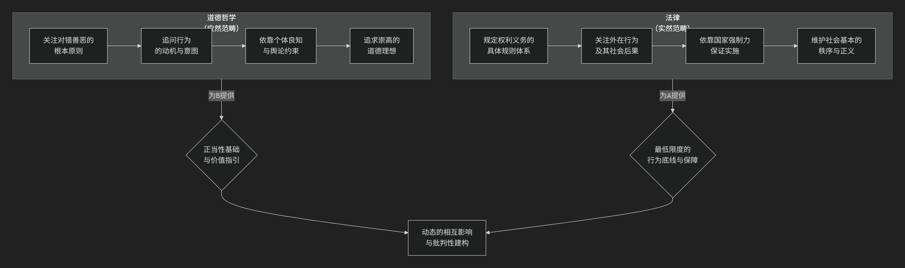

道德
=====

道德哲学分支。

一、核心定义

**道德哲学**，也称为 **伦理学**，是哲学的一个核心分支。它系统地研究、批判和分析关于 **对与错、善与恶、价值、责任、正义和美好生活** 等根本性问题的观念。

简单来说，它不满足于简单地知道“撒谎是错误的”，而是要追问：

*   **为什么** 撒谎是错误的？

*   判断对错的 **标准是什么** ？

*   “错误”这个 **词到底是什么意思** ？

*   我们 **如何知道** 一个行为是错误的？

二、道德哲学的主要分支

为了回答这些不同层面的问题，道德哲学通常分为三个主要领域，我们可以用一个生动的比喻来理解它们：

 **想象一下，道德哲学就像医学。**

 *    **元伦理学** 是研究“医学本身”的学科：什么是健康？什么是疾病？这些概念是客观存在的吗？

 *    **规范伦理学** 是“临床医学”：它提供具体的诊断标准和治疗方案（即道德原则），告诉我们如何判断一个行为是“健康”（道德）还是“疾病”（不道德），以及如何变得“健康”。

 *    **应用伦理学** 是“专科门诊”：它将医学理论和原则应用到具体的病例（即现实道德困境）中，如心脏病科、神经科等。

下面我们来详细看看这三个分支：

（一）元伦理学： “道德的物理学”

元伦理学是道德哲学的基础科学。它不直接指导行为，而是退后一步，分析道德话语和道德事实本身的 **性质**。

*   **它研究的问题包括：**

    *   **道德语言的意义**：当我们说“杀人是错误的”，我们是在陈述一个客观事实（像说“雪是白的”），还是在表达主观情感（像说“菠菜真难吃”）？

    *   **道德真理是否存在**：是否存在客观的、不依赖于人类意见的道德真理？还是说道德只是相对的，因文化或个人而异？

    *   **道德与动机**：认为“应该做某事”是否会必然产生去做这件事的动机？

*   **主要理论**：道德实在论、道德反实在论、情感主义、相对主义等。

   *   **道德实在论**：认为 **存在客观的道德事实或属性**，独立于我们的信念和情感。道德陈述有真假值。

   *   **道德反实在论**：否认存在客观的道德事实。

      *   **情感主义** （如 :doc:`A.J.艾耶尔 </chats/outlaw/analyse/foreign/branch/moral/ayer/index>` ）：道德判断（如“杀人是错的”）只是表达情感（“杀人，呸！”），不描述事实。

      *   **规定主义** （如 :doc:`R.M.黑尔 </chats/outlaw/analyse/foreign/branch/moral/hare/index>` ）：道德判断是普遍化的命令（“不要杀人！”）。

   *   **道德相对主义**：道德对错取决于文化、社会或个人的标准，没有普世标准。

（二） 规范伦理学： “道德的指南针”

这是大多数人最熟悉的道德哲学部分。它旨在 **建立一套普遍的道德标准或原则体系**，用以指导我们的行为，判断对错。

*   **它回答的核心问题是：“我们应该如何生活？”或“什么行为是道德的？”**

*   **三大主流理论：**

   1. **义务论**

   *   **核心思想**：行为对错取决于行为本身是否符合某种 **义务或道德规则**，而非行为后果。这些规则是普遍、绝对的。

   *   **关键概念**： **义务、规则、权利、可普遍化**。

   *   **著名代表**：
      *   :doc:`伊曼努尔·康德 </chats/outlaw/analyse/foreign/master/recent/kant/index>` ：提出“**绝对命令**”。例如，“要只按照你同时能够愿意它成为一个普遍法则的那个准则去行动。” 撒谎是错误的，因为如果每个人都撒谎，信任和语言本身将崩溃。
      *   **现代发展**：契约主义（如 :doc:`T.M.斯坎伦 </chats/outlaw/analyse/foreign/branch/moral/scanlon/index>` ），主张行为错误在于其依据的原则无法被他人合理拒绝。

   2. **后果主义**

   *   **核心思想**：行为对错完全取决于其 **产生的后果**。道德上正确的行为是能在所有可选方案中产生 **最好结果** 的行为。

   *   **关键概念**：**效用、福利、最大化、结果**。

   *   **著名代表**：
      *   **功利主义** （后果主义最主要分支）：主张追求“最大多数人的最大幸福”。
         *   :doc:`杰里米·边沁 </chats/outlaw/analyse/foreign/master/recent/bentham/index>` ：经典功利主义，快乐主义，量化计算。
         *   :doc:`约翰·斯图亚特·密尔 </chats/outlaw/analyse/foreign/master/recent/mill/index>` ：区分高级快乐和低级快乐。
         *   :doc:`彼得·辛格 </chats/outlaw/analyse/foreign/branch/moral/singer/index>` ：偏好功利主义，将道德关怀扩展到动物。

   3. **德性伦理学**

   *   **核心思想**：道德的核心不是“我应当做什么？”，而是“**我应当成为什么样的人？**” 关注行为者的 **品格和道德品质** （即德性）。正确的行为是一个有德性的人在该情境下会做出的行为。

   *   **关键概念**： **德性/美德、品格、幸福、实践智慧**。

   *   **著名代表**：

      *   :doc:`亚里士多德 </chats/outlaw/analyse/foreign/master/ancient/aristotle/index>` ：德性是实现人生“繁荣”或“幸福”的卓越品格特质，在于找到“中庸之道”。
      *   :doc:`阿拉斯代尔·麦金泰尔 </chats/outlaw/analyse/foreign/branch/moral/macIntyre/index>` ：现代德性伦理学的复兴者，强调德性在传统和社群背景下的实践。

（三）应用伦理学：“道德的手术刀”

应用伦理学是将元伦理学和规范伦理学的理论， **应用于具体的、现实的道德难题** 上。

*   **它研究的问题包括：**

    *   **生命伦理学**：堕胎、安乐死、基因编辑是否道德？

    *   **环境伦理学**：我们对动物和自然环境有何责任？

    *   **商业伦理学**：企业的社会责任是什么？什么是公平贸易？

    *   **社会正义**：如何构建一个公平的社会？平等意味着什么？

核心分支和流派对比一览表

.. list-table:: 
   :header-rows: 1
   :widths: 20 20 20 20 20
   :align: center

   * - **流派**
     - **核心问题**
     - **判断标准**
     - **关键词**
     - **代表性思想家**
   * - **义务论**
     - 我应当遵循什么规则？
     - 行为本身的正当性（义务）
     - 义务、权利、普遍法则
     -  :doc:`康德 </chats/outlaw/analyse/foreign/master/recent/kant/index>` 、:doc:`斯坎伦 </chats/outlaw/analyse/foreign/branch/moral/scanlon/index>` 
   * - **后果主义**
     - 如何实现最好的结果？
     - 行为的后果（效用）
     - 效用、福利、最大化
     -  :doc:`边沁 </chats/outlaw/analyse/foreign/master/recent/bentham/index>` 、:doc:`密尔 </chats/outlaw/analyse/foreign/master/recent/mill/index>` 、 :doc:`辛格 </chats/outlaw/analyse/foreign/branch/moral/singer/index>` 
   * - **德性伦理学**
     - 我应该成为什么样的人？
     - 行为者的品格（德性）
     - 美德、品格、幸福
     - :doc:`亚里士多德 </chats/outlaw/analyse/foreign/master/ancient/aristotle/index>` 、 :doc:`麦金泰尔 </chats/outlaw/analyse/foreign/branch/moral/macIntyre/index>` 
   * - **元伦理学**
     - "对错"意味着什么？
     - 道德语言和事实的本质
     - 客观性、相对性、情感
     - :doc:`摩尔 </chats/outlaw/analyse/foreign/branch/moral/moore/index>` 、:doc:`艾耶尔 </chats/outlaw/analyse/foreign/branch/moral/ayer/index>` 、:doc:`黑尔 </chats/outlaw/analyse/foreign/branch/moral/hare/index>` 

**总结**：

总而言之，道德哲学的主要流派提供了一个丰富的思想工具箱，帮助我们以不同的视角审视道德问题：

*   **义务论** 要求我们 **恪守原则**。

*   **后果主义** 要求我们 **权衡结果**。

*   **德性伦理学** 要求我们 **修养品格**。

*   **元伦理学** 则提醒我们 **反思道德概念本身的基础**。

这些流派并非总是互斥，现代道德哲学的发展往往致力于调和它们之间的张力，以应对日益复杂的伦理挑战。

三、 **道德哲学与法律的关系**

道德哲学（伦理学）与法律的关系是法哲学的核心议题，两者既紧密交织，又存在关键区别。它们共同塑造了社会规范，但从不同角度发挥作用。

以下是一张概括两者核心关系的示意图：

上图清晰地展示了道德哲学与法律之间 **对立统一、相辅相成** 的复杂关系。我们可以从“对立”和“统一”两个维度来深入理解。

对立与分工：为何两者不可或缺？

图中的左右两部分首先体现的是它们的区别与分工，这解释了为什么一个社会既需要道德，也需要法律。

1.  **范畴不同**：道德属于“应然”范畴，关注世界“应该”怎样；而法律属于“实然”范畴，规定社会“实际”的运行规则。

2.  **关注点不同**：道德追问行为的动机是否善良（“好心办坏事”可能道德上可谅），而法律主要关注行为的外在后果和是否符合规则（“好心办坏事”也可能需承担法律责任）。

3.  **约束力不同**：道德依靠 **内在约束** （良心谴责）和 **社会软约束** （舆论压力），而法律依靠 **国家强制力** （警察、法庭、监狱）这一外在的、强大的硬约束。

4.  **标准不同**：道德鼓励人做“好人”，追求崇高；法律要求人不做“坏人”，设定行为底线。法律是“最低限度的道德”。

统一与互动：如何相互影响？

图中的中间部分则体现了它们的统一与互动，展示了二者如何共同维系一个健康的社会。

1.  **道德是法律的“指南针”与“基石”**

    *   **提供价值基础**：法律的正当性（为什么我们要服从法律？）最终源于道德。例如，“法律面前人人平等”这一法律原则，其根基是道德哲学中的“人格平等”和“正义”观念。

    *   **引导法律演进**：社会道德的变迁往往会推动法律改革。例如，随着动物保护意识的提升（道德观念变化），许多国家出台了更严格的动物福利法。

2.  **法律是道德的“脚手架”与“底线”**

    *   **将道德制度化**：法律将社会最基本的、最共识性的道德准则（如不得杀人、不得偷窃）明确为规则，并用强制力保障其实施，为道德秩序提供了稳定性。

    *   **维护道德环境**：通过惩罚严重的不道德行为（如欺诈、暴力），法律维护了一个有序的社会环境，使得人们能够更安全地践行道德生活。

当道德与法律冲突时：经典的“公民不服从”难题

两者的关系并非总是和谐的，最深刻的哲学问题正源于此冲突。当一个法律被普遍认为是 **不公正的（即严重违背道德）** 时，该怎么办？

*   **自然法学派** （如 :doc:`富勒 </chats/outlaw/analyse/foreign/branch/legal/fuller/index>` ）倾向于认为：**“恶法非法”**。严重不道德的法律丧失了作为法律的资格，公民有权甚至有权利用不服从。

*   **法律实证主义** （如 :doc:`哈特 </chats/outlaw/analyse/foreign/branch/legal/hart/index>` ）则主张：**“恶法亦法”**。应区分“法律是什么”和“法律应该是什么”。即使法律不道德，它依然是法律，但我们可以通过道德批判去修改它。

历史上的例子（如种族隔离法、纳粹法律）表明，当法律严重背离基本道德时，公民基于良知的 **非暴力反抗（公民不服从）** （如 :doc:`亨利·大卫·梭罗 </chats/outlaw/analyse/foreign/branch/politic/thoreau/index>` 、 :doc:`马丁·路德·金 </chats/outlaw/analyse/foreign/branch/politic/king/index>` ）往往是推动法律向更公正方向变革的重要力量。

总之，道德哲学与法律的关系可以概括为：

*   **道德是法律的精神内核**，为其提供 **正当性来源和价值指引**。

*   **法律是道德的刚性外壳**，为其提供 **底线保障和制度支撑**。

*   二者是一种 **动态的、批判性的共生关系**：道德批判推动法律进步，法律框定道德实践的边界。一个理想的社会，其法律应当反映并保障基本的道德价值，同时其道德观念也应不断审视和推动法律的完善。

四、为什么道德哲学重要？

道德哲学的重要性不在于提供一本有标准答案的“人生指南”，而在于：

1.  **培养批判性思维**：它迫使我们审视那些被视为理所当然的道德观念，检查其逻辑和基础。
2.  **做出更合理的决策**：在面对复杂道德困境时（如电车难题、隐私与安全的冲突），它提供清晰的思考框架，帮助我们做出更明智、更一致的选择。
3.  **理解社会分歧**：许多社会争论（如关于堕胎、死刑的争论）本质上是不同道德框架之间的冲突。学习道德哲学有助于理解对立方的深层逻辑，从而进行更有建设性的对话。
4.  **过上有反思的生活**：它鼓励我们过一种经过审视的生活，思考生命的价值和意义，而不是简单地随波逐流。

**总而言之，道德哲学是人类对“如何共同生活”这一根本问题的理性探索。它试图为我们的是非观念寻找坚实的基石，并为我们应对复杂的道德世界提供思考的工具。**

-------------------------

 .. toctree::
    :maxdepth: 1

    scheler/index
    
 .. toctree::
    :maxdepth: 1

    moore/index

 .. toctree::
    :maxdepth: 1

    ayer/index

 .. toctree::
    :maxdepth: 1

    hare/index

 .. toctree::
    :maxdepth: 1

    anscombe/index

 .. toctree::
    :maxdepth: 1

    macIntyre/index

 .. toctree::
    :maxdepth: 1

    nagel/index

 .. toctree::
    :maxdepth: 1

    parfit/index

 .. toctree::
    :maxdepth: 1

    singer/index

 .. toctree::
    :maxdepth: 1

    nussbaum/index

 .. toctree::
    :maxdepth: 1

    stevenson/index

 .. toctree::
    :maxdepth: 1

    scanlon/index

 .. toctree::
    :maxdepth: 1

    meta/index

