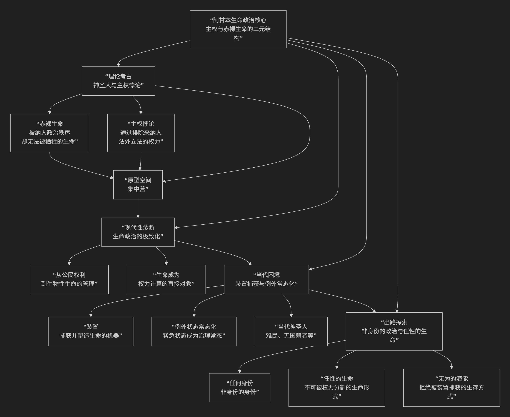

Giorgio Agamben
================

基于吉奥乔·阿甘本（Giorgio Agamben）的“生命政治”核心思想

-------------

吉奥乔·阿甘本是当代欧洲最具原创性和批判性的哲学家之一。他的“生命政治”思想深邃而复杂，其核心可以概括为：**对西方政治传统进行了一次“考古学”式的谱系挖掘，揭示出其隐藏的核心逻辑——通过制造“赤裸生命”来确立主权权力。他认为，现代政治已演变为一种极致的生命政治，即权力直接干预和管理生命本身，而“例外状态”的常态化与“装置”的普遍捕获，则构成了当代人面临的深层生存困境。其最终目标，是思考一种超越这种对立、实现“任性的生命”的真正政治可能性。**

阿甘本的思想体系庞大且环环相扣，其核心逻辑架构可以通过下图清晰地展现：

以下，我们将沿此逻辑脉络，深入解析阿甘本生命政治的核心要义。

一、理论基石：神圣人与主权悖论

阿甘本的思想起点，是对西方政治起源的考古学挖掘。他回到了古罗马法的 **“神圣人”** 概念。

*   **神圣人**：指一种可以被杀死，但不能被作为祭品献祭的人。他的生命被排除在神法和人法之外，成为一种 **纯粹的生物性存在**。
*   **赤裸生命**：阿甘本将“神圣人”的生命状态称为 **“赤裸生命”**——即被政治秩序 **捕获并排除**，剥夺了政治身份和法律保护的纯粹生物学生命。
*   **主权的悖论**：主权权力（制定法律者）的建立，恰恰依赖于它能够 **将生命置于法律之外（宣布例外状态），从而将生命纳入其管辖范围**。这就是“**通过排除来纳入**”的悖论性结构。主权者就像狼群中的头狼，它通过将其他狼排除在权力中心之外（威慑、驱逐），来确立自己的领导地位，从而将整个狼群纳入一个有序结构。

二、原型空间：集中营

阿甘本认为，**集中营** 并非历史偶然，而是现代生命政治逻辑的 **“隐秘范式”**。

*   **例外空间的实现**：集中营是一个主权权力可以 **悬置法律**、将人完全还原为“赤裸生命”的空间。在这里，人不再是权利主体，而是可以被随意处置的生物材料。
*   **现代性的真相**：阿甘本指出，当生命本身成为政治的直接对象时，**整个社会都可能变成一个巨大的集中营**。我们每个人都潜在地是“神圣人”。

三、现代性诊断：生命政治的极致化

阿甘本继承了福柯的“生命政治”概念，但将其推向更激进的结论。

*   **从福柯到阿甘本**：福柯认为，现代权力从“让人死”的君主权力，转向了“让人活”的生命权力，即管理人口的健康、寿命、生殖等。阿甘本则认为，这两种权力是一体两面。**权力在“让人活”的同时，也通过划分哪些生命值得活、哪些生命可以被放任死去，而实现了更精细的“让人死”**。
*   **现代神圣人**：在当代，**难民、无国籍者、关塔那摩湾的囚犯** 等，都是典型的“神圣人”。他们被剥夺了法律保护，生命处于一种悬置状态，赤裸地暴露在权力面前。

四、当代困境：装置与例外状态常态化

阿甘本用两个关键概念分析我们当下的处境。

*   **装置**：指任何具有 **捕获、引导、决定、塑造生命形式** 的机制、制度、技术或话语。从手机、社交媒体到法律制度、官僚体系，都是“装置”。它们不断地将“任性的生命”塑造为各种身份（消费者、公民、用户等）。
*   **例外状态的常态化**：**“9·11”事件后，反恐战争下的“紧急状态”被无限期延长**，成为一种新的治理常态。这意味着主权者可以随时以安全为名，悬置法律，将公民的权利剥夺，使其潜在地沦为“赤裸生命”。这在新冠疫情期间的“卫生紧急状态”中，也被阿甘本视为生命权力极端扩张的例证。

五、出路探索：任性的生命与无为的潜能

面对这种困境，阿甘本并非一味悲观，他试图寻找出路。

*   **任性的生命**：指一种 **不可被权力分割、不可被还原为赤裸生命或政治身份的生命形式**。它是一种完整的、拥有自身风格和形式的生活。
*   **任何身份**：指一种 **不依附于任何特定身份（种族、国籍、职业）的共同体形式**。它是一种“非身份的身份”，基于共同的“任性”而存在。
*   **无为的潜能**：阿甘本强调“潜能”的重要性，尤其是那种 **“不去做……的潜能”** 。例如，“沉默的潜能”比“说话的潜能”更根本。这种对自身潜能的保留，是一种 **拒绝被装置完全捕获、拒绝将自身完全实现为某种既定身份的革命性姿态**。

---

六、核心要义总结

.. list-table:: 
   :header-rows: 1
   :widths: 25 45 30
   :align: center

   * - **理论维度**
     - **核心命题**
     - **关键概念与贡献**
   * - **政治哲学考古学**
     - **主权权力通过制造"赤裸生命"（神圣人）而确立，其结构是"通过排除来纳入"的悖论。**
     - **神圣人、赤裸生命、主权悖论**
   * - **现代性诊断**
     - **集中营是生命政治的隐秘范式，现代政治已成为对生命本身的直接管理。**
     - **生命政治、集中营范式、现代神圣人**
   * - **当代批判**
     - **"装置"普遍捕获生命，"例外状态"常态化构成新的统治技术。**
     - **装置、例外状态常态化、紧急状态**
   * - **解放哲学**
     - **以"任性的生命"和"任何身份"来对抗生命政治，强调"无为的潜能"。**
     - **任性的生命、任何身份、无为的潜能**

七、思想特质与影响

*   **谱系学方法**：阿甘本擅长从法学、神学、语言学等古老文本中挖掘出理解当代问题的钥匙。
*   **批判的尖锐性**：他对西方民主制度的批判极为彻底，揭示了其与极权主义共享的逻辑基础。
*   **现实关切**：他的理论直接介入对难民危机、反恐战争、新冠疫情等当代事件的批判性分析。
*   **争议性**：其观点常被视为过于悲观或激进，尤其是对新冠疫情中防疫措施的批评，引发了巨大争议。

八、总结

总而言之，阿甘本的“生命政治”思想在于，他是一位 **“政治隐秘逻辑的解剖者”和“现代性困境的预警者”** 。他教导我们，**政治的真正战场在于生命本身。那些被我们视为保障的安全措施和便利装置，可能正悄然将我们拖入一种新型的奴役状态。**

他的全部工作是对**自由与安全、生命与权力之间脆弱边界**的一次极其深刻的探查。在危机四伏的当代，阿甘本的思想如同一面冷峻的镜子，迫使我们去思考：我们究竟愿意用多少自由和尊严，去换取看似牢靠的安全与秩序？在这个意义上，他不仅是一位哲学家，更是一位为我们这个时代敲响警钟的先知。

------------

 .. toctree::
    :maxdepth: 3

    grok
    copilot
    deepseek
    gemini
