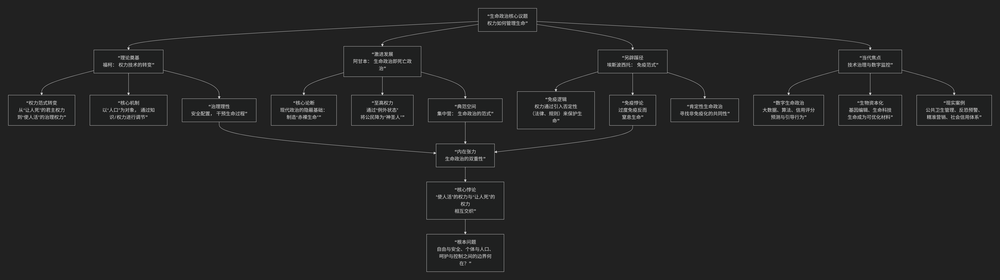

Biopolitics
=============

基于生命政治（Biopolitics）政治哲学核心思想

---------------------------------

这是一个极其重要的当代政治哲学概念。“生命政治”指的是一种 **现代权力形式，其核心操作对象不再是领土或法律主体，而是人类的生命本身——包括人口的健康、寿命、生育、卫生等生物性特征**。它标志着权力技术从“让人死”或“任人生”的君主权力，转向了以“优化生命”为目标的治理术。

其核心思想可以概括为：**现代权力已经深入到了人类的生物性存在层面，通过一系列知识（如医学、统计学、经济学）和制度（如公共卫生、社会保障）来管理和调节“人口”的生命过程，以实现人口的优化、生产力的提升和秩序的稳定。这种管理生命、培育生命的权力，与传统的“死亡权力”相互交织，构成了现代治理的核心特征。**

为了更清晰地把握生命政治的理论脉络与核心议题，下图梳理了其关键维度与内在逻辑：

以下，我们将沿此思想脉络，深入解析生命政治的核心要义。

一、理论奠基：福柯——从“使人死”到“使人活”的权力

米歇尔·福柯是“生命政治”概念的首创者和系统阐述者。他的分析最为经典。

*   **权力范式的历史转变**：

    *   **传统君主权力**：表现为 **“让人死或任人生”** 的权力。君主拥有剥夺生命的权利（死刑、战争），但不过多干预臣民的日常生活。

    *   **现代生命权力**：表现为 **“使人活或把人逐向死亡”** 的权力。权力不再以杀戮为主要手段，而是**积极干预、管理、优化和培育生命**，使其更健康、更高效、更有序。

*   **两个层面**：福柯认为生命权力在17-18世纪沿着两个方向发展：

    1.  **规训权力**：针对 **个体身体**。通过监狱、学校、工厂等机构，训练身体，使其既顺从又有用。目标是制造“驯顺的肉体”。

    2.  **生命政治**：针对 **人口**。人口作为一个生物物种，具有出生率、死亡率、健康状况、寿命等整体特征。国家运用统计学、公共卫生、城市规划、社会保障等措施，在总体层面上 **调节和优化人口的生命过程**。

*   **治理理性**：生命政治是 **自由主义治理术** 的核心。权力不再是通过压制来运作，而是通过 **“安全配置”** 来管理可能发生的风险，为生命创造自由流动的安全环境，并引导其自然发展。

二、激进发展：阿甘本——“赤裸生命”与死亡政治

乔治奥·阿甘本接受了福柯的命题，但得出了一个更为激进和悲观的结论。

*   **核心命题**：生命政治并非现代才有，而是 **西方政治隐秘的原初结构**。政治从一开始就是通过排除一种特殊的生命形式——**“赤裸生命”**——来确立自身的。

*   **“赤裸生命”**：指被剥夺了政治和法律身份（公民权、人权）、可以被杀死但不会被祭祀的生命。古希腊的“神圣人”就是其原型。

*   **“例外状态”**：主权权力（最高权力）通过宣布“例外状态”（如紧急状态、战争状态），悬置法律，从而将公民还原为“赤裸生命”。**集中营** （而非医院）是生命政治的“典范空间”，因为它最赤裸地展现了权力将人置于法律之外，使其生命可以被随意处置。

*   **结论**：因此，生命政治本质上就是 **“死亡政治”** 。现代民主社会看似呵护生命，但其底层逻辑依然依赖于将一部分人（难民、无国籍者、恐怖分子嫌疑人）排除在法律保护之外的可能性。

三、另辟蹊径：埃斯波西托——“免疫”范式

罗伯托·埃斯波西托提供了另一种解释模型，试图超越福柯和阿甘本的悲观论调。

*   **核心概念：“免疫”**：现代政治的本质是一种 **“免疫机制”** 。如同医学通过接种小剂量病毒来使身体获得免疫力，政治权力也通过引入一种 **“否定性”** （如法律、规则、边界）来保护共同体的生命，使其避免陷入混乱。

*   **免疫悖论**：但当这种免疫机制过度时，它就会 **反过来窒息它本应保护的生命**。过度的安全措施、身份管控、排外政策，会导致共同体活力的丧失。这就是现代生命政治的危机——“免疫过度”。

*   **建设性出路**：埃斯波西托试图寻找一种 **“肯定性的生命政治”** ，即一种不再基于排斥和否定，而是能够肯定生命、促进生命充盈的共同生活形式。

四、当代焦点：数字时代的新生命政治

在21世纪，生命政治呈现出新的形态：

*   **数字生命政治**：通过大数据、人工智能、社会信用评分等数字技术，权力能够**预测、引导和塑造人的行为**。生命被数据化，成为可分析、可管理的对象。
*   **生物资本化**：基因编辑、优生学、抗衰老技术等生物科技，使生命本身成为可以**被优化、被投资、被资本化的材料**。“生命”本身成为了一个经济和政治项目。

五、核心要义总结

.. list-table:: 
   :header-rows: 1
   :widths: 25 45 30
   :align: center

   * - **理论维度**
     - **核心命题**
     - **关键概念**
   * - **福柯：治理术**
     - **现代权力从"使人死"转向"使人活"，通过管理人口的生命过程进行治理。**
     - **生命权力、人口、调节、安全配置**
   * - **阿甘本：排斥结构**
     - **政治的核心是制造"赤裸生命"，生命政治本质上是死亡政治。**
     - **赤裸生命、例外状态、神圣人、集中营范式**
   * - **埃斯波西托：免疫逻辑**
     - **政治是一种免疫机制，过度免疫会导致共同体死亡。**
     - **免疫范式、否定性、免疫过度、肯定性生命政治**
   * - **当代发展**
     - **数字技术和生物科技使生命政治进入精准预测和深度干预的新阶段。**
     - **数据化、算法治理、生物资本**

六、为何重要？——生命政治的双重性

生命政治概念之所以关键，在于它揭示了现代权力的根本悖论和双重性：

*   **进步的正面**：公共卫生、社会福利、疫苗接种、环境保护……这些旨在改善民生、延长寿命的举措，无疑是生命政治的体现，也是现代文明进步的标志。

*   **控制的阴暗面**：种族主义、优生学、大规模监控、数据隐私侵犯、在“健康”名义下的社会排斥……这些同样是生命政治的体现，它展示了权力以“为你好”的名义，可以深入到何种程度。

**根本问题**：我们如何区分 **“呵护生命的政治”** 与 **“控制生命的政治”** ？在追求安全、健康和效率的同时，如何保障个人的自由、尊严和多样性？这正是生命政治理论留给我们的最紧迫的思考。

------------

 .. toctree::
    :maxdepth: 3

    grok
    copilot
    chatgpt
    deepseek
    gemini
    qwen
