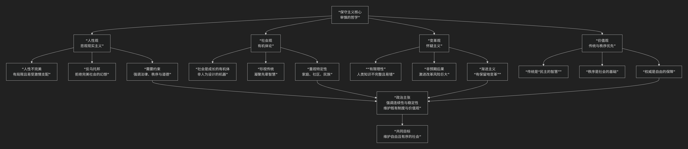

Conservatism
=============

基于保守主义政治哲学核心思想

---------------------------------

保守主义是西方现代政治思想中一股强大而复杂的力量。它并非一套严密的意识形态教条，而更像是一系列 **态度、倾向和偏好** 的集合，其核心思想可以概括为：**一种对激进变革持深刻怀疑态度，强调传统、秩序、权威和人性现实性的政治哲学。它认为人类社会是一个复杂而脆弱的有机体，而非可以随意拆卸重组的机器，因此主张以审慎、渐进的方式应对社会问题，珍视从历史中延续下来的习俗、制度和价值观。**

保守主义的思想脉络深邃且富于现实感，其核心原则与内在逻辑可以通过下图清晰地展现：

以下，我们将沿此逻辑脉络，深入解析保守主义政治哲学的核心要义。

一、人性观：悲观现实主义

保守主义思想的起点是对人性的不信任和清醒认识。

*   **核心命题**：人性是不完美的、有缺陷的。人类并非天生纯良理性，而是受欲望、激情和自私倾向的驱使。因此，人需要外部的约束和引导。

*   **哲学内涵**：

    *   **拒绝“圣洁理性”**：保守主义对启蒙运动倡导的“无限理性”深表怀疑，认为人类的理性是有限且易错的，无法凭空设计出完美的社会蓝图。

    *   **反乌托邦**：任何试图在人间建立“天堂”的激进计划，都必然因为对人性的错误估计而导向暴政和灾难（如法国大革命的雅各宾派统治）。

*   **政治结论**：正因为人性有恶的倾向，所以需要 **强大的法律、秩序、道德和权威机构** （如政府、教会）来约束人性，维持社会的基本稳定。

二、社会观：有机体论

保守主义将社会视为一个活生生的有机体，而非一台机器。

*   **核心比喻**：社会更像一棵 **古树**，而非一台 **钟表**。它是在特定历史、文化和土壤中 **自然生长** 起来的，其结构复杂而微妙，充满了非理性的情感和习惯纽带。

*   **珍视传统**：传统不是僵死的包袱，而是 **“代代相传的智慧银行”** （切斯特顿语）。它包含了无数先辈在应对生存挑战中积累的、未被明确表述的实践经验。盲目抛弃传统是愚蠢的。

*   **重视特定性与归属感**：保守主义强调对 **特定** 的家庭、社区、地区和民族的忠诚与归属感（“小家”），反对抽象、空洞的“世界主义”（“大家”）。这些具体的纽带是个人身份和意义的来源。

三、变革观：怀疑主义与渐进主义

基于上述人性观和社会观，保守主义对社会变革持有一种极其审慎的态度。

*   **“有限理性”的警示**：人类没有足够的智慧和能力去彻底理解并改造复杂的社会有机体。任何大规模的社会工程都建立在无知的基础上。

*   **“非预期后果法则”**：激进变革往往会引发一系列无法预料的灾难性后果，最终事与愿违。因此，变革必须如 **“修补一艘在海上航行的船”**，只能逐步进行，而不能将其彻底拆毁重建。

*   **著名格言**：**“有保留地变革”**。这是英国保守主义政治家埃德蒙·伯克的名言，意指变革应是迫不得已的、渐进的，并且要充分尊重既有的制度和传统。

四、核心价值：传统、秩序、权威

在这些基本态度之上，保守主义推崇一些核心价值。

*   **传统优先**：传统代表着连续性、稳定性和先辈的智慧，是社会秩序的基石。

*   **秩序至上**：没有秩序，就没有自由和正义。社会动荡是对所有人福祉的威胁。

*   **权威的必要性**：合法的权威是维护秩序和自由的保障。无政府状态比专制更可怕。权威源于历史、习俗和自然等级，而非单纯的民意。

五、主要流派与代表人物

.. list-table:: 
   :header-rows: 1
   :widths: 25 35 40
   :align: center

   * - **流派**
     - **核心特征**
     - **代表人物与思想**
   * - **传统保守主义**
     - 强调传统、秩序、等级和宗教价值，对自由主义和个人主义持批判态度。
     - **埃德蒙·伯克**：抨击法国大革命，赞美国内革命。认为社会是契约，不仅是活着的人之间，而且是"活着的人、已死的人和将要出生的人"之间的合伙关系。
   * - **自由保守主义/古典自由主义**
     - 在尊重传统和秩序的同时，强调自由市场、私有财产权和有限政府。
     - **弗里德里希·哈耶克**：区分"自生自发秩序"（市场、习俗）与"人造秩序"（政府计划），认为前者更优越。**迈克尔·奥克肖特**：将政治理解为"追求暗示"，而非贯彻意识形态蓝图。
   * - **社会保守主义**
     - 重点关注维护传统家庭价值观、宗教信仰和民族文化认同。
     - 通常与宗教右翼相关联，反对堕胎、同性婚姻等，认为这些冲击了社会的基本道德秩序。

六、核心要义总结

.. list-table:: 
   :header-rows: 1
   :widths: 25 45 30
   :align: center

   * - **理论维度**
     - **核心命题**
     - **关键概念与贡献**
   * - **人性论**
     - **人性不完美且有缺陷，需要法律、道德和权威的约束。**
     - **悲观现实主义、有限理性、反乌托邦**
   * - **社会论**
     - **社会是复杂而脆弱的有机体，传统是先辈智慧的结晶。**
     - **有机体论、传统智慧、特定性归属**
   * - **变革论**
     - **对社会工程持深刻怀疑，主张审慎和渐进的改革。**
     - **怀疑主义、渐进主义、非预期后果**
   * - **价值论**
     - **秩序、权威和传统是自由与繁荣的基础。**
     - **秩序至上、权威必要、传统优先**

七、思想特质与评价

*   **非意识形态化**：保守主义更像一种气质和倾向，反对用抽象的理论蓝图来裁剪复杂的现实。

*   **情境依赖性**：不同的保守主义在不同国家、不同时期有不同表现（如英国保守党与美国共和党的差异）。

*   **批判与争议**：批评者认为它过于悲观，容易沦为既得利益集团维护特权的工具，并可能阻碍必要的社会进步。

*   **现实意义**：在全球化、技术革命和社会变革加速的今天，保守主义的审慎智慧提醒人们关注变革的风险，珍视文明的连续性，为激进思潮提供了一种必要的平衡。

八、总结

总而言之，保守主义的核心思想在于，它是一位 **“审慎的守望者”和“传统的辩护人”** 。它教导我们，**人类社会是一项复杂的遗产，而非一张可以任意涂抹的白纸。真正的智慧不在于追逐最新的乌托邦幻想，而在于守护历经时间考验的文明成果，并以谦卑和审慎的态度面对未来。**

它的全部工作是对 **人类理性傲慢** 的一次持续不断的提醒。在一个崇尚创新和进步的时代，保守主义坚守着对历史、秩序和人性现实的深刻尊重，为政治生活提供了一种不可或缺的稳定器和反思维度。在这个意义上，它不仅是政治光谱中的一极，更是一种深邃的、关于人类处境的永恒智慧。

------------

 .. toctree::
    :maxdepth: 3

    grok
    copilot
    chatgpt
    deepseek
    gemini
    qwen
