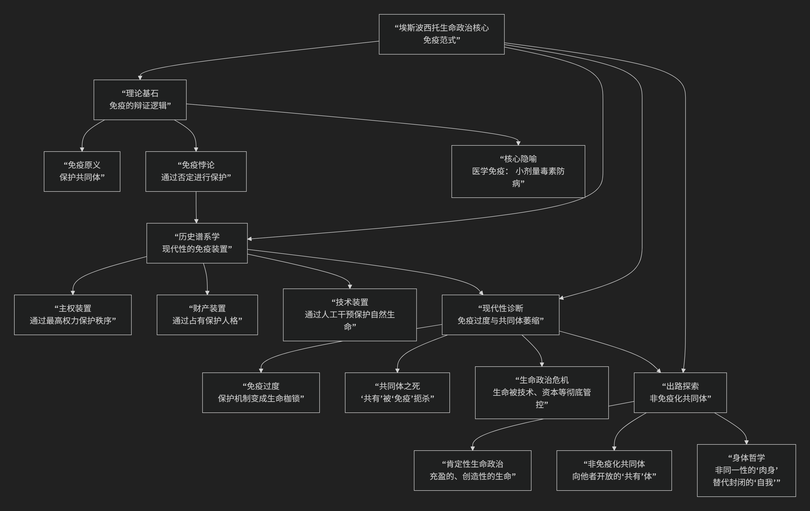

Roberto Esposito
======

基于罗伯托·埃斯波西托（Roberto Esposito）独特的“生命政治”核心思想

-------------

罗伯托·埃斯波西托是当代意大利政治哲学的重要代表，他提供了一种截然不同于阿甘本的、极具原创性的“生命政治”阐释路径。其核心思想可以概括为：**通过“免疫范式”这一核心概念，重新解读西方政治思想史，认为政治的本质并非阿甘本所言的“排除赤裸生命的死亡政治”，而是一种旨在保护共同体生命的“免疫机制”。但这种保护机制内含着一种悖论：它通过引入否定性（如法律、主权、财产）来保护生命，却可能窒息共同体生命本身。现代生命政治的危机正是“免疫过度”导致的。埃斯波西托的最终目标，是探寻一种“肯定性”的生命政治，即一种能够超越免疫悖论、实现生命充盈的“非免疫化共同体”。**

埃斯波西托的思想体系深刻而复杂，其核心逻辑架构可以通过下图清晰地展现：

以下，我们将沿此逻辑脉络，深入解析埃斯波西托生命政治的核心要义。

一、理论基石：免疫范式

这是埃斯波西托全部思想的拱顶石，他借此重新诠释了整个西方政治传统。

*   **免疫的原初含义**：源于拉丁语 *immunitas*，指 **“免除义务或危险”** ，与 *munus* （礼物、义务、职务）相对。拥有 *immunitas* 的人，被免除了共同体成员间相互馈赠和承担的义务。
*   **免疫的辩证逻辑**：埃斯波西托认为，免疫是共同体的 **“否定的补充物”** 。共同体的生命（*communitas*，源于 *cum-munus*，意为“共享义务”）需要一种保护机制来维持其同一性，避免在无限的相互给予中瓦解。但这种保护机制——免疫——恰恰是通过 **切断或否定** 那种构成共同体的“共享”关系来实现的。
*   **医学隐喻**：免疫就像接种疫苗，**通过引入小剂量的疾病（否定性）来激发身体的抵抗力，从而预防大病**。政治也是如此，它通过引入某种“毒素”（如法律、主权、边界）来保护共同体的“身体”。

二、历史谱系学：现代性的免疫装置

埃斯波西托通过谱系学分析，揭示了现代政治核心概念都是“免疫装置”。

*   **主权装置**：托马斯·霍布斯的《利维坦》是典范。为了结束“一切人反对一切人的战争”（生命的自然状态），人们通过社会契约创造一个 **绝对主权者**。这个主权者位于共同体之上，拥有生杀大权，其功能就是 **通过最高权力的否定性（使人恐惧死亡）来保护所有人的生命**。这就是一种典型的免疫策略。
*   **财产装置**：约翰·洛克的理论是代表。现代人格的确立依赖于 **财产权**。一个人通过占有外部事物（财产）和自身（自我所有权）来确立自己的边界，保护自己免受他人侵犯。财产成为一种免疫工具，但它也 **将人从共同体共享中分离出来**。
*   **技术装置**：在现代生命政治中，技术（尤其是生物技术）成为最新的免疫装置。它通过直接干预生命过程（基因编辑、健康管理）来保护和优化生命，但这也意味着生命本身被纳入 **可计算、可控制的范畴**，面临被彻底“物化”的危险。

三、现代性诊断：免疫过度与共同体的萎缩

埃斯波西托对现代性的诊断比阿甘本更深入一层。

*   **免疫过度的危机**：现代社会的核心问题是 **“免疫过度”** 。原本用于保护生命的免疫装置（主权、资本、技术）不断自我强化，最终 **反过来窒息、压抑和掏空了它们本应保护的生命和共同体**。
*   **共同体的死亡**：真正的 *communitas* （共同体）是基于“共有”和“共享”的，其特点是 **开放、不确定性和对他者的责任**。而免疫装置为了安全，不断 **划清界限、确立身份、排除异质**，导致共同体退化为封闭、同质化的“免疫共同体”，实则已是共同体的空壳。
*   **与阿甘本的区别**：阿甘本认为政治的核心是制造“赤裸生命”（被排除者）。埃斯波西托则认为，**我们所有人都已被纳入免疫装置之中，不再是“被排除的赤裸生命”，而是“被过度保护的免疫化生命”**。问题不在于被抛弃在外，而在于被禁锢在内。

四、出路探索：非免疫化共同体与肯定性生命政治

埃斯波西托的最终目标是为“免疫过度”的困境寻找一条出路。

*   **肯定性的生命政治**：他区分了 **“肯定性生命政治”** 和“否定性生命政治”（即免疫政治）。后者通过否定来保护，前者则寻求 **直接肯定和释放生命的充盈、创造性和潜能**。
*   **非免疫化共同体**：这是一种 **不再基于免疫逻辑的共同体形式**。它不寻求绝对的安全和同一性，而是 **勇敢地向不确定性、差异性和他者开放**。它接受生命的脆弱和相互依存，在“共有”中寻找力量，而非在“免疫”中寻求庇护。
*   **身体哲学**：为此，他提出了 **“肉身”** 的概念，以对抗封闭的“自我”。肉身不是归属于我的财产，而是一个 **向世界和他者开放的、非同一性的界面**。通过肉身，我们与他人、与世界先天性地联系在一起，这为一种新的共同体提供了本体论基础。

五、核心要义总结

.. list-table:: 
   :header-rows: 1
   :widths: 25 45 30
   :align: center

   * - **理论维度**
     - **核心命题**
     - **关键概念与贡献**
   * - **理论范式**
     - **政治的本质是"免疫"，即通过引入否定性来保护共同体生命。**
     - **免疫范式、免疫悖论、否定的补充物**
   * - **历史谱系**
     - **主权、财产、技术等现代核心概念都是历史的"免疫装置"。**
     - **主权装置、财产装置、技术装置**
   * - **现代性诊断**
     - **现代危机是"免疫过度"，导致共同体萎缩和生命被管控。**
     - **免疫过度、共同体死亡、被过度保护的生命**
   * - **解放哲学**
     - **探寻"肯定性生命政治"与"非免疫化共同体"，以"肉身"为基础实现生命充盈。**
     - **肯定性生命政治、非免疫化共同体、肉身哲学**

六、思想特质与影响

*   **原创性范式**：“免疫范式”是埃斯波西托对政治哲学的根本性贡献，提供了一个全新的分析框架。
*   **建设性批判**：他不仅批判现代性的困境，更积极地致力于寻找出路，其理论带有建设性色彩。
*   **对话与超越**：他的思想是在与福柯、阿甘本、南希等哲学家的深度对话中形成的，并试图超越他们的局限。
*   **现实关切**：其理论对理解当代的生态危机、公共卫生危机、技术伦理和身份政治等问题具有深刻的启发性。

七、总结

总而言之，罗伯托·埃斯波西托的核心思想在于，他是一位 **“免疫机制的解码者”和“共同体的再造者”** 。他教导我们，**政治最大的悖论在于，那些为我们提供安全的东西，可能正是剥夺我们生命活力的根源。对绝对安全的追求，最终会导致共同体的死亡。**

他的全部工作是对 **保护与窒息、个体与共同体、安全与自由** 这一永恒张力的一次极其深刻的重构。在疫情、战争和技术垄断的时代，埃斯波西托的思想如同一剂清醒药，提醒我们：真正的挑战或许不在于如何筑起更高的免疫之墙，而在于如何有勇气共同生活在一个不可避免的、脆弱且相互依存的世界里。在这个意义上，他为我们思考一种超越恐惧的、更具生命力的未来政治提供了宝贵的地图。

------------

 .. toctree::
    :maxdepth: 3

    grok
    copilot
    deepseek
    gemini
