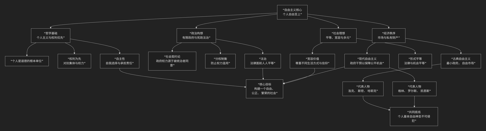

Liberalism
=============

基于自由主义（Liberalism）政治哲学核心思想

---------------------------------

自由主义是近现代西方主导性的政治哲学传统，其思想体系宏大而多元，但所有自由主义者都共享一个核心承诺：**个人自由具有至高无上的价值。** 其核心思想可以概括为：**一种将个人置于政治思考中心的哲学。它主张个体拥有不可剥夺的权利、独特的尊严和自主选择的能力，并认为政治社会的首要目的是保护和增强这些个人自由。为实现此目的，它倡导法治、宪政政府、宽容和社会正义，同时对权力的集中，尤其是政府权力，保持深刻的警惕。**

自由主义内部虽有丰富流派，但其核心原则与演变脉络可以通过下图清晰地展现：

以下，我们将沿此逻辑脉络，深入解析自由主义政治哲学的核心要义。

一、哲学基石：个人主义与权利优先

这是自由主义最根本的出发点，与集体主义哲学形成鲜明对比。

*   **个人主义**：**个人是道德价值的最终承担者和政治思考的出发点**。社会、国家、集体都是由个人组成的，其存在的正当性在于服务于个人的福祉与发展。个人的利益和权利不能为所谓的“集体利益”而被轻易牺牲。

*   **权利优先于善**：个人拥有一些基本的、**不可剥夺的权利** （如生命权、自由权、财产权），这些权利为个人划定了不受他人（包括政府）侵犯的自治领域。政府的任务不是规定某种“良善生活”的标准，而是要保护每个人自由地追求自己心目中的“好生活”。

*   **个人自主**：自由主义高度重视个人的 **理性选择能力和自我决定权**。一个真正自由的人，是能够根据自己的价值观和理性，塑造自己生活的人。

二、政治构想：有限政府、宪政与法治

基于对权力的深刻不信任，自由主义设计了一套限制权力的政治方案。

*   **有限政府**：政府的权力必须是 **有边界的、受到严格限制的**。其唯一或主要的正当职能是保护个人权利，而非包办一切。权力集中必然导致腐败和暴政。

*   **社会契约论**：政府的合法性来源于 **被统治者的同意**。政治权威不是神授的或天然的，而是自由、平等的个体为了更好地保护自身权利，通过某种形式的“契约”自愿建立的。

*   **宪政主义**：通过一部 **成文宪法** 来明确规定政府的组织结构、权力范围和运行方式，并将基本权利条款奉为圭臬，使其不易被普通立法所更改。

*   **分权制衡**：将政府权力划分为立法、行政、司法等分支，并使其相互制约平衡，防止任何一个分支权力过度膨胀。

*   **法治**：法律必须是 **普遍的、公开的、不溯及既往的、清晰的**，并且法律面前人人平等。政府也必须依法行事，即“王在法下”。

三、经济秩序：市场、财产与正义

自由主义与市场经济有着天然的联系，但在政府干预程度上存在分歧。

*   **古典自由主义**：强调 **自由市场、私有财产权和契约自由** 是经济繁荣和个人自由的基石。主张“守夜人”式的最小政府，认为政府干预会扭曲市场信号，扼杀创新和效率。代表人物：亚当·斯密、哈耶克。

*   **现代自由主义（社会自由主义）**：承认市场的效率，但认为不受约束的市场会导致严重的贫富分化、垄断和公共品供给不足。因此，政府有责任进行 **适度干预**，提供社会保障、教育、医疗等，以确保 **起点公平** 和 **社会正义**。代表人物：约翰·罗尔斯。

四、社会理想：平等、宽容与多元

自由主义追求一种特定的社会形态。

*   **平等**：自由主义主张的是 **权利的平等、机会的平等和法律面前的平等**，而非结果平等。每个人都应拥有平等的机会去发展自己的才能，追求自己的目标。

*   **宽容**：这是自由社会的核心美德。个人有权持有不同的信仰、价值观和生活方式，只要不侵害他人权利，就应受到尊重和宽容。国家应在不同的“善的观念”之间保持中立。

*   **多元主义**：自由主义承认并珍视价值观和生活方式的多样性，认为一个充满差异的社会比一个整齐划一的社会更富有活力、更具创造性。

五、主要思想流派与代表人物

.. list-table:: 
   :header-rows: 1
   :widths: 25 35 40
   :align: center

   * - **流派**
     - **核心特征**
     - **代表人物与核心思想**
   * - **古典自由主义**
     - 强调 **消极自由** （免于强制的自由），主张最小政府、自由市场和严格的私有财产权。
     - **约翰·洛克**： 自然权利（生命、自由、财产）、政府基于同意。**亚当·斯密**： "看不见的手"，自由市场促进公益。**哈耶克**： 自发秩序，反对中央计划。
   * - **现代自由主义（社会自由主义）**
     - 强调 **积极自由** （实现自我潜能的自由），主张国家有责任通过干预创造公平的社会条件。
     - **约翰·密尔**： 《论自由》，防范"多数的暴政"，强调个性发展。**T.H.格林**： 积极自由概念。**约翰·罗尔斯**： 《正义论》，作为公平的正义（差异原则）。
   * - **自由意志主义**
     - 最极端的个人主义，主张将国家职能缩减到最小（仅维持治安和国防），近乎无政府资本主义。
     - **罗伯特·诺齐克**： 《无政府、国家与乌托邦》，最弱意义的国家，权利是"边际约束"。

六、核心要义总结

.. list-table:: 
   :header-rows: 1
   :widths: 25 45 30
   :align: center

   * - **理论维度**
     - **核心命题**
     - **关键概念**
   * - **本体论/价值论**
     - **个人是价值的本源，其权利与自由具有至高无上的价值。**
     - **个人主义、权利优先、个人自主**
   * - **政治学**
     - **权力（尤其是政府权力）是危险的，必须通过宪政、法治和分权加以限制。**
     - **有限政府、社会契约、宪政主义、分权制衡**
   * - **经济学**
     - **市场经济是个人自由的延伸，但政府在确保机会公平上扮演不同角色。**
     - **自由市场、私有财产、社会正义**
   * - **社会学**
     - **一个理想社会是宽容、多元且保障个体在法律和机会面前平等的。**
     - **宽容、多元主义、机会平等**

七、思想评价与挑战

*   **伟大成就**：自由主义为现代民主宪政、人权保障和市场经济制度奠定了理论基础，是当今世界最具影响力的政治哲学。

*   **内在张力与批评**：

    *   **个人与社会的平衡**：过度强调个人是否会侵蚀社会团结和共同体价值？

    *   **平等与自由的矛盾**：结果平等是否会损害经济自由？形式平等是否足以实现真正的社会正义？

    *   **文化相对主义的挑战**：自由主义的价值观是普世的，还是西方特有的？

八、总结

总而言之，自由主义的核心思想在于，它是一位 **“个人权利的守护神”和“权力专制的解毒剂”** 。它教导我们，**一个良好的社会，首先应是一个允许每个个体有尊严地、自由地探索和实现其生命价值的社会。政治的最高艺术，不在于设计乌托邦的宏伟蓝图，而在于精巧地构建一套“制衡”权力的制度，从而为无数个体的自发创造和合作留出最大空间。**

它的全部工作是对 **人类尊严与自由** 的一次持久而有力的辩护。尽管面临种种挑战和内部争论，但自由主义所倡导的对个人权利的尊重、对权力的警惕和对开放社会的追求，使其依然是现代世界最重要的精神资源之一。

------------

 .. toctree::
    :maxdepth: 3

    grok
    copilot
    chatgpt
    deepseek
    gemini
    qwen
