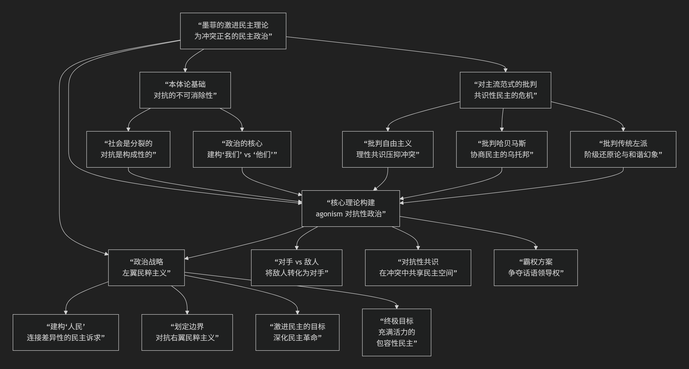

Chantal Mouffe
==============

基于尚塔尔·墨菲（Chantal Mouffe）的“激进民主”理论核心思想

------------------------------------------------------

尚塔尔·墨菲是当代政治理论界最具影响力的思想家之一。她的“激进民主”理论提供了一种旨在克服传统左派困境、并有力回应右翼民粹主义挑战的独特政治方案。其核心思想可以概括为：**在承认社会冲突和对抗不可消除的前提下，重新构想一种充满活力且具有包容性的民主。它拒绝自由主义的“共识幻觉”与传统马克思主义的“彻底和谐幻想”，主张通过“左翼民粹主义”策略，将多样的民主诉求连接为一种“人民”的集体意志，从而在“我们”与“他们”的对抗中重新激活民主斗争，夺回被新自由主义霸权占据的民主阵地。**

墨菲的理论极具现实针对性和战略眼光，其核心架构与内在逻辑可以通过下图清晰地展现：

以下，我们将沿此逻辑脉络，深入解析墨菲“激进民主”理论的核心要义。

一、本体论基础：对抗的不可消除性

墨菲理论的出发点是对社会本质的一种深刻判断，这主要受惠于其丈夫厄尼斯特·拉克劳的“话语理论”。

*   **核心命题**：**社会是不可能的。** 这意味着，不存在一个完全和谐、透明、理性共识的社会秩序。社会总是被 **分裂、对抗和权力关系** 所贯穿，这些对抗是“构成性的”，即它们塑造了社会身份和政治领域本身。

*   **“政治”与“政治性”的区分**：

    *   **政治性**：指社会关系中 **固有的对抗维度**，即人类共处中无法根除的冲突可能性。这是本体论层面的。

    *   **政治**：指在制度、话语和实践层面 **组织人类共处** 的一系列活动。它试图驯服和引导“政治性”。

*   **政治的核心**：政治活动的核心就在于 **建构“我们”与“他们”的边界**。任何政治认同都是在与某种“他者”的对立中形成的。

二、对主流范式的批判：共识性民主的危机

基于上述本体论，墨菲猛烈抨击了主流的民主理论，认为它们无力解释和应对当代的政治危机（如右翼民粹主义崛起）。

*   **批判自由主义**：她批评以约翰·罗尔斯为代表的自由主义试图通过理性程序达成 **道德共识**，从而 **消除对抗、压抑冲突**。这种“无对抗”的政治幻想，使得民主变得乏味、技术化，无法激发公民的政治热情，反而为极端情绪提供了土壤。
*   **批判协商民主**：她认为尤尔根·哈贝马斯的“协商民主”理想是一个 **理性的乌托邦**，它预设了可以通过理性论证消除分歧，忽视了情感、激情和集体认同在政治中的根本作用。
*   **批判传统左派**：她批评某些左派思想中的 **阶级还原论** （将一切斗争还原为阶级斗争）和 **和谐社会的终极幻想**，认为这无法处理性别、种族、生态等多元化的现代斗争。

三、核心理论构建：对抗性政治

墨菲提出的替代方案是 **“对抗性政治”**，这是“激进民主”的运作模式。

*   **对手 vs 敌人**：这是最关键的区别。

    *   **敌人**：是需要 **从物理上消灭** 的对立面。这是你死我活的关系。

    *   **对手**：是 **合法性对手**。我们激烈反对其观点，但 **承认其拥有存在的权利和为自己观点辩护的权利**。

*   **对抗性政治的目标**：民主政治的核心任务，不是消除冲突，而是 **将“敌人”转化为“对手”**。即，将可能导致内战的 **对抗性冲突**，转化为民主框架内良性竞争的 **对抗性冲突**。

*   **对抗性共识**：对抗双方共享一个基本的 **民主游戏规则**，但在规则内为完全不同的社会方案而斗争。竞争的核心是 **霸权**，即争夺对社会主流价值和制度的领导权。

四、政治战略：左翼民粹主义

为实现对抗性政治，墨菲提出了备受争议但极具影响力的 **“左翼民粹主义”战略**。

*   **建构“人民”**：政治的关键不是发现一个预先存在的“人民”，而是 **通过话语实践，将各种分散的民主诉求（如女权、环保、反种族主义、反紧缩）连接起来**，建构一个广泛的“人民”集体意志。
*   **划定政治边界**：这个“人民”的认同，需要通过 **划定一个共同的对立面** 来强化。在当下，这个对立面就是 **新自由主义霸权** 及其导致的寡头统治、社会不公和民主空洞化。
*   **与右翼民粹主义的区别**：右翼民粹主义也将“人民” vs “精英”作为叙事核心，但它的“人民”是 **排外的、种族同质化的**，其对手是“危险的它者”（如移民、穆斯林）。左翼民粹主义的“人民”则应是 **包容的、多元的**，其对手是 **那些阻碍民主深化的经济和政治精英**。
*   **激进民主的目标**：这不是一场夺取政权后就结束的革命，而是一场 **持续的“民主革命”**，旨在不断地质疑和挑战各种形式的不平等和从属关系，从而 **深化和扩展民主原则（自由、平等）到社会生活的各个领域**。

五、核心要义总结

.. list-table:: 
   :header-rows: 1
   :widths: 25 45 30
   :align: center

   * - **理论维度**
     - **核心命题**
     - **关键概念与贡献**
   * - **本体论**
     - **社会对抗是构成性的、不可消除的，政治在于建构"我们/他们"。**
     - **对抗性、政治性、社会的不可能性**
   * - **批判理论**
     - **自由主义的"理性共识"与协商民主的"理性乌托邦"压抑了政治冲突，导致民主疲软。**
     - **共识幻觉、后政治、民主的危机**
   * - **民主模式**
     - **"对抗性民主"旨在将"敌人"转化为"对手"，在冲突中实现动态共存。**
     - **对抗性政治、对手/敌人区分、霸权斗争**
   * - **政治战略**
     - **通过"左翼民粹主义"策略，建构一个多元的"人民"意志，以对抗新自由主义霸权。**
     - **左翼民粹主义、建构人民、划定边界、民主革命**

六、思想特质与影响

*   **现实感与战略性**：墨菲的理论直接介入当代政治斗争，为左派提供了一种务实的、非教条的战略指南。
*   **对激情的重视**：她恢复了情感、激情和集体认同在政治分析中的核心地位，弥补了理性主义政治理论的不足。
*   **争议性**：她的“民粹主义”策略备受争议，批评者认为其危险地玩弄身份政治火焰，但支持者认为这是左派夺回政治主动权的必要之举。
*   **深远影响**：她的思想深刻影响了欧洲左翼政党（如西班牙的“我们可以党”、希腊的“激进左翼联盟”）的战略思考，是理解21世纪左派政治转型的关键理论家。

七、总结

总而言之，尚塔尔·墨菲的“激进民主”理论在于，她是一位 **“政治冲突的辩护者”和“左派战略的重构者”** 。她教导我们，**一个健康的民主社会，不是没有冲突的社会，而是一个能够将致命的冲突转化为良性竞争的社会。民主的活力恰恰源于其对峙双方的激情投入，而非对虚假共识的追求。**

她的全部工作是对 **民主本质** 的一次犀利重估。在民主制度全球性遭遇信任危机的今天，墨菲的理论如同一剂强心针，它呼吁左派及所有民主力量放弃对和谐的空想，勇敢地投身于政治战场，通过建构一种充满激情且具有包容性的“我们”，来夺回民主，使其真正成为一场永不落幕的、旨在实现更大自由与平等的“革命”。

------------

 .. toctree::
    :maxdepth: 3

    grok
    copilot
    deepseek
    gemini
