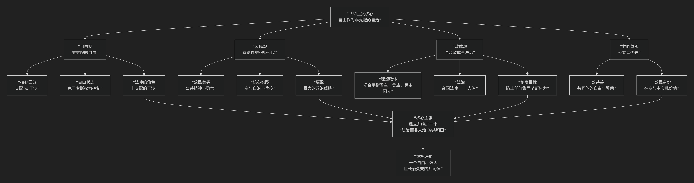

Republicanism
=============

基于共和主义（Republicanism）政治哲学的核心思想

---------------------------------

好的，共和主义是西方政治思想史中一条悠久而强大的传统，它提供了另一种理解自由、公民身份和政治共同体的方式。其核心思想可以概括为：**一种将“自由”理解为“非支配”、强调公民美德与公共善、并主张通过混合政体和法治来实现共同自治的政治哲学。它认为真正的自由不在于不受干涉的私人领域，而在于免于专断权力的支配，而实现这种自由的关键，是公民积极投身公共事务，以法律为纽带，建立一个自治的“共和国”。**

共和主义的思想深邃且富有实践智慧，其核心架构与内在逻辑可以通过下图清晰地展现：

以下，我们将沿此逻辑脉络，深入解析共和主义政治哲学的核心要义。

一、自由观：自由即“非支配”

这是共和主义最核心、最独特的贡献，与自由主义的“自由即不受干涉”形成鲜明对比。

*   **核心区分：“支配”与“干涉”**

    *   **自由主义关注“干涉”**：自由意味着没有他人或政府的实际干预。例如，一个仁慈的君主没有干涉你的生活，你就是自由的。

    *   **共和主义关注“支配”**：自由意味着 **不受他人专断权力的控制**。即使这个君主没有干涉你，但他 **随时有能力** 干涉你（比如无需理由地剥夺你的财产或生命），那么你仍然处于不自由状态。**自由是“免于奴役”，而非“免于打扰”。**

*   **法律与自由**：共和主义认为，**恰当的法律不是对自由的限制，而是自由的基石**。因为法律是 **非专断的**：它必须符合公共善，且平等地适用于所有人（包括统治者）。法律是一种“非支配的干涉”，它像一个护栏，防止任何人落入被他人支配的境地。

二、公民观：积极公民与公民美德

共和主义对公民提出了更高的要求，公民不是权利的被动享受者，而是公共生活的主动参与者。

*   **积极公民**：公民的本质是 **参与自治**。通过参加公民大会、担任公职、参与陪审团等方式，公民直接参与到统治过程中，成为自己命运的主人。

*   **公民美德**：维持共和国需要公民具备 **公共精神**，即愿意将 **公共善置于个人私利之上**。具体美德包括：勇气（保卫共和国）、审慎（明智决策）、正义（公平待人）和节制（抵制腐败）。

*   **腐败是共和国的癌症**：共和主义最大的恐惧是公民美德的沦丧，即“腐败”。当公民只关心私利，放弃公共责任，将导致派系斗争、暴政或外敌入侵，共和国终将灭亡。

三、政体观：混合政体与法治

为确保自由和防止腐败，共和主义设计了一套独特的政治制度。

*   **混合政体**：单一政体（如纯粹民主制、寡头制、君主制）容易蜕变为暴政。最理想的政体是 **混合政体**，即 **将君主（代表效率）、贵族（代表智慧）和民主（代表自由）三种要素** 平衡地结合在一个政体中。例如，罗马共和国的执政官、元老院和公民大会。这种制衡可以防止任何单一集团垄断权力。

*   **法治**：共和国必须是 **“法律的帝国，而非人的帝国”** 。统治者的权力必须由法律授予并受其约束，不能凭个人喜好恣意妄为。法律面前人人平等。

四、共同体观：公共善优先

共和主义强调共同体的价值和政治的公共性。

*   **公共善**：政治的最高目标是实现 **公共善**，即整个共同体的自由、繁荣与长治久安。个人的福祉与共同体的福祉密不可分。

*   **政治的本质**：政治不是不同私人利益在市场中的博弈，而是公民们在公共领域 **通过理性对话，共同探寻公共善** 的过程。

五、思想谱系与代表人物

.. list-table:: 
   :header-rows: 1
   :widths: 30 70
   :align: center

   * - **时期**
     - **代表人物与思想**
   * - **古典共和主义**
     - **亚里士多德**：人是政治动物，城邦的目的是实现"至善"。公民轮番为治。**西塞罗（罗马）**：将共和国定义为"人民的财产"，法律是纽带，强调混合政体与公民义务。
   * - **近代共和主义**
     - **马基雅维利（意大利）**：在《论李维》中盛赞罗马共和国的活力，认为其源于公民美德、冲突与扩张。**卢梭（日内瓦）**："公意"概念，主张通过社会契约建立道德共同体，公民通过服从公意获得自由。
   * - **新共和主义**
     - **汉娜·阿伦特**：强调"公共领域"和"行动"对于实现人的最高价值的意义。**昆廷·斯金纳**、**菲利普·佩蒂特**：复兴"自由即非支配"的古典观念，并将其发展为自由主义的替代方案。

六、与自由主义的主要区别

.. list-table:: 
   :header-rows: 1
   :widths: 25 35 40
   :align: center

   * - **对比维度**
     - **共和主义**
     - **自由主义**
   * - **自由观**
     - **自由即"非支配"** （免于专断权力）
     - **自由即"不受干涉"** （消极自由）
   * - **公民角色**
     - **积极公民**：参与自治是实现自由和价值的核心
     - **权利主体**：享受法律保护下的私人自由
   * - **法律观**
     - **自由的构成性条件** （法律保障非支配）
     - **自由的保护性工具** （法律划定不受干涉的领域）
   * - **核心价值**
     - **公共善、公民美德、自治**
     - **个人权利、中立性、宽容**

七、核心要义总结

.. list-table:: 
   :header-rows: 1
   :widths: 25 45 30
   :align: center

   * - **理论维度**
     - **核心命题**
     - **关键概念与贡献**
   * - **自由论**
     - **自由是"非支配"，即免于专断权力的控制。**
     - **非支配的自由、支配与干涉的区分、法律作为自由基础**
   * - **公民论**
     - **公民是有德性的自治参与者，腐败是共和国的最大威胁。**
     - **积极公民、公民美德、公共精神、腐败**
   * - **政体论**
     - **混合政体与法治是维护自由、防止专制的制度保障。**
     - **混合政体、分权制衡、法治、共和国**
   * - **共同体论**
     - **政治的目的是实现公共善，个人福祉与共同体命运相连。**
     - **公共善、公共领域、公意**

八、思想特质与当代影响

*   **强烈的现实感**：共和主义对权力、腐败和人性的洞察极为深刻，其制度设计旨在应对最坏情况。

*   **崇高的理想性**：它对公民美德和公共生活的呼唤，提升了政治的道德境界。

*   **当代复兴**：新共和主义（尤其是佩蒂特的理论）对当代政治哲学和宪政设计产生了重要影响，为思考自由、民主和公民身份提供了富有活力的替代方案。

*   **实践遗产**：美国的建国之父们（如麦迪逊）深受共和主义影响，其宪政设计中的分权制衡、代议制和对“派系”的警惕，都体现了共和主义的智慧。

九、总结

总而言之，共和主义的核心思想在于，它是一位 **“公共自由的捍卫者”和“公民精神的召唤者”** 。它教导我们，**真正的自由并非离群索居的私己安宁，而是与同胞们共同生活在一种免于奴役的法治秩序中，并通过积极参与来共同塑造这一秩序。一个人的自由，只有在自由的政治共同体中才能得以保全和实现。**

它的全部工作是对 **政治自由本质** 的一次深刻探索。在个人主义盛行的时代，共和主义提醒我们，一个健康的社会不能仅仅依靠权利和法律的架构，更需要公民对公共事务的关切、担当和奉献。在这个意义上，共和主义不仅是一种古老的传统，更是一种永恒的、关于如何过上一种真正自由和富有尊严的公共生活的智慧。

------------

 .. toctree::
    :maxdepth: 3

    grok
    copilot
    chatgpt
    deepseek
    gemini
    qwen
