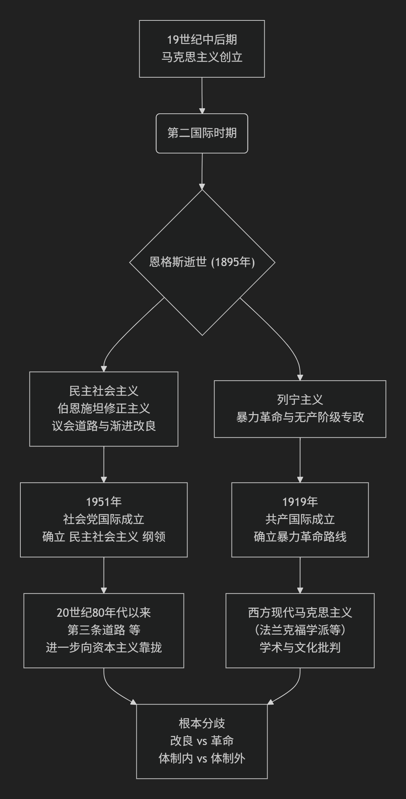

# 民主社会主义与西方马克思主义

---

民主社会主义与西方马克思主义的关系，可以概括为“同源异流”和“殊途同归”。它们都源于对经典资本主义的批判，但选择了截然不同的改造路径，最终在目标上也可能走向了不同的方向。

下面这张时间线梳理了它们的关键发展节点和核心分歧，可以帮助你直观地把握其演变脉络。

### 🔍 核心分歧一览

为了更清晰地对比，以下是它们在一些根本问题上的不同立场 ：

| 对比维度 | **西方现代马克思主义** | **民主社会主义** |
| :--- | :--- | :--- |
| **对资本主义的态度** | 认为其存在根本性矛盾，需被**超越和替代** | 承认其框架，旨在通过改良**管理并缓和其矛盾** |
| **变革的路径** | 强调**根本性变革**（虽多转向理论批判） | **议会民主、渐进改良**，拒绝暴力革命 |
| **指导思想** | 仍以**马克思主义**为主要分析工具 | **指导思想多元化**（基督教伦理、人道主义等） |
| **终极目标** | 最终取代资本主义，实现更高级的社会形态 | 放弃制度替代，追求**价值目标**（自由、公正、互助） |
| **与现有国家关系** | 持批判态度，认为国家是阶级统治工具 | **利用并改革**现有国家机器 |

### 💎 简单来说

总而言之，西方现代马克思主义更像是一位在资本主义体系之外的 **“诊断医生”和“批判者”** ，它深入剖析病症根源，但开出的“手术”方案（革命）在西方缺乏实践条件。而民主社会主义则像是资本主义体系内的 **“护理师”和“修复师”** ，它承认现有身体结构（制度），但致力于通过调理（改良）来缓解病痛，延长其寿命。

两者虽有共同的思想源头，但在如何看待世界以及如何改变世界的关键问题上，早已分道扬镳 。
