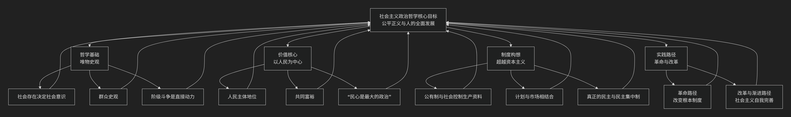

Socialist
===========

基于社会主义（Socialist）政治哲学核心思想

---------------------------------

社会主义政治哲学是一个内涵丰富的思想体系，其核心在于追求一个**消灭剥削、实现社会公平正义和人的自由全面发展的社会**。它深刻批判资本主义的矛盾，并探索通向更优越社会制度的路径。

以下是其核心思想的概要：

下面我们来具体看看这些核心思想。

🧠 哲学基础：唯物史观

唯物史观是社会主义政治哲学的基石。它认为：

*   **社会存在决定社会意识**：一个社会的经济结构（生产力和生产关系）构成了其政治、法律和意识形态的基础。

*   **群众史观**：人民群众是物质财富和精神财富的创造者，是推动历史发展的决定性力量。

*   **阶级斗争是直接动力**：在阶级社会里，阶级斗争是社会发展的直接动力。社会主义的目标就是要最终消灭阶级对立。

❤️ 价值核心：以人民为中心

社会主义政治哲学将“人民”置于最高位置：

*   **人民主体地位**：发展的根本目的是为了满足人民对美好生活的向往，而非资本的增殖。这体现了对“人”的终极关怀。

*   **共同富裕**：社会主义反对两极分化，致力于在发展的过程中让成果更多更公平地惠及全体人民，逐步实现共同富裕。

*   **“民心是最大的政治”**：政治合法性的根本来源在于民心向背。政党和政府的政策必须以最广大人民的根本利益为出发点和落脚点。

⚖️ 对资本主义的批判与新社会构想

社会主义政治哲学源于对资本主义的深刻批判，并在此基础上构想新社会。

*   **批判资本逻辑**：它揭示资本主义生产方式的核心是追求无限增殖，这导致劳动异化、经济危机、生态破坏和人的片面发展。

*   **构想新社会**：旨在建立一个超越资本主义的社会形态，核心特征包括：

    *   **公有制主体地位**：主张由社会或集体主要掌握和控制生产资料，从根本上消除剥削的经济基础。

    *   **计划与市场相结合**：强调社会生产的有计划性和协调性，以克服资本主义生产的无政府状态，同时也不完全排斥市场在资源配置中的积极作用。

    *   **真正的民主**：追求比资本主义形式民主更广泛、更实质的民主。在实践层面，**民主集中制** 是一项重要原则，旨在结合广泛民主和高效执行。

🛠️ 实现路径的探索

如何实现社会主义？在这个问题上，社会主义内部发展出不同的实践路径：

*   **革命路径**：通过彻底改变旧的国家机器和所有制关系来建立社会主义制度。

*   **改革与渐进路径**：在保持基本制度不变的前提下，通过持续改革来完善社会主义，解放和发展生产力，回应时代挑战。

这些路径的探索，也使得社会主义理论本身不断丰富和发展，形成了包括 **科学社会主义**、**民主社会主义** 等在内的多种流派。

💎 核心目标与思想流变

社会主义政治哲学的最终目标是 **实现人的自由全面发展**。这意味着每个人都能在物质充裕、精神解放、社会关系和谐的条件下，充分发挥自己的潜能。

纵观其发展历程，社会主义政治哲学经历了从 **空想** 到 **科学**、从 **理论** 到 **实践** 的漫长演变。从早期对理想社会的文学化描绘（空想社会主义），到马克思、恩格斯创立唯物史观和剩余价值学说使其成为科学，再到二十世纪以来在世界各地的多样实践（如苏联模式、中国特色社会主义、北欧的民主社会主义等），这一思想体系始终在批判与建构中不断发展。

------------

 .. toctree::
    :maxdepth: 3

    grok
    copilot
    chatgpt
    deepseek
    gemini
    qwen
