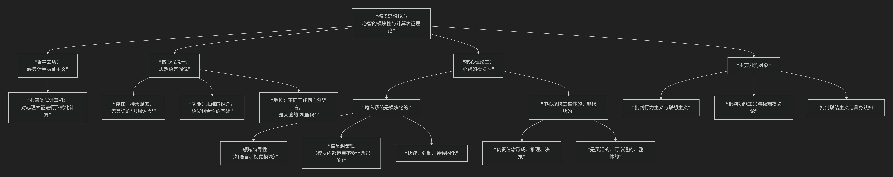

Jerry Fodor
==============

根据杰瑞·福多（Jerry Fodor）的心灵哲学和认知科学核心思想。

---------

杰瑞·福多是20世纪最具影响力的心灵哲学家和认知科学家之一。他的核心思想并非严格意义上的“语言学”，而是 **关于心智如何工作的哲学与科学理论**，但其理论基石—— **“思想语言假说”** 和 **“心智模块性”** ——深刻挑战并重塑了我们对语言、思维和认知本质的理解。

其核心思想与理论架构，可以通过下图清晰地概览：

以下，我们将沿此逻辑脉络，深入解析其核心要义。

**一、核心基石：思想语言假说**

这是福多理论最著名、也最具争议的起点。他认为：

1.  **存在一种“思想语言”**：在我们能说出的任何自然语言（如汉语、英语）之下，存在一种 **天赋的、无意识的、形式化的符号系统**，它是 **“思维的媒介”**。我们所有的思维活动（推理、计划、解决问题）都在这种语言中进行。

2.  **它解释“思想何以可能”**：自然语言的句子之所以有组合性（有限的词能生成无限的句子），是因为思想语言本身具有 **组合性的句法和语义**。我们理解一个句子的过程，就是将其 **翻译成思想语言并进行计算** 的过程。

3.  **它的地位**：它不同于任何后天习得的自然语言，更像是大脑硬件运行的 **“机器码”** 。自然语言是这种内在代码的“外壳”或表达接口。

**二、核心理论：心智的模块性**

在1983年的名著《心智的模块性》中，福多提出了一个极具影响力的大脑架构模型。

1.  **输入系统是模块化的**：负责处理特定感官信息（如语言、视觉、听觉）的 **“低级”认知系统是模块**。模块的核心特征是：

    *   **领域特异性**：只处理特定类型信息（语言模块只处理语言信号，不管视觉）。

    *   **信息封装性**：模块内部运算快速、自动、不受中心信念系统（如知识、愿望、期待）的影响。例如，即使你知道米勒-莱尔幻觉中的两条线等长，**视觉模块** 仍然迫使你“看到”一长一短。

    *   **快速、强制、神经固化**：它们是硬连接的、高效的、不由意识控制。

2.  **中心系统是非模块化的**：负责高级认知功能（如信念形成、决策、类比推理）的 **“中心系统”是整体的、非模块的**。它从各模块接收信息，但处理过程是**缓慢的、渗透性的（受信念影响）、并具有“全局访问”能力**。福多认为，科学推理、创造思维等高级过程无法用模块理论解释。

**三、哲学基础与批判对象**

福多的理论服务于一个更宏大的哲学目标：**为“心灵表征理论”和“意向性”（即心理状态关于世界的能力）提供科学基础。**

*   **核心立场**：**经典计算表征主义**。心智之于大脑，如同软件之于硬件；思维是对具有句法和语义的心理表征进行的形式化计算过程。

*   **主要批判对象**：

    1.  **行为主义与联想主义**：认为思维只是刺激-反应联结或观念联想。

    2.  **功能主义（某些版本）与极端模块论**：他反对将整个心智（包括中心系统）都视为模块集合的观点。

    3.  **联结主义与具身认知**：他一生都在激烈批评联结主义神经网络模型，认为其无法解释思想的**系统性、生产性和组合性**，也反对具身认知将思维过度还原为身体体验。

**四、与乔姆斯基语言学的关联与区别**

.. list-table:: 乔姆斯基与福多思想核心维度对比
   :header-rows: 1
   :widths: 20 40 40
   :align: center

   * - **维度**
     - **乔姆斯基的生成语言学**
     - **福多的思想**
   * - **共同点**
     - 坚持 **天赋论** 和 **理性主义**；认为语言能力是心智中一个 **专门的子系统**；都强调形式的 **组合性**。
     - 
   * - **核心对象**
     - **自然语言** 的语法结构（句法）。
     - 所有思维的基础媒介—— **思想语言**。
   * - **理论目标**
     - 解释人类 **语言知识** 的本质。
     - 解释人类 **思维和认知** 的本质。
   * - **关系**
     - 福多将乔姆斯基的“普遍语法”视为思想语言在 **语言模块** 中的具体体现。语言模块是思想语言的一个专门化的输入/输出接口。
     -

**总结**

总而言之，福多的核心思想描绘了一幅 **经典认知科学的标准图景**：心智是一个由 **模块化的输入系统** 和 **非模块化的中心推理系统** 组成的 **计算装置**，这个装置使用一种天赋的 **思想语言** 作为其内部代码来运行。

尽管他的许多具体主张（如严格的模块封装性、思想语言的实在性）备受争议，并被后来的认知神经科学和具身认知思潮所修正，但他提出的根本问题——**思维如何表征世界？心智功能是否模块化？**——以及他论证的严谨性和彻底性，使他成为任何研究心智、语言与认知的学者都无法绕过的思想巨擘。他的工作为心灵哲学和认知科学划定了基础性的辩论战场。

-------------------

 .. toctree::
    :maxdepth: 3

    grok
    gemini
    copilot
    chatgpt
    deepseek
    qwen

