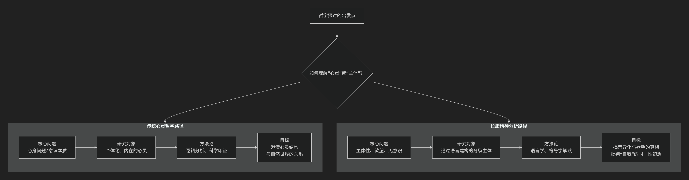

Jacques Lacan
==============

根据雅克·拉康（Jacques Lacan）的精神分析哲学核心思想。

---------

被誉为“法国的弗洛伊德”的拉康是20世纪最具颠覆性的思想家之一，他试图以结构语言学为工具，**重读和激进化弗洛伊德的精神分析**，其思想体系极其复杂晦涩。他的核心思想可以概括为：**“无意识具有语言一样的结构”，并且主体是在一个由语言、符号和差异构成的“大他者”领域中，通过误认和欲望的辩证运动才得以形成的。真正的“自我”并非一个统一、自洽的实体，而是一个在想象界、象征界和实在界三个秩序的交界处不断建构和消解的产物。**

拉康的核心目标是将精神分析从生物学和心理学中解放出来，将其锚定在 **语言学和结构人类学** 的基石上。其思想精髓建立在以下四大支柱之上：

一、核心革命：无意识像语言一样结构

这是拉康全部思想的基石，也是他对弗洛伊德最根本的改写。

*   **批判自我心理学**：拉康猛烈抨击那种将分析目标定为“强化自我”的美国自我心理学。他认为这完全背叛了弗洛伊德的发现，因为“**自我是错觉的中心**”，它本质上是防御性的、扭曲的。

*   **回到弗洛伊德**：他主张回到弗洛伊德发现的 **无意识的革命性维度**。

*   **语言学转向**：他提出著名论断：“**无意识像语言一样结构**”。这意味着：

    1.  **无意识不是本能的混沌**，而是由 **能指** （语言符号）构成的网络。

    2.  无意识的运作机制（如凝缩、移置）完全对应着语言的修辞手法（如隐喻、转喻）。

    3.  症状、口误、梦境都是 **无意识的语言**，需要像解读文本一样进行解读。

二、主体理论：主体是由语言（大他者）言说的

拉康的主体观是对笛卡尔“我思故我在”的彻底颠覆。

*   **“我思故我不在，我在故我不思”**：拉康认为，真正的主体（无意识主体）在“我思”的透明自我出现之前就已经被语言结构所决定了。当我们用“我”这个词来指代自己时，我们已经落入了一个符号性的陷阱。

*   **大他者**：这是拉康思想中最关键的概念。**大他者不是某个具体的人，而是符号秩序的场所**，是语言、法律、文化、习俗的总和，是我们一出生就进入的 **先于我们存在的符号世界**。它是 **欲望的原因和场所**。

*   **主体的异化**：主体是在 **大他者的领域** 中并通过 **大他者** 才得以构成的。我们只能通过大他者（语言）来言说自己和认识自己，因此 **主体本质上是分裂的、异化的**。著名的公式是：**“人的欲望是他者的欲望”**。

三、三界理论：想象界、象征界、实在界

拉康用这三个“界”来描述人类存在的三个基本维度，它们像三环结一样相互交织。

1.  **想象界**：

    *   **核心：镜像阶段与误认**。婴儿（6-18个月）在镜中看到自己的统一形象，产生了一种 **掌控感和完整性的幻觉**，这个理想的“我”构成了自我认同的基础。但这是一个 **误认**，因为婴儿内在的实际体验是支离破碎的。想象界由此充满了 **二元关系、形象、错觉和侵略性**。

2.  **象征界**：

    *   **核心：语言、法则与父亲的名义**。主体通过进入语言（象征秩序）而真正形成。这个入口由 **“父亲的名义”**  （象征性的父法）所标志，它打断了婴儿与母亲之间原始的、想象的二元关系，引入了 **法则、差异和缺失**。象征界是 **大他者** 的领域，是 **欲望和律法** 的领域。

3.  **实在界**：

    *   **核心：不可象征化的创伤性内核**。实在界是 **绝对抗拒被符号化的东西**，是创伤、不可能性和绝对偶然性的领域。它无法被想象，也无法被言说，但它会像 **创伤性事件** 一样，不断地在象征秩序中 **回归**，并干扰我们的现实感。它是 **欲望的终极对象因（对象a）** 的来源。

四、欲望理论：欲望是对永远缺失之物的渴求

拉康的欲望理论是其伦理学的核心。

*   **需要 → 要求 → 欲望**：

    1.  **需要**：生物性的，如饥饿、口渴，可以被满足。
    
    2.  **要求**：通过语言向他者（最初是母亲）表达的需要。但要求总包含着 **对无条件的爱** 的渴望，这是无法满足的。

    3.  **欲望**：从“要求”中减去“需要”后剩下的 **无法被满足的残余**。欲望不是对某个具体对象的需求，而是 **对“无”的欲望**，是永远指向 **他者欲望** 的转喻运动。

*   **对象a**：这是欲望的 **成因**，是那个原初失落的对象（如母亲的身体），它本身是空无的，但却是欲望机器运转的驱动力。所有具体的欲望对象（爱情、财富、知识）都是这个根本缺失的 **替代品**。

*   **幻想**：主体通过 **幻想** 来支撑欲望，幻想提供了一个场景，试图回答“他者到底想要我什么？”这个谜题，从而为欲望提供暂时的坐标。

---

核心要义总结

.. list-table:: 
   :header-rows: 1
   :widths: 25 45 30
   :align: center

   * - **理论维度**
     - **核心命题**
     - **关键概念与贡献**
   * - **无意识理论**
     - **"无意识具有语言一样的结构"**，症状是能指的网络。
     - **能指链、隐喻与转喻、回到弗洛伊德**
   * - **主体理论**
     - **主体由大他者（符号秩序）言说**，是分裂和异化的。
     - **大他者、分裂主体、他者的欲望**
   * - **三界理论**
     - 人类存在由 **想象界、象征界、实在界** 三个交织的秩序构成。
     - **镜像阶段、误认、父亲的名义、对象a**
   * - **欲望理论**
     - **欲望是对永远缺失之物的渴求**，由对象a驱动，在幻想中展开。
     - **欲望辩证法、对象a、幻想**

影响与挑战

拉康的思想影响深远且具挑战性：

*   **哲学影响**：深刻影响了后结构主义、女性主义、批判理论和文化研究。

*   **精神分析实践**：改变了分析的方向，从解读“自我”的防御转向聆听“无意识主体”的真理。

*   **挑战性**：其思想的晦涩性和非体系性本身是对“清晰自我”这一幻想的挑战。

总而言之，拉康的核心思想在于进行一次 **主体的“去中心化”革命**。他摧毁了笛卡尔以来西方哲学中自治、透明的理性主体神话，揭示出主体是在 **语言、他者和欲望** 的复杂网络中形成的 **分裂的、被言说的存在**。他的工作是对人类自恋的第三次重大打击（继哥白尼、达尔文、弗洛伊德之后），迫使我们去思考：**我们以为的“我”，或许只是一个由语言编织的、精巧而必要的错觉。**

-------------------

 .. toctree::
    :maxdepth: 3

    grok
    gemini
    copilot
    chatgpt
    deepseek
    qwen

----------------------

**拉康的思想不属于传统意义上的“心灵哲学”，甚至是对其根本前提的彻底颠覆和挑战。**

为了更好地理解这一点，我们需要厘清“心灵哲学”的定义，并将其与拉康的核心计划进行对比。

什么是传统“心灵哲学”？

心灵哲学主要是英美分析哲学传统下的一个分支，它关注的是**心灵的本质、状态及其与身体（尤其是大脑）的关系**。它的典型问题包括：

*   **心身问题**：心灵与身体是如何相互作用的？
*   **意识问题**：什么是意识？它是如何从大脑活动中产生的？
*   **意向性**：心理状态（如信念、欲望）是如何“关于”或“指向”外部世界的？
*   **他心问题**：我们如何知道他人也拥有心灵？

心灵哲学通常预设了一个**内在的、私人的、可被科学研究的“心灵”或“意识”作为其研究对象**，并试图通过逻辑分析、思想实验或借助认知科学、神经科学的发现来解答上述问题。

为什么拉康的思想不属于此列？

拉康的整个理论规划与心灵哲学的预设和目标几乎是背道而驰的。下图清晰地展示了二者在核心问题、研究对象和方法论上的根本分歧：

如上图所示，两者的分歧是根本性的：

1.  **核心问题不同**：
    *   **心灵哲学**：关注“心灵是什么？”（一个本体论问题）。
    *   **拉康**：关注“**主体是如何构成的？**”（一个发生学和解构性问题）。他关心的是欲望、无意识、他者性，而非意识的结构。

2.  **对“自我”的态度截然相反**：
    *   **心灵哲学**：通常将“自我”或“心灵”作为一个有待分析和解释的给定实体。
    *   **拉康**：认为“**自我”是一个误认的产物**，是在“镜像阶段”通过对外部形象的认同而形成的**幻想性统一体**。真正的核心是**分裂的主体**和**无意识**。

3.  **研究方法的根本差异**：
    *   **心灵哲学**：追求清晰的定义、逻辑论证和（可能的）科学印证。
    *   **拉康**：采用**解释学**和**符号学**的方法，将症状、梦、口误等视为需要解读的**文本**。他的方法是**阐释性的**，而非科学证明性的。

4.  **对语言的角色理解不同**：
    *   **心灵哲学**：语言是表达内在心理状态的工具。
    *   **拉康**：语言是**构成主体的基本维度**。他的核心论点是“**无意识像语言一样结构**”，并且主体是在“**大他者**”（符号秩序）的领域中被构成的。**不是我在说话，而是“话在说我”**。

拉康的思想属于什么？

拉康的思想更准确地属于：

1.  **（后）结构主义哲学**：他深受索绪尔结构语言学的影响，关注符号系统如何先于并构成个体。
2.  **精神分析哲学**：他将弗洛伊德的发现哲学化，并将其与语言学、人类学、数学等结合起来，形成一套关于主体性的独特理论。
3.  **批判理论**：他的工作旨在**祛魅**，揭露我们关于自我、自主性和理性的常识观念其实是建立在误认和压抑之上的。

因此，**拉康的哲学不仅不属于心灵哲学，它实际上是对心灵哲学所依赖的“内在心灵”、“统一自我”等概念的激进批判。** 他将探讨的焦点从“内在的心灵空间”转移到了“**主体在语言和他者场域中的构成过程**”。

如果说心灵哲学试图绘制一幅“心灵地图”，那么拉康则致力于证明，这张地图所依据的“领土”（统一的自我）本身就是一个海市蜃楼。他的工作揭示了主体性中无法被地图化的、异质性的真相——无意识。这正是拉康思想的革命性和挑战性所在。