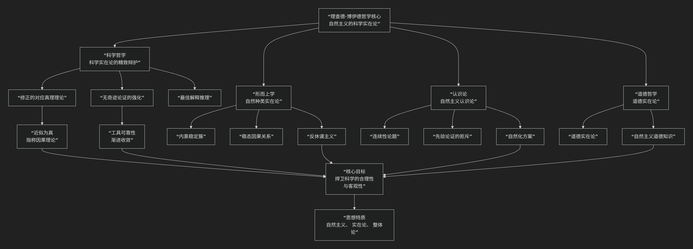

Richard Boyd
==============

基于理查德·博伊德（Richard Boyd）的哲学核心思想

----------------------------------------------------------------------------

理查德·博伊德是美国当代极具影响力的科学哲学家和自然主义认识论者。他的核心思想可以概括为：**为“科学实在论”提供了一套精致而强有力的辩护，并将其核心论点——“最佳解释推理”——拓展至自然种类、因果关系和道德哲学等领域，从而构建了一个统一的、自然主义的实在论哲学体系。**

博伊德的思想深刻而具系统性，其核心架构可以通过下图清晰地展现：

以下，我们将沿此脉络，深入解析博伊德哲学的核心要义。

一、科学哲学：为科学实在论的精致辩护

博伊德是科学实在论最著名的捍卫者之一。他的辩护超越了早期简单版本，更具说服力。

*   **核心立场**：我们的 **最佳科学理论（尤其是关于不可观察实体的理论）是近似为真的**，其核心术语（如“电子”、“基因”）真实地指称了客观世界中的实体。

*   **核心论证：“无奇迹论证”的强化版**

    *   博伊德认为，科学实在论是 **对科学巨大经验成功（如做出新颖预测、指导技术进步）的最佳解释**。如果理论不是近似为真，那么其成功将是一个无法解释的“奇迹”。

    *   他强化了这一论证：科学的成功不仅在于预测，更在于我们 **基于理论在实验中成功地操作和干预世界**（例如，使用扫描隧道显微镜操纵原子）。这种 **工具可靠性**强烈暗示我们关于理论实体的知识是大致正确的。

*   **真理与指称理论**：

    *   **近似真理**：他主张一种更符合科学史的“修正的对应真理理论”，承认理论是 **近似为真** 的，而非绝对为真。科学通过不断修正理论而 **渐进地逼近真理**。

    *   **指称的因果理论**：即使一个理论的部分内容是错误的，其核心术语也能成功指称，只要存在一个 **适当的历史-因果链条** 将术语的使用与相应的实体联系起来（类似克里普克和普特南的指称理论）。

二、形而上学：自然种类实在论

博伊德将科学实在论思想应用于“自然种类”问题，提出了独特的“内禀稳定簇”理论。

*   **核心问题**：什么是“自然种类”（如“水”、“老虎”、“电子”）？它们是人类心灵的划分，还是世界本身的客观结构？

*   **博伊德的答案：“内禀稳定簇”理论**

    *   一个自然种类（如“金属”）是由一簇 **内禀的（固有的）、稳定的性质** 通过 **稳态因果关系** 绑定在一起而定义的。

    *   这些性质（如导电性、延展性、金属光泽）之所以稳定地共现，不是因为我们的定义，而是因为背后有 **共同的深层微观结构** （金属键）和 **因果机制** 在维持它们。

    *   因此，自然种类是 **世界本身的客观划分**，而非我们主观的创造。

*   **反休谟主义**：他反对休谟将因果关系还原为“恒常联结”的观点，主张因果关系是世界中真实的、能产生效果的 **自然必然性**。

三、认识论：自然主义认识论

博伊德的认识论与奎因一脉相承，但更加精细。

*   **核心主张**：**认识论是自然科学的一部分**。我们研究人类如何获得知识，应该使用科学方法（如心理学、认知科学），而不是寻求先于科学的、先验的“辩护基础”。

*   **“连续性论题”**：在观察陈述与理论陈述之间，或在常识与科学之间，**不存在绝对的、质的界限**，只存在 **程度的差异**。我们所有的认知能力都是自然进化而来的，在本质上连续。

*   **对先验论证的拒斥**：他坚决反对任何试图从概念分析或先验推理中推导出世界本质的哲学方法（如康德或某些语言分析哲学）。他认为，关于世界本质的知识只能 **后验地** 通过科学探究获得。

四、道德哲学：自然主义道德实在论

博伊德最大胆的尝试是将科学实在论拓展至伦理学，捍卫一种自然主义的道德实在论。

*   **核心主张**：**道德属性（如“善”、“恶”）是客观存在的自然属性**。

*   **论证**：

    *   他认为，存在 **道德上的自然种类**，如“善的社会”或“人类繁荣”。这些种类是由一簇 **内禀的、稳态的因果属性** 定义的（如满足基本需求、社会合作、心理健康等）。

    *   道德探究类似于科学探究：我们通过 **经验观察和理论修正** 来逐步逼近关于“人类繁荣”条件的 **道德真理**。

    *   因此，道德判断可以有 **客观的真值** （对或错），因为它们对应于世界的客观事实（关于人类本性和社会组织的复杂事实）。

五、核心要义总结

.. list-table:: 
   :header-rows: 1
   :widths: 30 40 30
   :align: center

   * - **理论领域**
     - **核心命题**
     - **关键概念与贡献**
   * - **科学哲学**
     - **科学实在论：最佳科学理论近似为真，其术语真实指称。**
     - **无奇迹论证、最佳解释推理、近似真理、指称因果理论**
   * - **形而上学**
     - **自然种类实在论：自然种类由"内禀稳定簇"客观定义。**
     - **内禀稳定簇、稳态因果关系、自然种类、反休谟主义**
   * - **认识论**
     - **自然主义认识论：认识论是科学的一部分，拒斥先验论证。**
     - **自然化认识论、连续性论题、科学方法优先**
   * - **道德哲学**
     - **自然主义道德实在论：道德属性是客观的自然属性。**
     - **道德自然种类、人类繁荣、道德真理、经验道德探究**

六、思想特质与影响

*   **系统性**：博伊德的工作极具系统性，他将科学实在论的核心见解一以贯之地应用于形而上学、认识论和伦理学，构建了一个统一的自然主义世界观。

*   **精致性与韧性**：他的理论能够回应许多对早期科学实在论的批评（如“悲观元归纳”、“不充分决定性”），提供了更精致、更有韧性的辩护版本。

*   **争议性**：尤其是他的道德实在论，面临着“自然主义谬误”（如何从“是”推导出“应当”）等传统挑战，但其大胆尝试极大地推动了元伦理学的讨论。

七、总结

总而言之，理查德·博伊德的核心思想在于，他是一位 **“自然主义实在论的建筑师”和“科学理性的坚定捍卫者”** 。他教导我们，**一种彻底的、连贯的自然主义哲学，不仅能够捍卫自然科学在认识论上的权威地位，还能为道德领域的客观性提供一个统一的、基于世界本身结构的自然主义框架。**

他的全部工作是对 **科学合理性、形而上学客观性和伦理知识可能性** 的一次雄心勃勃而又严谨细致的探索。在相对主义和怀疑论盛行的时代，博伊德的哲学代表了一种对理性、真理和客观价值的不懈追求，为理解科学和我们在世界中的位置提供了极其有力的哲学工具。

------------

 .. toctree::
    :maxdepth: 3

    grok
    copilot
    deepseek
    gemini
