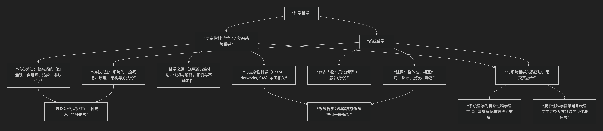

# Compare

---

**科学哲学中有关于“复杂性”的专门探讨，形成了所谓“复杂性科学哲学”或“复杂系统哲学”的分支理论；而“系统哲学”可以看作是与之密切相关、甚至在一定程度上为其提供基础或组成部分的另一个重要分支。它们之间既有联系，也有区别，共同构成了理解复杂现象的哲学基础。**

下面，我们将系统地梳理这两个概念及其关系，并尝试用图表和清晰的逻辑来展现它们的核心内容和相互关联。

---

## 一、科学哲学中的“复杂性”分支：复杂性科学哲学 / 复杂系统哲学

### 1. **定义与核心关注**

* **定义**：复杂性科学哲学是科学哲学的一个新兴分支，它聚焦于 **复杂系统（Complex Systems）** 的性质、结构、演化规律以及我们如何认识和解释这些系统。它试图从哲学层面探讨复杂性问题，为复杂性科学提供概念澄清、方法论反思和本体论基础。
* **核心关注**：
  * **什么是复杂系统？**（定义与判据）
  * **复杂性的本质是什么？**（涌现、非线性、自组织、适应等）
  * **如何认识和理解复杂系统？**（认知方法、模型、还原论与整体论的张力）
  * **复杂系统的演化机制与规律？**（动态、路径依赖、突变、混沌边缘）
  * **复杂性与科学解释、因果性、预测的关系？**
  * **人类社会、生命、意识等是否属于复杂系统，如何哲学地理解？**

### 2. **相关学科领域**

  * 与 **复杂性科学（Complexity Science）** 紧密相关，后者包括：系统动力学、混沌理论、自组织理论、网络科学、人工生命、进化计算等。
  * 涉及对 **非线性动力学、涌现现象、自组织系统、适应与演化系统** 的哲学反思。

### 3. **核心议题举例**

* **还原论 vs 整体论**：能否将复杂系统的行为还原为其组成部分的行为？整体是否具有不能从其部分预测的“涌现”特性？
*   **涌现（Emergence）**：整体展现出的新性质，不能简单地从组成部分中推导出来。
*   **自组织（Self-organization）**：系统如何在缺乏中央控制的情况下，通过内部相互作用形成有序结构。
*   **适应性（Adaptivity）与进化（Evolution）**：系统如何通过与环境的交互而改变自身，以更好地适应环境。

---

## 二、系统哲学：更基础或相关的哲学分支

### 1. **定义与核心关注**

* **定义**：系统哲学（Philosophy of Systems 或 Systems Philosophy）是一门更广泛且相对更基础的哲学分支，它将 **“系统”（System）**视为理解世界的一个基本范畴和视角，探讨**系统的一般概念、原理、结构、功能、分类及其与整体和部分的关系**。
* **核心关注**：
  * **什么是系统？**（系统的定义、边界、要素、关系、结构）
  * **系统有哪些基本类型和分类？**（如开放系统/封闭系统、简单系统/复杂系统、线性系统/非线性系统等）
  * **系统与整体论（Holism）的关系？**
  * **系统的层次性、组织性、目的性、动态性？**
  * **系统方法论（Systems Approach / Systems Thinking）：一种跨学科的、强调整体性、相互作用和反馈的认知与问题解决方法。**

### 2. **代表人物与思想**

* **Ludwig von Bertalanffy** （贝塔朗菲）：一般系统论（General System Theory）的创始人，被认为是系统哲学和实践的奠基人之一。他强调用“系统”的观点来看待自然界和人类社会中的各种现象。
* **系统论、控制论（Cybernetics）、信息论（Information Theory）** 等20世纪中叶兴起的跨学科理论，为系统哲学提供了重要的思想资源和工具。

### 3. **核心贡献**

*   提供了理解复杂现象的**系统视角和系统方法论**。
*   强调**整体不等于部分之和**，重视**要素之间的相互作用、反馈、结构和功能关系**。
*   为后来复杂性科学和复杂性科学哲学的发展，提供了重要的**概念基础和分析框架**。

---

## 三、系统哲学与复杂性科学哲学的关系

我们可以用下图来直观展现它们的核心内容与相互关系：

### 1. **联系（亲和性与交叉性）**

* **共同焦点**：两者都关注**整体性、相互作用、非线性、动态性**等核心特征，都试图超越传统的还原论分析方法。
* **系统哲学为复杂性科学哲学提供基础**：
  * 复杂性科学哲学所探讨的“复杂系统”，是 **“系统”这一范畴中更为复杂、动态、具有涌现特性的子集**。
  * 系统哲学关于**系统结构、功能、层次、整体与部分关系**的讨论，为理解复杂系统提供了**一般性的概念框架和方法论基础**。
* **共同方法论**：都倾向于采用**系统思维（Systems Thinking）**，强调整体把握、相互联系和动态过程。

### 2. **区别（侧重点与层次）**

* **系统哲学** 更 **基础、广泛和一般性**：
  * 它关注的是 **“系统”作为认识世界的一种基本视角和范畴**，适用于各种类型的系统（包括简单系统）。
  * 其核心在于提供关于**系统本质、系统思维和系统方法论**的哲学探讨。
* **复杂性科学哲学** 更 **专门、深入和特定性**：
  * 它聚焦于 **复杂系统（特别是具有涌现、自组织、适应等特性的系统）** 这一特定领域。
  * 其核心在于探讨**复杂性的本质、复杂系统的认知与解释、以及复杂性科学本身的哲学基础和含义**。
* **复杂性科学哲学可以视为系统哲学在复杂系统/复杂性问题上的深化、拓展和具体化**。

---

## 四、总结：一个互补与递进的哲学图景

| 维度                    | **系统哲学**           | **复杂性科学哲学**                                    |
| :---------------------- | :--------------------------- | :---------------------------------------------------------- |
| **核心范畴**      | 系统（一般概念）             | 复杂系统（特殊高级系统）                                    |
| **关注焦点**      | 整体性、相互作用、系统方法论 | 涌现、自组织、非线性、适应、演化                            |
| **方法论**        | 系统思维、整体论倾向         | 复杂性分析、跨学科综合、模型与仿真                          |
| **代表人物/理论** | 贝塔朗菲（一般系统论）       | 圣塔菲研究所（Santa Fe Institute）、复杂适应系统（CAS）理论 |
| **与科学的关系**  | 为跨学科系统研究提供哲学基础 | 为复杂性科学（如混沌、网络、演化计算）提供哲学反思          |
| **与对方关系**    | 提供一般系统概念与方法论基础 | 是系统哲学在复杂系统领域的深化与具体应用                    |

---

## 五、结语

综上所述：

* **科学哲学中确实存在关于“复杂性”的专门分支，即“复杂性科学哲学”或“复杂系统哲学”，它关注复杂系统的哲学问题。**
* **“系统哲学”是一个更基础、更广泛的哲学分支，它为理解各类系统（包括复杂系统）提供了一般性的概念、原理和方法论。**
* **二者关系密切，系统哲学为复杂性科学哲学提供了基础性的概念框架和方法论支撑，而复杂性科学哲学则是在系统哲学基础上，针对复杂系统这一特定领域的深化、拓展和具体化。**

将它们结合起来理解，能够为我们提供一个更为完整和深刻的 **“系统-复杂性”哲学图景**，帮助我们更好地认识和应对这个充满复杂性和不确定性的世界。这种哲学视角，对于科学研究、政策制定、社会治理乃至个人生活决策，都具有重要的启发意义。
