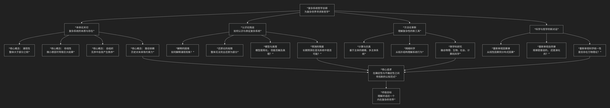

Complex Systems
================

基于复杂系统（complex systems）哲学核心思想

---------------------------------

复杂系统哲学是科学哲学中一个前沿且充满活力的分支，它专注于对“复杂系统”进行根本性的哲学反思。其核心思想可以概括为：

**一种以“复杂系统”为研究对象，旨在揭示其本质特征（如涌现、非线性、自组织），并在此基础上重新审视传统哲学范畴（如因果、还原、解释、规律、模型）的哲学探索。它试图为理解我们身处的高度互联、动态且不可预测的世界，提供一套全新的世界观和方法论。**

复杂系统哲学的核心架构与关切，可以通过下图清晰地展现：

以下，我们将沿此逻辑脉络，深入解析复杂系统哲学的核心要义。

---

一、本体论关切：复杂系统的本质是什么？

复杂系统哲学首先追问：复杂系统何以存在？其根本属性是什么？

*   **涌现**：这是复杂系统最核心、最神奇的特性。它指 **整体层面** 出现了其 **组成部分** 所不具备的新性质、新模式或新行为（例如，单个水分子没有“湿”的特性，但大量水分子聚集的液体却具有“湿润”这一涌现属性）。这直接挑战了“整体等于部分之和”的还原论观点。
*   **非线性**：系统中的因果关系不是简单的按比例增长。**微小的扰动可能通过反馈循环被急剧放大**，导致巨大的、不可预测的后果（如“蝴蝶效应”）。这动摇了基于线性因果的传统预测模型。
*   **自组织**：系统在 **没有中央控制者** 的情况下，通过组分之间的局部相互作用，自发地形成宏观的、有序的结构和行为（例如，鸟群的形成、雪花的结晶）。
*   **路径依赖**：系统的发展历史对其当前状态和未来轨迹有决定性影响。**过去的偶然事件可能被系统锁定**，从而影响长期的演化路径（如QWERTY键盘布局的延续）。

二、认识论挑战：我们如何认识复杂系统？

面对复杂系统，传统的认识方法遇到了巨大挑战。

*   **解释的困境**：如何解释“涌现”现象？用组成部分的性质来解释涌现性质，似乎是一种循环论证或解释失败。复杂系统哲学需要发展一种 **关于“涌现”本身的解释理论**。
*   **还原论的局限**：经典的还原论策略——将整体分解为部分进行研究——在复杂系统面前常常失效。因为一旦分解，组分之间的 **关键相互作用** 和 **整体涌现属性** 就消失了。这迫使人们转向 **整体论** 或 **多层级** 的解释策略。
*   **模型与真理**：由于复杂系统难以通过传统实验完全掌控，**计算建模与仿真** （如基于主体的模型）成为核心研究工具。这引发哲学思考：这些高度简化的模型能否揭示关于真实世界的真理？还是它们只是有用的“隐喻”或“工具”？
*   **预测的限度**：对混沌系统或适应性强系统的长期、精确预测在原则上是否可能？复杂系统哲学倾向于认为，预测的重点应从“精确预言”转向“**划定可能性空间**”或“**预见趋势和模式**”。

三、方法论革新：我们如何研究复杂系统？

复杂系统科学催生了新的研究方法，这些方法本身也成为了哲学反思的对象。

*   **计算与仿真**：**基于主体的建模** 等方法允许研究者从简单的规则出发，观察宏观模式的涌现，这成为探索复杂系统的主要实验室。
*   **网络科学**：将系统抽象为节点和连接的 **网络**，通过研究其拓扑结构（如度分布、聚类系数、中心性）来理解系统的稳健性、传播动力学等属性。
*   **跨学科性**：复杂系统研究本质上是跨学科的。它用一套共享的概念工具（如网络、涌现、非线性）来研究物理、生物、社会、经济等截然不同的领域，追求一种 **跨领域的统一原理**。

四、对传统哲学问题的重塑

复杂系统哲学正在重塑我们对一些经典哲学问题的看法：

*   **因果律**：传统的线性因果观被 **分布式因果、循环因果、自上而下的因果** （即整体层面的涌现属性可以约束和影响组成部分的行为）等概念所补充和挑战。
*   **自然律**：规律是否永远是普适、永恒的？或者，在复杂系统中，是否存在 **演化的、历史的、语境依赖的“律则”**？
*   **科学统一性**：复杂系统研究是更倾向于科学的统一（寻求普适的复杂系统原理），还是更强调科学的多元（不同领域的复杂系统有不可还原的特殊性）？

---

五、核心要义总结

.. list-table:: 
   :header-rows: 1
   :widths: 25 35 40
   :align: center

   * - **理论维度**
     - **核心关切**
     - **关键概念与问题**
   * - **本体论**
     - **复杂系统的根本属性是什么？**
     - **涌现、非线性、自组织、路径依赖、混沌边缘**
   * - **认识论**
     - **我们能否及如何认识和解释复杂系统？**
     - **解释涌现、还原论的局限、模型的地位、预测的限度**
   * - **方法论**
     - **我们用什么工具和方法研究复杂系统？**
     - **基于主体的建模、网络科学、计算仿真、跨学科研究**
   * - **科学哲学**
     - **复杂性如何重塑我们对科学本身的理解？**
     - **因果律、自然律、科学统一性、科学解释**

六、思想特质与意义

*   **范式转换**：它代表了一种从 **还原论、决定论、均衡论** 的传统科学范式，向 **整体论、非决定论、非均衡论** 的新范式的深刻转变。
*   **桥梁作用**：它在 **具体科学实践（如生物学、经济学、社会学）** 与 **抽象哲学思考** 之间架起了桥梁，使哲学更贴近现代科学的前沿。
*   **实践意义**：其对不确定性、非线性和涌现性的洞察，对于应对 **气候变化、金融危机、流行病传播、人工智能治理** 等全球性复杂挑战，具有至关重要的启示意义。

七、总结

总而言之，复杂系统哲学的核心思想在于，它是一位 **“谦逊的观察者”和“新范式的构建者”** 。它教导我们，**我们必须放弃牛顿式宇宙观中那种拉普拉斯妖式的、完全预测和控制世界的幻想，转而学会欣赏、理解并适应一个内在复杂的、充满涌现性和不确定性的世界。真正的智慧不在于简化复杂，而在于学会与复杂共舞。**

它的全部工作是对 **经典科学哲学根基** 的一次系统性审视与革新。在21世纪，当我们面临的重大问题日益呈现出复杂的、网络的、全球性的特征时，复杂系统哲学为我们提供了一套不可或缺的思维工具和哲学基础，帮助我们更清醒、更谦逊、也更有效地思考这个世界。

------------

 .. toctree::
    :maxdepth: 3

    grok
    copilot
    chatgpt
    deepseek
    gemini
    qwen

---------------------------

[:doc:`“系统哲学”与“复杂系统哲学” </chats/outlaw/analyse/foreign/branch/science/complex/compare>`]

---------------------------

Video Overview

-------------------

01. `Trial by Science <https://youtu.be/8NkvmL8u4lw>`_

02. `Complex Systems vs Linear Law <https://youtu.be/gcm428o8M-U>`_

03. `The Friction of Paradigms: Judging Complexity <https://youtu.be/azED7bdFr1w>`_

04. `The Civilizational Fault Line: A Complex Systems Critique <https://youtu.be/-OInZp2C9WU>`_

05. `科学之盾：基于复杂系统理论的寻衅滋事案件剖析 <https://youtu.be/-vqlYL5_H1M>`_

06. `机械法理学与复杂网络的范式碰撞 <https://youtu.be/ubfcH0IMLuo>`_

07. `范式冲突：物理、法律与网络剖析 <https://youtu.be/1r9hazJlU0w>`_

08. `转发的物理学与法律的碰撞 <https://youtu.be/76QeBBd1ueo>`_
