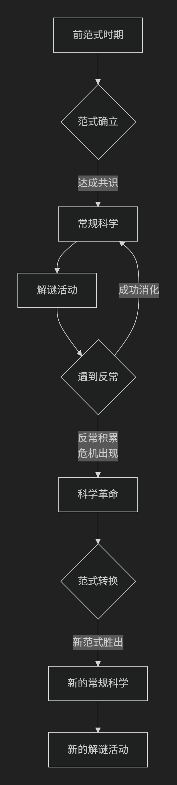

Thomas Kuhn
=========

基于托马斯·库恩（Thomas Kuhn）科学哲学核心思想对陈京元博士案件进行评价。

----------------

托马斯·库恩是20世纪最具影响力的科学哲学家之一，他的思想彻底改变了我们看待科学及其进步的方式。他的核心思想可以概括为：**科学的发展并非通过知识的线性积累，而是通过“范式转换”实现的“科学革命”；在常态时期，科学家在既定“范式”下解谜，而当反常积累到一定程度时，则会发生颠覆性的革命，新旧范式之间甚至“不可通约”。**

库恩在1962年出版的《科学革命的结构》中提出了这一革命性理论，其核心框架可以通过下图清晰地展示：

一、核心概念：范式与科学共同体

这是库恩理论的基础。他提出了一个核心概念——**范式**。

*   **范式**：一个科学共同体（如物理学家、化学家）在特定时期内共同接受的 **理论假设、研究方法、价值标准、实验范例的总和**。它提供了一个框架，告诉科学家世界由什么实体构成、这些实体如何相互作用、哪些问题是值得研究的以及如何解决这些问题。

    *   **例子**：牛顿的力学体系、拉瓦锡的氧化理论、爱因斯坦的相对论都曾是主导性的范式。

*   **科学共同体**：由接受并实践同一范式的科学家组成的群体。他们是科学活动的主体。

二、科学发展的动态模式：常规科学与科学革命

库恩认为，科学史并非平稳的积累过程，而是 **常规科学** 与 **科学革命** 交替出现的动态过程（如上图所示）。

1.  **前范式时期**：某一领域没有统一范式，各种理论相互竞争。

2.  **常规科学**（上图中蓝色部分）：范式确立后，科学家们在范式的框架内进行工作。他们的任务不是做出惊天动地的发现，而是像 **解谜** 一样，解决范式所提出的难题，扩展范式的应用范围，使其更加精确。这个阶段是 **积累性和稳定** 的。

3.  **反常与危机**：在解谜过程中，科学家总会遇到一些用现有范式无法解释的现象，这就是 **反常**。起初，反常会被忽略或被视为可解决的问题。但当反常越来越多、越来越严重，甚至动摇了范式的核心时，就引发了 **危机**。

4.  **科学革命**（上图中红色部分）：危机导致旧范式松动，新的竞争性理论出现。最终，科学共同体放弃旧范式，接受一个全新的、能更好地解释反常并开辟新领域的新范式。这个过程就是 **科学革命**。它不是温和的修正，而是 **世界观的彻底转变**。

    *   **经典案例**：从地心说到日心说，从牛顿力学到爱因斯坦相对论。

三、革命性影响：范式之间“不可通约”

这是库恩思想中最具争议也最深刻的部分。

*   **不可通约性**：新旧范式之间不是谁比谁更正确的关系，而是像 **不同世界** 之间的关系。它们之间存在三大不可通约性：

    1.  **标准不可通约**：评判理论好坏的标准不同（如牛顿范式重视预测，爱因斯坦范式重视内在一致性）。

    2.  **概念网络不可通约**：基本概念的含义彻底改变（如“质量”在牛顿力学中是常量，在相对论中随速度变化）。

    3.  **世界观的不可通约**：科学家在不同范式下 **“看到”的是不同的世界**。支持地心说和日心说的人仰望星空时，感知到的宇宙秩序是完全不同的。

*   **意义**：这意味着科学进步 **不是通向真理的直线**，而更像是 **进化论**，是从一个范式生态位到另一个更适应解决新问题的范式生态位的转换。

四、对传统科学观的挑战

库恩的理论对两种传统科学观构成了根本性挑战：

*   **挑战证伪主义**（波普尔）：波普尔认为科学通过“猜想与反驳”前进，一次证伪就可推翻理论。库恩指出，在常规科学阶段，科学家 **不会因个别反常就放弃范式**，而是致力于消化反常。

*   **挑战积累主义**：传统的观点认为科学是知识不断积累、真理大厦越建越高的过程。库恩则认为，科学革命是 **推倒重来**，新旧范式是断裂的，而非连续的积累。

---

核心要义总结

.. list-table:: 
   :header-rows: 1
   :widths: 25 45 30
   :align: center

   * - **理论维度**
     - **核心命题**
     - **关键概念与贡献**
   * - **科学结构**
     - **科学由"范式"所组织**，范式为科学共同体提供研究框架。
     - **范式、科学共同体、解谜**
   * - **发展模式**
     - **科学发展是"常规科学"与"科学革命"的交替循环**，而非线性积累。
     - **常规科学、反常、危机、科学革命**
   * - **革命本质**
     - **科学革命是"范式转换"**，新旧范式之间存在"不可通约性"。
     - **范式转换、不可通约性、世界观转变**
   * - **影响**
     - **挑战了科学的积累观和朴素的证伪观**，引入历史和社会学视角。
     - **历史主义、对理性主义的挑战**

影响与争议

库恩的思想影响巨大且深远：

*   **开创科学哲学的历史主义转向**：将科学史研究带入哲学核心。

*   **影响广泛**：其思想深刻影响了社会学、语言学、文化研究等领域。

*   **引发争议**：批评者认为其理论有 **相对主义** 倾向，削弱了科学的客观性和进步性。

总而言之，托马斯·库恩的核心思想在于，他进行了一场 **科学观的“范式革命”**。他教导我们，科学并非冷酷理性的直线前进，而是一项 **充满人性色彩的历史性、社会性活动**。科学家不是真理的被动发现者，而是活跃在特定范式世界中的“解谜者”，而科学进步的图景，也因此是一幅由 **常规积累与革命性断裂** 共同绘制的、远比我们想象中复杂的画卷。

-------------------

 .. toctree::
    :maxdepth: 3

    grok
    gemini
    copilot
    deepseek
    qwen

