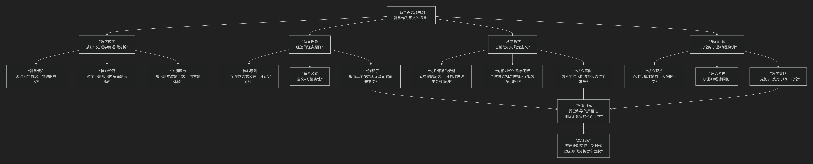

Moritz Schlick
=====================

基于维也纳学派创始人、分析哲学的重要先驱莫里茨·石里克（Moritz Schlick）的核心思想

----------------------------------------------------------------------------

莫里茨·石里克是二十世纪哲学史上一位里程碑式的人物。作为 **维也纳学派** 的创始人和领袖，他是 **逻辑实证主义** 运动的核心推动者。他的核心思想可以概括为：**一种致力于通过现代逻辑工具和实证科学精神来澄清哲学基础、划清科学与形而上学界限的激进哲学方案。其根本目标是终结哲学史上无休止的形而上学争论，将哲学从“思辨体系”转变为“追寻意义”的科学活动。**

石里克的思想深刻而精密，其核心体系与演进可以通过下图清晰地展现：

以下，我们将沿此逻辑脉络，深入解析石里克的核心要义。

一、哲学的革命：哲学是意义的追寻

石里克带来了一场哲学范式的根本性转变。

*   **哲学的新使命**：受维特根斯坦《逻辑哲学论》启发，石里克认为，哲学的根本任务不再是构建关于世界的宏大理论体系，而是 **“澄清命题的意义”**。

*   **著名论断**：**“哲学不是一门科学，即不是一个知识体系，而是一种活动。”** 这种活动就是 **逻辑分析** 活动，即运用现代逻辑工具分析科学概念和命题，使其含义清晰明确。

*   **关键区分**：他严格区分了 **“知识的本质”** 和 **“体验的本质”**。科学提供关于世界的 **形式结构** 知识，而世界的 **内容** （如“红”的感觉、疼痛的体验）是私人的、不可言传的，只能被体验。哲学关心的是前者。

二、意义的基石：经验的证实原则

这是石里克和维也纳学派最著名的学说，是判断一个陈述是否有认知意义的标尺。

*   **核心原则**：**“一个命题的意义就在于它的证实方法。”** 一个陈述如果要有意义，我们必须能够说出在何种可能的经验条件下，这个陈述会被证实为真或证伪为假。

*   **著名公式**：**意义 = 可证实性**。无法被经验证实或证伪的句子，即便在语法上正确，也缺乏认知意义。

*   **批判的矛头**：这一原则直指传统 **形而上学** 的命题（如“世界是绝对精神的显现”、“物自体不可知”）。石里克认为，这些命题无法被经验检验，因此是 **无意义的伪命题**，它们可能表达了一种人生态度或情感，但不传递任何知识。

三、科学哲学的奠基：对几何学与相对论的哲学阐释

石里克是一位精通物理学的哲学家，他对现代科学的哲学基础进行了卓越分析。

*   **对几何学的分析**：他区分了 **直观几何学** （关于空间的感性经验）、**纯粹几何学** （一个先天的逻辑系统，其公理是“隐定义”）和**物理几何学**（应用于现实世界的几何学）。他指出，欧几里得几何和非欧几何在逻辑上同样正确，选择哪种几何学来描述物理空间，是一个 **经验问题和约定问题**。这体现了他的 **约定主义** 思想。

*   **对相对论的阐释**：他深刻指出，爱因斯坦相对论的成功，正在于它澄清了“同时性”等基本概念的 **操作定义** （即如何通过光信号来测量同时性），从而揭示了这些概念的意义依赖于具体的证实方法。这为他的证实原则提供了强大的科学支持。

四、身心问题：心理-物理协同论

在心灵哲学上，石里克提出了一种温和的一元论方案。

*   **核心观点**：他反对心物二元论，认为“心理的”和“物理的”不是两种不同的实体，而是 **对同一实在的两种不同描述方式**。

*   **心理-物理协同论**：每一个心理事件都严格对应一个物理事件（特别是大脑中的生理过程）。它们不是因果关联，而是 **同一件事物的两个方面**，就像同一个数学函数可以用不同的坐标系来表示一样。这本质上是一种 **一元论**。

五、核心要义总结

.. list-table:: 
   :header-rows: 1
   :widths: 25 45 30
   :align: center

   * - **理论维度**
     - **核心命题**
     - **关键概念与贡献**
   * - **哲学观**
     - **哲学是澄清命题意义的逻辑分析活动，而非构建知识体系。**
     - **哲学作为活动、逻辑分析、意义的追寻**
   * - **意义理论**
     - **一个命题的意义在于其经验证实的方法。**
     - **证实原则、可证实性、反形而上学**
   * - **科学哲学**
     - **科学概念的意义源于其操作定义，科学理论包含约定成分。**
     - **约定主义、隐定义、对相对论的哲学阐释**
   * - **心灵哲学**
     - **心理事件与物理事件是同一实在的两种描述。**
     - **身心同一论、心理-物理协同论**

六、思想特质与历史影响

*   **清晰性与严格性**：石里克追求哲学的极致清晰和逻辑严谨，其文风明晰，论证有力。

*   **维也纳学派的灵魂**：他以其个人魅力和学术深度，将维也纳学派凝聚成一个富有创造力的思想团体，吸引了卡尔纳普、纽拉特等一大批杰出学者。

*   **深远影响与争议**：

    *   其证实原则本身也遭到了质疑（如“证实原则本身如何被证实？”），但它极大地推动了语言哲学和科学哲学的发展。

    *   他对形而上学的激进批判虽然后来被软化，但永久性地改变了哲学讨论的方式，迫使形而上学必须更严谨地对待语言和意义问题。

*   **悲剧结局**：石里克于1936年被一名精神错乱的学生刺杀，他的逝世也象征了维也纳学派在欧洲的终结。

七、总结

总而言之，石里克的核心思想在于，他是一位 **“哲学的科学家”和“意义的清道夫”** 。他教导我们，**真正的哲学进步不在于给出更多的答案，而在于提出更清晰、更有意义的问题。在思想能够正确地探索世界之前，必须首先澄清思想自身的语言和逻辑工具。**

他的全部工作是对 **哲学自身性质** 的一次彻底反思和改造。在一个科学迅猛发展的时代，他力图让哲学摆脱玄思的桎梏，使其成为一种能够与科学并肩前行、为其奠定坚实概念基础的严格学科。尽管逻辑实证主义的许多强硬纲领后来被修正，但石里克所开启的“分析转向”和对意义的执着追寻，已经深深地刻入了现代哲学的基因之中。在这个意义上，他不仅是维也纳学派的创始人，更是整个分析哲学传统的奠基之父之一。

------------

 .. toctree::
    :maxdepth: 3

    grok
    gemini
    copilot
    chatgpt
    deepseek
    qwen
