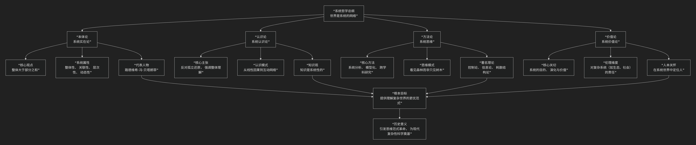

Systems Philos
===============

基于系统哲学（Systems Philosophy）的核心思想

---------------------------------

系统哲学是一门深刻且影响深远的现代哲学思潮。它可以被简要而核心地概括为：

**一种将“系统”作为核心范畴来理解世界的哲学。它认为，宇宙万物皆可被视为由相互关联的元素组成的、具有整体性的“系统”。其核心任务是阐明系统的普遍特征、规律及与之相关的认识论与方法论，以此取代传统的、机械的还原论思维模式。**

为了更清晰地把握系统哲学的全貌，其核心架构与历史演进可以通过下图清晰地展现：

以下，我们将沿此逻辑脉络，深入解析系统哲学的核心要义。

---

一、本体论：世界是系统的网络

系统哲学对本源问题的回答是：**“系统”是物质存在的基本方式。**

*   **核心命题**：**“整体大于部分之和”**。这是系统哲学最著名的论断。它表明，当要素以特定方式组织成一个系统时，会 **涌现** 出各个孤立要素所不具备的新属性、新功能和新规律。

*   **系统的核心属性**：

    1.  **整体性**：系统是一个不可分割的统一整体，任何部分脱离整体都会失去其在系统中的意义和功能。

    2.  **关联性**：系统内各要素之间、系统与环境之间存在着复杂的、非线性的相互作用和信息反馈。

    3.  **层次性**：系统由子系统构成，同时又是更大系统的组成部分，宇宙由此形成一个嵌套的、有层次的系统网络。

    4.  **动态性**：系统是活的、动态的，它处于不断的演化、适应和自我调整的过程中。

    5.  **目的性**：系统行为往往趋向于某个目标或稳定状态（如维持内环境稳定的“稳态”）。

*   **代表人物与奠基**：**路德维希·冯·贝塔朗菲** 是现代系统哲学的奠基人，他创立的 **“一般系统论”** 旨在发现适用于各种类型系统的一般原理和规律。

二、认识论：如何认识系统？

系统哲学对“我们如何认识世界”这一问题给出了全新的答案。

*   **核心主张**：**反对孤立的、静态的还原论**。传统的还原论将事物不断分解为最基本的部分，认为理解了部分就自然能理解整体。系统哲学则认为，必须 **从事物的整体、关联、动态和演化的角度来认识它**。

*   **认识模式的转变**：

    *   **从线性因果到互动网络**：不再仅仅追寻A导致B的简单线性因果关系，而是分析系统内多要素之间错综复杂的 **互动反馈回路**。

    *   **从实体中心到关系中心**：关注的重点从“它是什么”的实体，转向 **“它如何与其他事物相关联”** 的关系。

*   **知识观**：真正的知识是关于 **系统的结构、功能、演化及其与环境关系** 的知识，是整体性的、语境化的。

三、方法论：系统思维与系统分析

系统哲学不仅是一种世界观，更是一套强大的方法论工具。

*   **核心方法**：**系统思维** 和 **系统分析**。

    *   **系统思维**：一种 **看见森林而非只见树木** 的思维方式。它要求我们始终将研究对象置于更大的背景和更长的时空尺度中，考察其整体行为模式和长期演化趋势。

    *   **系统分析**：运用建模、仿真等工具，对系统的结构、功能进行定性和定量分析，以理解其运行机制并预测其行为。

*   **跨学科性**：系统哲学天然地倡导 **跨学科研究**。因为现实问题（如气候变化、城市交通、公共卫生）都是复杂的系统性问题，需要整合生态学、经济学、社会学、计算机科学等多学科知识。

*   **相关理论**：控制论（研究系统的控制与通信）、信息论、耗散结构理论（系统在远离平衡态时如何通过耗散能量维持有序结构）等，都是系统方法论的重要分支。

四、价值论：系统的目的与人的责任

系统哲学也探讨价值、伦理和人的意义。

*   **核心关切**：系统是否有其内在的“价值”或“目的”？人类在复杂的系统网络中处于何种位置？应承担何种责任？
*   **伦理维度**：当我们认识到人类社会、全球经济、生态系统都是一个巨大的、相互关联的复杂系统时，我们就必须对自身行为可能引发的 **系统性后果** （如生态破坏、金融危机）承担道德责任。这催生了 **生态伦理、全球伦理** 等新的伦理思考。
*   **人的定位**：人既是无数子系统（如身体、家庭、组织）构成的复杂系统，同时也是更大系统（如社会、生物圈）的组成部分。人的自由和价值需要在系统的约束和可能性中实现。

---

五、核心要义总结

.. list-table:: 
   :header-rows: 1
   :widths: 25 45 30
   :align: center

   * - **理论维度**
     - **核心命题**
     - **关键概念与贡献**
   * - **本体论**
     - **"整体大于部分之和"：系统是现实的基本存在方式。**
     - **系统、整体性、涌现、层次性、动态性**
   * - **认识论**
     - **反对还原论，强调整体性、关联性的认识路径。**
     - **系统思维、互动网络、关系优先**
   * - **方法论**
     - **提供"系统分析"与"系统思维"等理解复杂性的工具。**
     - **建模、仿真、跨学科、控制论**
   * - **价值论**
     - **探讨系统目的、演化及人在系统中的责任。**
     - **系统价值、生态伦理、全球责任**

六、思想特质与历史影响

*   **思维范式的革命**：系统哲学引发了从 **机械论世界观** 到 **有机体世界观** 的根本性转变，是20世纪最重要的思想革命之一。
*   **复杂性科学的哲学基础**：它为后来兴起的 **复杂性科学** （如混沌理论、网络科学、复杂适应系统理论）提供了重要的哲学预备和概念框架。
*   **广泛的应用**：其思想和方法已渗透到生物学、心理学、管理学、社会学、生态学、计算机科学等几乎所有现代学科领域，成为解决复杂问题的关键方法论。

七、总结

总而言之，系统哲学的核心思想在于，它是一位 **“整体性的透视者”和“关联性的思考者”** 。它教导我们，**要理解任何重要的事物，无论是一个细胞、一个城市还是一种经济现象，都不能将其从它所嵌入的复杂网络中剥离出来进行孤立研究，而必须审视其内部各组成部分之间以及它与环境之间的动态互动关系，从而在整体上把握其运行规律和演化方向。**

它的全部工作是对 **自笛卡尔、牛顿以来主导西方思想的还原论、机械论范式** 的一次深刻反思与超越。在人类面临的问题日益复杂化、全球化的今天，系统哲学为我们提供了一种更为有效、也更为负责任的认知世界的“新透镜”。在这个意义上，系统哲学不仅是哲学，更是一种应对现代性挑战的智慧。

------------

 .. toctree::
    :maxdepth: 3

    grok
    copilot
    chatgpt
    deepseek
    gemini
    qwen

---------------------------

[:doc:`“系统哲学”与“复杂系统哲学” </chats/outlaw/analyse/foreign/branch/science/complex/compare>`]
[:doc:`“系统哲学”与“结构主义哲学” </chats/outlaw/analyse/foreign/branch/science/system/structure>`]
[:doc:`中国哲学中对系统思想的探索 </chats/outlaw/analyse/foreign/branch/science/system/chinese>`]

---------------------------

Video Overview

-------------------

- `Trial by Science <https://youtu.be/8NkvmL8u4lw>`_
- `Complex Systems vs Linear Law <https://youtu.be/gcm428o8M-U>`_
- `The Friction of Paradigms: Judging Complexity <https://youtu.be/azED7bdFr1w>`_
- `The Civilizational Fault Line: A Complex Systems Critique <https://youtu.be/-OInZp2C9WU>`_
- `当科学遇见法律：复杂网络下的因果法则与正义涌现 <https://youtu.be/A0v4Uat8CwM>`_
- `科学之盾：基于复杂系统理论的寻衅滋事案件剖析 <https://youtu.be/-vqlYL5_H1M>`_
- `机械法理学与复杂网络的范式碰撞 <https://youtu.be/ubfcH0IMLuo>`_
- `范式冲突：物理、法律与网络剖析 <https://youtu.be/1r9hazJlU0w>`_
- `转发的物理学与法律的碰撞 <https://youtu.be/76QeBBd1ueo>`_
