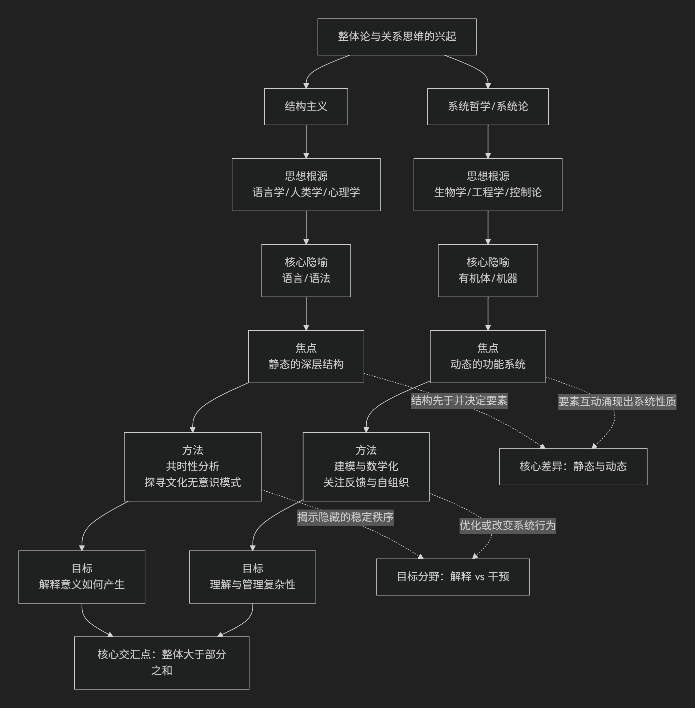

# 比较哲学

## “系统哲学”与“结构主义哲学”

---

结构主义和系统哲学的关系，可以概括为：**两者是20世纪中叶几乎同时兴起、共享“整体论”和“关系思维”内核的思想双子星，但它们在起源、焦点和方法论上存在关键分野，最终走向了不同的道路。**

它们共同反对当时主流的“原子论”和“机械还原论”，但提出了不同的替代方案。

下图从多个维度概括了两者的关系与差异：

### 核心共同点：整体论与关系思维

1. **整体先于部分**：两者都认为，不能通过孤立地研究组成部分来理解整体。整体的属性（无论是语言的意义、社会的功能，还是一个生态系统的平衡）源自组成部分之间的**关系**和**组织方式**。
2. **关注关系与网络**：都将研究对象视为一个由相互关联的要素构成的网络或系统。要素本身由其在网络中的位置和与其他要素的关系所定义。
3. **反对线性因果，强调相互依存**：认为因果关系更多是网络中的循环、互动与反馈，而非简单的A→B。

### 关键差异：从静态“结构”到动态“系统”

尽管共享基础，它们的走向截然不同，具体差异如下：

| 维度                 | **结构主义**                                                                                                   | **系统哲学 / 系统论**                                                                                            |
| :------------------- | :------------------------------------------------------------------------------------------------------------------- | :--------------------------------------------------------------------------------------------------------------------- |
| **思想根源**   | 语言学（索绪尔）、人类学、心理学                                                                                     | 生物学（贝塔朗菲）、工程学、控制论、信息论                                                                             |
| **核心隐喻**   | **语言、语法**                                                                                                 | **有机体、机器、生态系统**                                                                                       |
| **焦点**       | **静态的、共时的深层结构**。探寻隐藏的、无意识的、 稳定的规则模式，这些模式**生成**了表面现象。     | **动态的、历时的功能系统**。 关注系统如何通过输入、输出、反馈、自组织来**维持、适应和演化**。         |
| **时间性**     | 强调 **“共时性”** ，将系统视为在特定时间切片上的稳定关系架构。 历史变化是次要的，或是不同结构间的切换。 | 强调**“历时性”** ，时间、过程、变化、演化是核心关切。 系统是动态平衡的。                                  |
| **核心概念**   | 能指/所指、二元对立、转换规则、深层结构/表层结构                                                                     | 输入/输出、反馈（正/负）、熵/负熵、自组织、涌现、边界、控制论                                                          |
| **方法倾向**   | **定性分析、阐释学**。通过符号学、语言学方法解读文化文本， 寻找其底层的“语法”。                         | **跨学科、建模、数学化**。 试图用数学模型、图表、计算机模拟来描述系统行为，追求可操作的理论。               |
| **目标**       | **解释意义如何产生**。 理解文化、语言、心理现象背后的**不变秩序**。                                 | **理解并管理复杂性**。解决现实世界的复杂问题 （工程、管理、生态、社会政策），**优化或改变系统行为**。 |
| **对人的看法** | 人由**结构决定**。主体是文化、语言、心理结构的承载者 或“场所”，其意识被深层结构塑造。                   | 人是**复杂适应系统**。人是具有能动性的、能与环境互动的反馈系统， 是更大社会、生态系统的一部分。             |
| **代表性人物** | 索绪尔、列维-斯特劳斯、拉康、阿尔都塞                                                                                | 路德维希·冯·贝塔朗菲、诺伯特·维纳、 格雷戈里·贝特森、斯塔福德·比尔                                           |

### 关系演变与思想史定位

1. **并行发展与相互影响**：它们在20世纪40-60年代几乎同时达到鼎盛，都代表了当时的科学精神向人文社科领域的渗透。系统论的控制论思想曾间接影响了一些结构主义者（如拉康对交流模式的兴趣）。
2. **结构主义是系统哲学的“人文近亲”**：系统哲学更“硬”，更具科学和工程色彩；结构主义更“软”，更具人文和阐释色彩。可以说，结构主义是**系统思维在人文领域的一种特殊表现形式**，但因其固守“静态结构”和“决定论”而有所局限。
3. **后结构主义对两者的超越**：正是由于结构主义对**稳定、封闭、决定论结构**的强调，催生了其对立面——**后结构主义**（德里达、福柯、德勒兹）。后结构主义批判结构的封闭性，强调差异、流变、开放和权力的生产性。有趣的是，**后结构主义在很多方面反而更接近系统哲学**，尤其是复杂系统理论（如德勒兹的“块茎”思想与网络、自组织概念高度共鸣）。系统哲学天然地接纳动态、开放和非平衡。

### 总结

**结构主义与系统哲学是整体论家族中的一对兄弟：**

* **结构主义** 像是这个家族中**研究“解剖学”和“语法”的学者**。它拿起一个文化对象（如神话、亲属关系），像解剖一具静止的标本或分析一句凝固的句子一样，寻找其内部稳定的关系骨架。它追问：“是哪些隐秘的规则，使得这个意义得以可能？”
* **系统哲学/系统论** 则像是这个家族中**研究“生理学”和“生态学”的工程师**。它观察一个活生生的有机体、一个城市或一个市场，关注其如何消化、呼吸、反馈、适应和演化。它追问：“这个系统如何运作、维持并适应变化？我能否影响它的过程？”

简而言之，**结构主义揭示了文化的“静态解剖结构”，而系统哲学提供了理解世界“动态生理过程”的框架。** 前者最终导向了对深层秩序的阐释，后者则导向了对复杂性的管理与塑造。理解它们的异同，是理解二十世纪思想从“实体思维”转向“关系思维”这一伟大革命的关键。

---------------------------------

## 系统哲学（系统论）的对立面

**与系统哲学（系统论）构成最直接、最深刻对立的，是那些强调个体性、偶然性、不可化约性、解构与差异的哲学流派。**

我们可以从以下几个层面来理解这种对立：

### 核心对立面：对“系统”本身的反叛

系统哲学的核心是**整体论、关系网络、稳定秩序、功能与模型化**。与它构成张力的哲学，则从不同角度挑战这些核心理念：

1.  **存在主义与现象学（尤其是其强调个体的一面）**
    *   **对立点**：**系统 vs. 个体存在**。
    *   系统哲学将个体视为更大系统中的一个节点或功能组件，其意义由在系统中的位置和关系决定。**存在主义**则高扬个体的绝对独特性、自由、选择与责任，认为“存在先于本质”，反对将人还原为任何系统（无论是社会系统、生物系统还是概念系统）的预定产物。**现象学**则强调回到“事物本身”和个体的“生活世界”，反对用任何先验的、抽象的系统框架来覆盖直接的经验。

2.  **后结构主义 / 解构主义**
    *   **对立点**：**稳定的结构 vs. 流动的差异**。
    *   这是**最激进、最根本的对立**。系统论追求发现或建构一个可描述、可预测的稳定秩序。而后结构主义思想家（如德里达、福柯、德勒兹与加塔利）则认为：
        *   **德里达**：系统总有“裂缝”，意义在“延异”中无限延后，不存在封闭、自足的系统。
        *   **德勒兹**：反对层级化、中心化的“树状”系统模型，推崇开放、去中心化、动态连接的“块茎”模型。他们强调生成、流变、去疆域化，与系统论对平衡、稳态、边界和控制的研究目标背道而驰。

3.  **实用主义（特别是其激进经验主义版本）**
    *   **对立点**：**抽象模型 vs. 具体情境**。
    *   系统哲学倾向于建立普遍化的模型。实用主义（如威廉·詹姆斯、约翰·杜威）则怀疑宏大抽象的系统，强调知识源于具体的、流动的经验和实践情境，真理是在特定情境中“行得通”的东西，反对用固定的系统框架切割丰富的现实。

4. **方法论个人主义与原子论**
    *   **对立点**：**整体优先 vs. 个体优先**。
    *   这是社会科学哲学中的直接对立。系统哲学认为整体性质不能还原为个体之和。而**方法论个人主义**（如波普尔、哈耶克的部分思想）认为，社会现象必须最终通过对个体行为、信念和选择的分析来解释，反对将“社会系统”等整体作为实在的分析单位。

### 总结：一幅思想光谱

我们可以这样勾勒这幅对立图景：

- **系统哲学（系统论）阵营**：强调整体、关系、稳定、秩序、模型、控制、功能、等级（结构）。
- **反系统 / 后系统哲学阵营**：强调个体、存在、自由、差异、流变、解构、情境、去中心化。

**真正的张力在于：** 是将世界看作一个**可被认知、描述、甚至管理的、由相互关联部分构成的有机整体（系统观）**，还是看作一个**由独一無二的个体、不可化约的事件、永远延异的意义和永恒的生成变化所构成的、无法被任何总体性框架捕捉的开放场域（后结构主义/存在主义观）**。

所以，与系统哲学相对立的，并非某个特定的政治学说，而是现代哲学中那股**怀疑总体性、反抗体系化、捍卫偶然性与个体性**的强劲思想脉络。