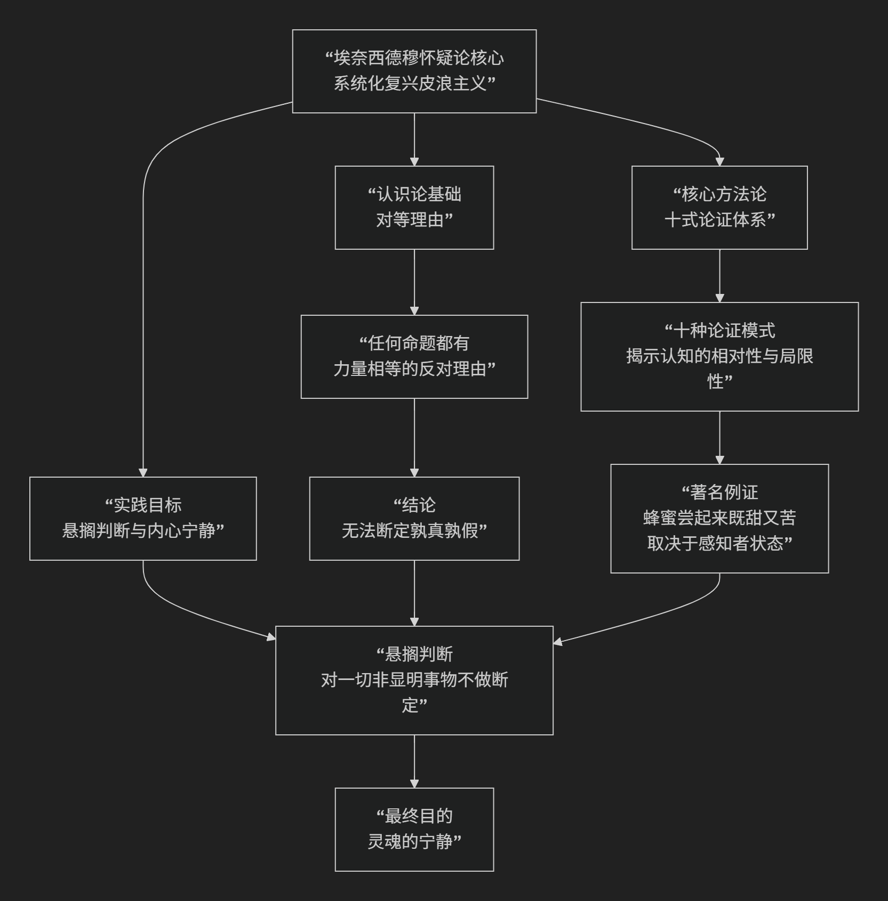

Aenesidemus
================

基于埃奈西德穆（Aenesidemus，复兴皮浪怀疑主义的关键人物）的哲学核心思想

----------------------------------------------------------------------------

埃奈西德穆是公元前1世纪人，是复兴皮浪派怀疑论的关键人物。他的核心思想可以概括为：**系统化地复兴和捍卫皮浪的怀疑论立场，通过提出著名的“十式”论证，旨在证明任何独断论（无论是独断的肯定还是否定）都是站不住脚的，从而引导人们“悬搁判断”，达到内心宁静的境界。**

他的哲学体系精妙而富有实践性，其核心思想可以通过下图清晰地展现其论证结构与目标：

以下，我们将沿此逻辑脉络，深入解析埃奈西德穆哲学的核心要义。

一、哲学目标：复兴皮浪与反对独断论

埃奈西德穆活跃在一个哲学纷争的时代，斯多葛学派、伊壁鸠鲁学派等“独断论”哲学各执一词。他认为，这些学派都武断地声称自己掌握了真理，但他们的理论充满矛盾，无法证实。

*   **独断论**：指那些声称发现了真理，并对此持有肯定或否定信念的哲学体系。
*   **埃奈西德穆的使命**：他旨在证明，所有独断论的主张都是 **无法得到确证** 的。他回归皮浪的怀疑论，不是为了否定世界，而是为了表明我们 **无法认识世界的真实本性**。

二、核心方法论：“十式”——导致“悬搁判断”的十大论证模式

这是埃奈西德穆最著名的贡献，他系统总结了十种论证方式，用以说明为何我们必须“悬搁判断”。

**“悬搁判断”** 是怀疑论的核心概念，指 **停止对非显明之事做出“真”或“假”的判断**，因为支持和反对的理由同样有力。

以下是“十式”的精要，它们共同揭示了 **认知的相对性**：

1.  **不同生物的感知差异**：不同动物（人、狗、鹰）的感官结构不同，对同一对象的感知也不同（如毒药对人致命，对某些动物无害）。我们无法确定哪种感知是“真实”的。
2.  **不同个体的感知差异**：不同的人对同一事物有不同感受（有人爱吃菠菜，有人讨厌）。谁对谁错？
3.  **不同感官通道的差异**：同一对象，看起来是光滑的，摸起来可能粗糙。哪种感觉更真实？
4.  **感知者自身状态的差异**：健康与生病、清醒与醉酒、喜怒哀乐时，对同一事物的感知截然不同（病人觉蜜苦，健康人觉蜜甜）。
5.  **位置、距离和情境的差异**：远看山小，近看山大；鸽子脖子颜色随光线变化。对象呈现为何，取决于观察条件。
6.  **媒介的混合效应**：空气、水分等介质会改变我们对对象的感知（桨在水中看起来是弯的）。
7.  **对象的结构和成分的差异**：同一对象（如花岗岩）由不同成分构成，我们感知到的是整体，而非其真实部分。
8.  **相对性**：万物都是相对的，总是相对于感知者和条件而显现。我们无法认识事物“自身”是怎样的。
9.  **常见与罕见的影响**：常见之事觉得平淡，罕见之事觉得惊奇，这影响我们的判断。
10. **习惯、法律和神话信仰的差异**：不同文化有不同习俗和信仰，没有绝对标准判断其对错。

**“十式”的核心逻辑**：所有这些模式都论证了，我们 **永远无法将事物的“显现”与其“真实本性”分离开来**。我们的认识永远被主观的、相对的条件所中介。因此，对事物本质做出任何独断的声称都是武断的。

三、实践目标：悬搁判断带来内心宁静

怀疑论并非为怀疑而怀疑，它有其积极的伦理目标——**内心宁静**。

*   **论证链条**：

    1.  独断论者执着于某种“真理”，并为之争论、焦虑。

    2.  怀疑论者运用“十式”发现，**任何命题都有对等的反对理由**，无法断定孰是孰非。

    3.  于是，他们 **停止了对非显明之事的判断**。

    4.  随着悬搁判断，**灵魂关于这些问题的困扰和纷争便随之停止**，从而达到了 **宁静** 的境界。

*   **著名比喻**：皮浪派怀疑论者说，画家阿佩莱斯想画海沫，屡试不成，怒将海绵掷向画板，结果海绵留下的痕迹完美呈现了海沫的效果。同样，怀疑论者追求宁静而不得，却在 **放弃追求（悬搁判断）后意外获得了它**。

四、针对因果概念的批判

埃奈西德穆还进一步批判了独断论哲学（尤其是斯多葛学派）的核心概念——**因果关系**。

*   **核心论点**：原因和结果是 **相对** 的概念。一个事件不能同时是自身的原因和结果。
*   **批判**：如果原因先于结果，那么当原因存在时，结果尚不存在；当结果存在时，原因已不复存在。**原因和结果永远无法同时共存**，那么它们如何能发生相互作用？所谓“原因产生结果”的关系就无法被观察到，也无法被理解。
*   **意义**：这动摇了独断论哲学试图用因果律来解释世界的基础。

五、核心要义总结

.. list-table:: 
   :header-rows: 1
   :widths: 25 45 30
   :align: center

   * - **理论维度**
     - **核心命题**
     - **关键概念与贡献**
   * - **哲学立场**
     - **复兴皮浪怀疑论，系统化地反对一切独断论。**
     - **怀疑论、反独断论、皮浪主义复兴**
   * - **认识论方法论**
     - **提出"十式"论证，揭示认知的相对性，导致"悬搁判断"。**
     - **十式、悬搁判断、对等理由、认知相对性**
   * - **伦理学目标**
     - **"悬搁判断"是达到"内心宁静"的途径。**
     - **内心宁静、不动心、实践目标**
   * - **形而上学批判**
     - **批判因果关系等核心独断论概念，揭示其逻辑困难。**
     - **因果批判、相对性**

思想特质与影响

*   **系统性**：埃奈西德穆将早期怀疑论的零散批评系统化为一个强有力的、多角度的论证体系（“十式”）。
*   **治疗性**：他的哲学具有强烈的治疗目的，旨在通过逻辑论证来消除人们因独断信念而产生的精神痛苦。
*   **深远影响**：他的工作为后来的怀疑论者（如塞克斯都·恩披里柯）奠定了坚实基础，其论证至今仍在知识论、相对主义和科学哲学中被广泛讨论。

总而言之，埃奈西德穆的核心思想在于，他是一位 **“怀疑论的系统工程师”和“独断论的治疗师”** 。他教导我们，**对人类认知能力的局限性和条件性保持清醒的认识，放弃对绝对真理的武断执着，反而能引领我们走向一种更平和、更富有韧性的生活姿态。**

他的全部工作是对 **人类认知傲慢** 的一次系统性质疑，并试图通过这种质疑为心灵找到一条 **通往宁静的道路**。在这个意义上，他不仅是古希腊怀疑论的伟大复兴者，也是一位致力于解决人类根本困境的深刻思想家。

------------

 .. toctree::
    :maxdepth: 3

    grok
    copilot
    deepseek
    gemini
