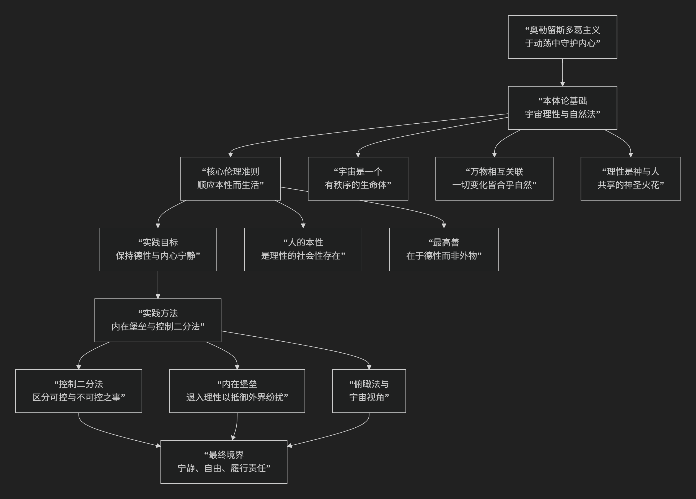

Aurelius
================

基于罗马皇帝哲学家马可·奥勒留（Marcus Aurelius）的斯多葛主义哲学核心思想

----------------------------------------------------------------------------

马可·奥勒留是罗马帝国五贤帝时代的最后一位皇帝，同时也是斯多葛学派哲学最重要的代表人物之一。他的哲学思想并非系统的理论建构，而是体现在其私人日记——《沉思录》——中的个人实践与精神修炼。其核心思想可以概括为：**一种以理性观照宇宙秩序和人类本性，通过严格的精神自律来接受命运的一切安排，从而在动荡不安的世界中保持内心宁静与德性完善的实践哲学。**

奥勒留的斯多葛主义是一种高度内化和个人化的生活艺术，其核心逻辑与实践路径可以通过下图清晰地展现：

以下，我们将沿此逻辑脉络，深入解析奥勒留哲学的核心要义。

一、宇宙观：理性的宇宙与自然的和谐

奥勒留思想的基石是一种对宇宙的宗教般的敬畏与信任。

*   **宇宙是一个有生命、有理性的整体**：他认为宇宙（或“自然”）是一个神圣的、有秩序的生命体，由一种普遍的“理性”或“神性”所统治和渗透。万物都是这个整体的一部分。
*   **万物相互关联与变化**：宇宙中的一切事件都不是孤立的，而是处于一张巨大的因果网络之中。所有发生的事，无论是福是祸，都是 **宇宙整体秩序的必要部分**，都服务于整体的和谐与完美。因此，从宇宙的视角看，**“一切发生的都是正当的”**。
*   **人的理性是神性的分有**：人的灵魂中最神圣的部分就是“理性”，它是对宇宙普遍理性的分有。因此，遵循理性生活，就是 **顺应宇宙本性** 而生活。

二、伦理学：德性为最高善，履行社会义务

在这样的人性论和宇宙观基础上，奥勒留确立了其伦理生活的核心准则。

*   **德性是唯一的善**：人生的最高目标不是追求财富、健康、名声等 **“外在的善”**，因为这些不由我们完全控制，且本身非善非恶。真正的善只存在于 **内在的德性** ——智慧、勇气、节制、正义。德性是完全可由我们掌控的。
*   **顺应本性（自然）而生活**：人的本性是理性与社会性。因此，顺应本性生活意味着：

    1.  **运用理性**：用理性来指导判断和行动，克服激情和错误的观念。

    2.  **履行社会责任**：认识到人类是一个共同体，我们都是同胞。因此，要 **仁爱、公正地对待他人**，履行作为家庭成员、公民和世界公民的责任。

三、实践方法：精神修炼与内心堡垒

《沉思录》最核心的价值在于它详细记录了一套严格的精神修炼方法，旨在将上述哲学理念转化为日常生活的实践。

1. 控制二分法（虽由爱比克泰德明确提出，但奥勒留彻底践行）

*   **核心**：清晰地区分 **什么是我们能控制的，什么是我们不能控制的**。

    *   **我们能控制的**：我们的 **信念、判断、欲望和厌恶** （即我们的内心态度）。

    *   **我们不能控制的**：我们的身体、财产、名声、地位及外部发生的任何事情。

*   **实践**：将全部精力投入到 **管好我们能控制的事情（内心）** 上，而对不能控制的事情（外在结果） **坦然接受**。这样，外界就无法真正伤害我们。

2. 内在堡垒

*   **核心**：人的理性是一个 **坚固的堡垒**。外界任何纷扰都无法直接闯入，除非我们自己的 **判断** 允许它进入。

*   **实践**：当遇到痛苦、侮辱或诱惑时， **退入这个内心堡垒**，运用理性审视它们。你会发现，扰乱你的并非事件本身，而是你对事件的看法。改变看法，困扰就会消失。

3. 俯瞰法与宇宙视角

*   **核心**：经常从 **宇宙的宏大视角** 来俯瞰世事。

*   **实践**：想象自己翱翔于天空，俯瞰尘世。你会发现，个人的烦恼、帝国的兴衰、生命的生死，在浩瀚的宇宙和永恒的时间长河中，都显得 **微不足道、转瞬即逝**。这能有效消除对琐事的执着和对死亡的恐惧。

4. 对表象的警觉与拒斥

*   **核心**：事物本身不会强迫我们，是我们对事物的 **判断（即我们赋予它的“标签”）** 在影响我们。
*   **实践**：当一件事让你痛苦时，先 **剥离你给它附加的价值判断**。例如，不要说“他侮辱了我”，而只说“他认为他说的对”。这样，痛苦就失去了根基。

四、对待死亡与命运的态度

*   **死亡**：死亡是自然的法则，是 **原子的分解和重组**，是为新生命让路。它本身并不可怕，可怕的是我们对死亡的恐惧。生命的长短在宇宙尺度上没有区别，重要的是 **活得好** （即有德性地活）。

*   **命运（天命）**：发生的一切都是 **宇宙自然链条中注定要发生的**。因此，要 **心甘情愿地接受** 命运的一切安排，把它们当作自然交付给你的任务和锻炼德性的机会。这就是著名的 **“爱你的命运”**。

五、核心要义总结

.. list-table:: 
   :header-rows: 1
   :widths: 25 45 30
   :align: center

   * - **理论维度**
     - **核心命题**
     - **关键概念**
   * - **形而上学/宇宙观**
     - **宇宙是理性、有序的整体，万物相互关联，变化合乎自然。**
     - **宇宙理性、自然法、整体与部分**
   * - **人性论/伦理学**
     - **人分有神性理性，最高善是德性，应理性、仁爱地履行社会义务。**
     - **理性本性、德性至上、社会性、世界公民**
   * - **实践方法论**
     - **通过精神修炼严格区分可控与不可控，守护内心宁静。**
     - **控制二分法、内在堡垒、俯瞰法、审视表象**
   * - **生命态度**
     - **坦然接受死亡与命运的一切安排，视其为自然。**
     - **顺应天命、爱命运、死亡是自然变化**

思想特质与影响

*   **实践性与个人化**：奥勒留的哲学完全服务于个人在复杂世界中的内心修炼，是“生活哲学”的典范。

*   **坚韧的理性主义**：在极度动荡和痛苦的环境中（战争、瘟疫、背叛），他始终诉诸理性来寻求稳定和意义。

*   **深远影响**：《沉思录》作为斯多葛主义的实践手册，超越了时代，为后世无数人提供了精神慰藉和行动指南，其思想在现代心理治疗（如认知行为疗法CBT）中也能找到共鸣。

六、总结

总而言之，马可·奥勒留的核心思想在于，他是一位 **“理性的苦行僧”和“责任的践行者”** 。他教导我们，**真正的自由和力量，不在于改变世界以满足我们的欲望，而在于通过严格的理性自律，改变我们对世界的态度，从而在任何环境下都能保持内心的德性与宁静。**

他的全部工作是对 **灵魂韧性** 的一次伟大探索。在一个充满不确定性和痛苦的世界里，他为我们提供了一套强大而深刻的精神修炼术，其核心智慧是：**“外界无法伤害你，除非你允许它伤害你。你的力量存在于你的选择之中。”** 在这个意义上，他不仅是一位罗马皇帝，更是一位永恒的哲学导师。

------------

 .. toctree::
    :maxdepth: 3

    grok
    copilot
    deepseek
    gemini
