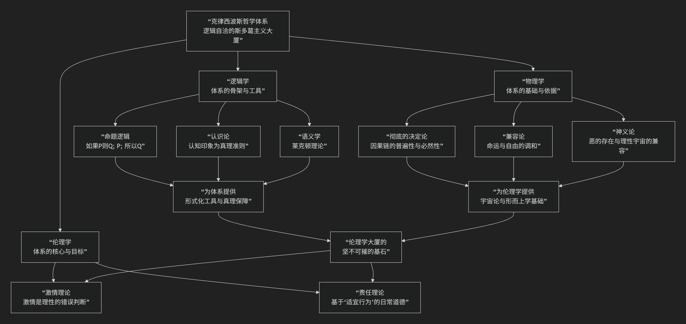

Chrysippus
================

基于克律西波斯（Chrysippus）的斯多葛主义哲学核心思想

----------------------------------------------------------------------------

克律西波斯是古希腊斯多葛学派至关重要的人物。他是学派创始人芝诺的第三代传人，因其系统化、捍卫和发展了斯多葛学说，被誉为 **“斯多葛学派的第二创始人”**。甚至有言：“若无克律西波斯，斯多葛学派早不复存。”

他的核心思想可以概括为：**将早期斯多葛主义构建成一个极其严密、逻辑自洽的宏大体系，尤其在逻辑学、物理学和决定论方面做出了奠基性贡献，为斯多葛伦理学提供了坚不可摧的理性基础。**

克律西波斯的思想体系庞大而精微，其核心架构与内在逻辑可通过下图清晰地展现：

以下，我们将沿此逻辑脉络，深入解析克律西波斯哲学的核心要义。

一、逻辑学：体系的骨架与工具

克律西波斯是古代逻辑学的巨匠，他将斯多葛逻辑学发展到前所未有的高度，其贡献甚至被认为超越了亚里士多德（尤其在命题逻辑方面）。

*   **命题逻辑的奠基人**：

    *   他发展了一套复杂的 **命题逻辑系统**，以替代亚里士多德的词项逻辑。

    *   其核心是 **五种无效论证形式** 及其还原方法，这实际上是早期形式的 **推理规则**。最著名的例子是 **“如果P，则Q；P；所以Q”** （肯定前件式）和 **“如果P，则Q；非Q；所以非P”** （否定后件式）。

    *   这使他能够精确分析复杂的连锁论证，为整个哲学体系提供了 **形式化工具**。

*   **“莱克顿”理论**：

    *   他提出了关键的 **“莱克顿”** 概念，指 **所说内容的意义或命题本身**，它不同于表达它的物理声音（符号），也不同于它所指的外部对象（所指物）。

    *   这一区分（符号-意义-所指）极大地推动了语言哲学和语义学的发展。

*   **认识论：捍卫“认知印象”**：

    *   他强力捍卫芝诺的“认知印象”作为 **真理的准则**，并详细论证了如何通过它来区分真理与谬误，应对怀疑论的挑战。

二、物理学与决定论：体系的基础

克律西波斯在物理学上的贡献至关重要，他构建了一个彻底的、但又试图为道德责任留下空间的决定论体系。

*   **彻底的决定论（天命论）**：

    *   他论证宇宙是一个由神圣“逻各斯”或“命运”统治的 **单一、连贯、因果紧密相连的整体**。宇宙中发生的 **每一件事都是前因的必然结果**，不存在任何偶然或断裂。

    *   著名比喻：宇宙就像一卷正在展开的卷轴，上面的字句（事件）早已写好，只是依次呈现。

*   **“兼容论”的尝试：调和命运与责任**：

    *   这是克律西波斯最富创造性的贡献之一。面对“如果一切皆命中注定，人何来道德责任？”的诘难，他提出了精巧的解答。

    *   **著名比喻：马车与狗**：

        *   设想一只狗被拴在马车上。如果它 **顺从地跟着跑**，那么它既是 **被拖着走** （命运的强制），也是 **自愿跟着走** （它的本性配合了运动）。

        *   如果它 **反抗并挣扎**，它最终仍会被 **强迫着走**。

        *   **寓意**：人的心灵也是如此。外部事件是命运决定的（马车的前行），但我们对事件的 **内心同意和反应方式** （是顺从理性还是抗拒）则属于我们自身。恶行和激情是心灵 **对命运做出的“错误同意”和“扭曲反应”**。因此，我们仍需为自己的 **内在态度** 负责。

*   **神义论：为恶辩护**：

    *   他论证说，宇宙中的“恶”（如痛苦、疾病）并非源于神的恶意或无能，而是 **整体和谐所必需的“副产品”**。例如，没有疾病，就无法彰显健康的可贵和医术的价值。局部之“恶”服务于整体之“善”。

三、伦理学：体系的核心

克律西波斯将伦理学建立在坚实的逻辑和物理学基础之上，使其更加系统化。

*   **激情的精细理论**：

    *   他比前人更系统地分析了 **激情是“理性判断的错误”**。

    *   他认为，激情并非非理性的力量，而是 **心灵本身做出的、过度的、违背自然（理性）的错误判断**。例如，恐惧是对“即将来临的恶”的错误放大和认同。

    *   因此，治疗激情的方法不是压制，而是通过哲学训练 **修正其底层的错误信念**。

*   **“责任”与“适宜行为”**：

    *   他详细阐述了 **“适宜行为”** ——即那些虽非至善（只有德性是至善），但 **符合自然、有理性依据的行为** （如赡养父母、参与社会）。

    *   这为普通人在成圣之前提供了具体的生活指南，使斯多葛主义更具实践性。

四、核心要义总结

.. list-table:: 
   :header-rows: 1
   :widths: 25 45 30
   :align: center

   * - **理论维度**
     - **核心命题**
     - **关键概念与贡献**
   * - **逻辑学**
     - **建立系统的命题逻辑，以"莱克顿"理论深化语义学，捍卫"认知印象"。**
     - **命题逻辑、莱克顿、认知印象、真理准则**
   * - **物理学/形而上学**
     - **捍卫彻底的决定论，并以"兼容论"调和命运与人的道德责任。**
     - **决定论、天命、因果链、兼容论、神义论**
   * - **伦理学**
     - **将激情系统地定义为"错误判断"，详细阐述"适宜行为"理论。**
     - **激情理论、错误判断、适宜行为、责任**
   * - **体系构建**
     - **将斯多葛主义构建成逻辑自洽、环环相扣的严密系统。**
     - **系统化、第二创始人、体系辩护者**

五、思想特质与影响

*   **无与伦比的系统性**：克律西波斯是一位真正的体系构建者，他使得斯多葛主义的各个部分（逻辑、物理、伦理）相互支撑，形成一个坚固的整体。

*   **逻辑的严谨性**：他嗜好逻辑论证，其著作等身（据说有700余卷），以论证复杂、精密甚至晦涩著称。

*   **决定论的深度**：他对决定论的捍卫和兼容论的阐释，至今仍是哲学史上关于自由与必然关系的最早、最深刻的讨论之一。

*   **深远影响**：他的思想通过后来的斯多葛学者（如塞内卡、爱比克泰德、马可·奥勒留）和批评者（如普鲁塔克）流传下来，深刻影响了西方哲学关于逻辑、自由意志和伦理学的讨论。

六、总结

总而言之，克律西波斯的核心思想在于，他是一位 **“斯多葛体系的建筑师”和“逻辑的捍卫者”** 。他教导我们，**一种真正有力的生活哲学，必须建立在关于世界（物理学）和知识（逻辑学）的坚实理性基础之上；而面对看似冷酷的宇宙决定论，人类依然可以在内心反应的领域找到道德责任和自由的空间。**

他的全部工作是对 **理性一致性** 的一次极致追求。他将斯多葛主义从一种生活态度提升为一套能够经受住最严格哲学批判的理性体系。在这个意义上，他不仅是斯多葛学派的柱石，更是古希腊哲学理性精神的杰出代表。

------------

 .. toctree::
    :maxdepth: 3

    grok
    copilot
    deepseek
    gemini
