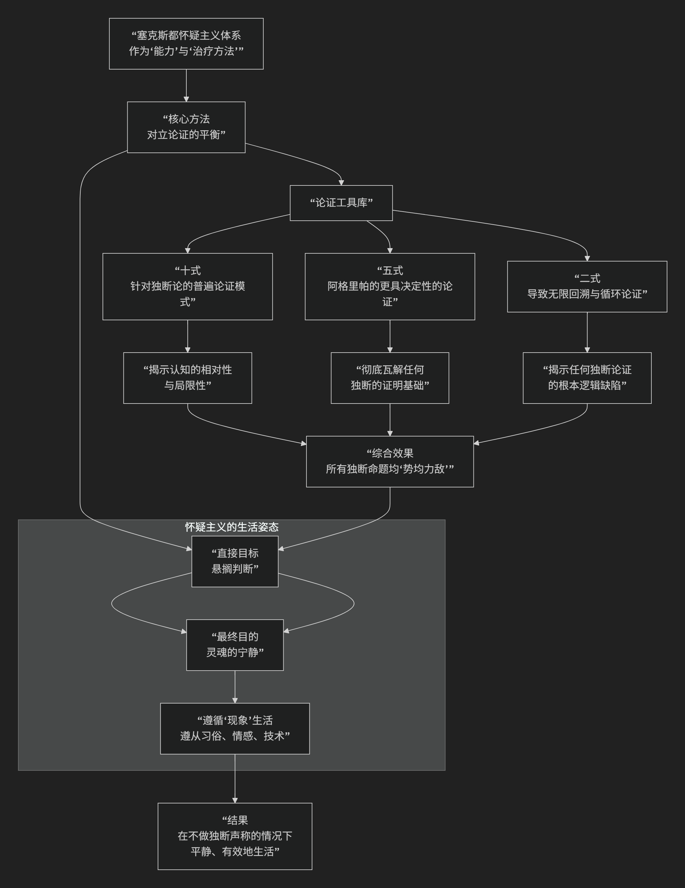

Sextus
================

基于塞克斯都·恩披里克（Sextus Empiricus）的怀疑主义哲学核心思想

----------------------------------------------------------------------------

塞克斯都·恩披里克是公元2世纪的古希腊医生和哲学家，他是**古代皮浪怀疑主义思想的集大成者和最后一位系统阐述者**。他的核心思想可以概括为：**将怀疑主义定义为一种“能力”，通过将对立论证置于“势均力敌”的状态，从而“悬搁判断”，最终达到“灵魂的宁静”。怀疑主义不是一种教条，而是一种持续探究的生活方式和治疗方法，旨在治愈“独断论”的“轻率”和“心灵烦扰”。**

塞克斯都的怀疑主义是一个严谨的、具有治疗目的的体系。其核心架构与运作机制可以通过下图清晰地展现：

以下，我们将沿此逻辑脉络，深入解析塞克斯都怀疑主义的核心要义。

一、怀疑主义的定义与目标：一种治疗性的“能力”

塞克斯都将怀疑主义明确定义为一种 **实践性的能力**，而非一套理论教条。

*   **定义**：**“怀疑主义是一种能力，它通过将现象与思想对立起来，形成一种首先悬搁判断、随后达到灵魂宁静的状态。”**

*   **关键点**：

    *   **能力**：它是一种主动的、可练习的思考技艺。

    *   **对立**：其方法是 **系统性地为任何一个命题寻找力量相等的反命题**。

    *   **目标**：首先是 **“悬搁判断”** ，最终是 **“灵魂的宁静”**。

*   **治疗隐喻**：塞克斯都将怀疑主义视为一种 **医术**，专门治疗“独断论”这种疾病。独断论者武断地坚信自己发现了真理，从而陷入无休止的争论、焦虑和失望。怀疑主义通过“悬搁判断”来消除这种心灵的纷扰。

二、核心方法：对立论证与“悬搁判断”

“悬搁判断”是怀疑主义的核心操作，塞克斯都用古希腊词 **epochē** 来描述，字面意思是“中止”或“停止”。

*   **如何实现悬搁判断？** 通过 **构建“势均力敌”的对立论证**。

    *   对于任何独断论者提出的命题P（如“世界是无限的”），怀疑论者会提出一个同样有力的反命题Not-P（如“世界是有限的”）。

    *   当支持和反对的理由在说服力上完全相当时，心灵就无法倾向于任何一方，于是 **自然而然地停止了对该问题的判断**。

*   **著名比喻**：画家阿佩莱斯想画马沫，屡试不成，怒将海绵掷向画板，结果海绵的痕迹完美呈现了马沫。同样，怀疑论者追求宁静而不得，却在 **放弃追求（悬搁判断）后意外获得了它**。

三、论证武器库：十式、五式与二式

塞克斯都系统整理并阐述了前代怀疑论者（如埃奈西德穆）留下的强大论证工具。

1. 十式（十大模式）

旨在展示 **认知的相对性和局限性**，从而证明我们无法认识事物的真实本性。例如：

*   **不同生物的感知不同** （蜜蜂与人看同一朵花颜色不同）。

*   **不同人的感知不同** （有人爱橄榄，有人厌之）。

*   **感知受条件影响** （病人觉蜜苦，健康人觉蜜甜）。

**结论**：我们只能认识事物“向我显现”的样子，无法认识事物“自身”的样子。

2. 五式（阿格里帕的五式）

这是更具逻辑威力、针对知识论本身的论证，旨在 **瓦解任何独断的证明体系**。

1.  **意见分歧**：对任何问题都存在无法解决的意见冲突。

2.  **无限回溯**：任何证明都需要另一个证明来证明，如此无限循环。

3.  **相对性**：事物只相对于判断者和感官而显现。

4.  **任意假设**：为避免无限回溯，独断论者只能武断地假设某个前提为真。

5.  **循环论证**：用来证明前提的结论，本身又依赖于该前提。

**结论**：任何形式的“证明”都是不可能的。你无法为知识找到一个绝对可靠的基础。

3. 二式（两种模式）

这是五式的简化版，直击核心：

1.  **无限回溯**：任何声称需要证明，证明需要前提，前提又需要证明，以至无穷。

2.  **循环论证**：独断论者试图用来证明前提的东西，本身又需要这个前提来证明。

**结论**：独断论在逻辑上是不可能的。

四、生活方式：遵循“现象”生活

怀疑主义者“悬搁判断”后，如何生活？他们会陷入瘫痪吗？塞克斯都明确回答：不会。

*   **遵循“四个方面”生活**：

    1.  **自然的指导**：遵循本能和感觉（如渴了喝水）。

    2.  **情感的驱动**：无法抗拒的情感（如饿则求食）。

    3.  **法律与习俗的传统**：遵守所在社会的习俗和法律（如奉行当地宗教仪式）。

    4.  **技艺的传授**：学习并运用各种生活技艺（如医术、航海术）。

*   **关键区分**：怀疑论者 **不独断地声称** “水真正能解渴”或“这种仪式是神真正喜悦的”。他们只是 **遵循现象**：**“我渴了，喝水似乎能缓解。”** “按照习俗行事，似乎能带来社会和谐。” 他们接受“显现”出来的东西，但不对其背后的“真实本质”做出判断。

五、核心要义总结

.. list-table:: 
   :header-rows: 1
   :widths: 25 45 30
   :align: center

   * - **理论维度**
     - **核心命题**
     - **关键概念与贡献**
   * - **定义与目标**
     - **怀疑主义是一种通过"对立论证"实现"悬搁判断"以达到"灵魂宁静"的能力。**
     - **能力说、治疗性、灵魂宁静**
   * - **核心方法**
     - **系统性地构建"势均力敌"的对立论证，迫使心灵"悬搁判断"。**
     - **对立论证、势均力敌、悬搁判断**
   * - **论证体系**
     - **运用"十式"、"五式"、"二式"等论证，揭示认知相对性与独断论证的逻辑不可能性。**
     - **十式、五式（阿格里帕）、二式、无限回溯、循环论证**
   * - **实践方案**
     - **"悬搁判断"后，遵循"现象"生活（自然、情感、习俗、技艺），不做独断声称。**
     - **遵循现象、生活经验、非独断实践**

思想特质与影响

*   **系统性**：塞克斯都的著作是古代怀疑主义最完整、最系统的记录和阐述。
*   **治疗性**：其哲学具有明确的实践目的——治疗心灵烦恼，追求宁静生活。
*   **深远影响**：他的作品在中世纪后期被重新发现，对蒙田、休谟等近代哲学家产生了巨大影响，成为西方哲学中怀疑论思潮的主要源泉。

总而言之，塞克斯都·恩披里克的核心思想在于，他是一位 **“怀疑主义的系统整理者”和“心灵的治疗师”**。他教导我们，**通过对一切独断声称保持彻底的、系统性的审查和中立，心灵可以从无休止的真理之争中解放出来，从而获得一种深刻的宁静。**

他的全部工作是对 **人类认知局限性的一次最彻底、最坦诚的审视**，并为在这种局限性之下如何 **清醒、平和且有效地生活** 提供了一份详尽的指南。在这个意义上，他不仅是古代怀疑主义的最高峰，也是一位为所有时代追求智慧者提供永恒启迪的思想家。

------------

 .. toctree::
    :maxdepth: 3

    grok
    copilot
    deepseek
    gemini
