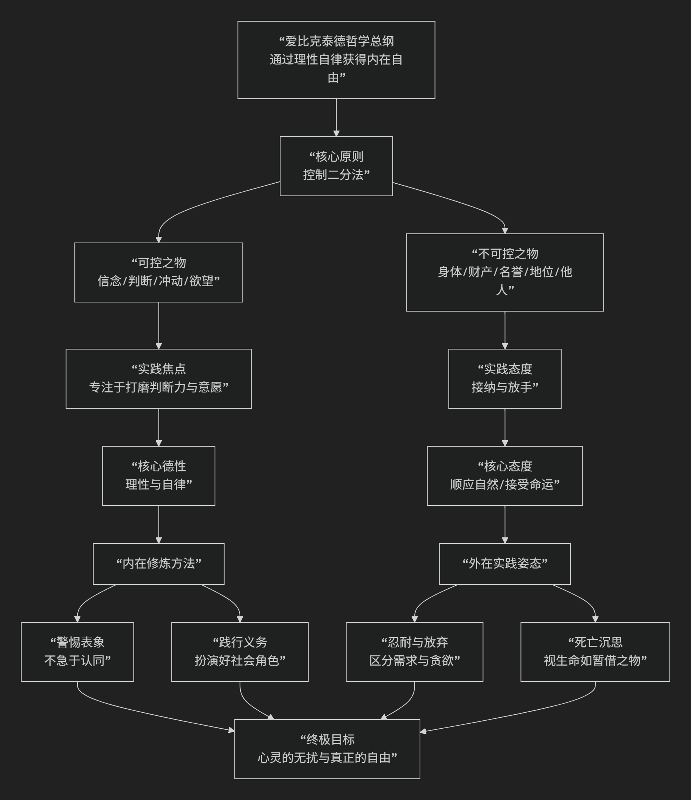

Epictetus
================

基于爱比克泰德（Epictetus）的斯多葛哲学核心思想

----------------------------------------------------------------------------

爱比克泰德是罗马斯多葛学派最具影响力的哲学家之一。他曾是一名奴隶，后成为一位极具魅力的教师。他的哲学核心思想可以概括为：**一种强调“内在自由”的实践哲学，其基石是著名的“控制二分法”——即清晰区分我们所能控制的事物（我们的判断、冲动和欲望）与我们无法控制的事物（身体、财产、名誉等），并将人生的目标定义为通过理性驯服欲望，从而在任何外部环境下都能保持心灵的自由与宁静。**

爱比克泰德的哲学不是抽象的理论，而是一套严格的精神修炼指南。其核心逻辑与实践路径可以通过下图清晰地展现：

以下，我们将沿此逻辑脉络，深入解析爱比克泰德哲学的核心要义。

一、哲学目标：真正的自由

爱比克泰德哲学的全部目的在于追求一种 **真正的、不受外界条件影响的自由**。

*   **问题**：人们通常认为，自由就是能够随心所欲地获得自己想要的东西（健康、财富、成功）并避开讨厌的东西（疾病、贫穷、失败）。但这种自由是 **不可靠的**，因为外部世界不为我们所控，追求它必然导致焦虑、恐惧和失望。

*   **解决方案**：真正的自由不是 **改变外部世界以满足我们的欲望**，而是 **改变我们的欲望以顺应外部世界**。自由在于 **让我们的意愿与自然和理性保持一致**。

*   **著名格言**： **“自由的人就是如愿以偿的人。”** 而斯多葛主义者的“愿”，就是 **只欲求自己可控之事** （培养德性）， **接纳自己不可控之事** （外部发生的一切）。

二、核心方法：控制二分法

这是爱比格泰德思想最著名、最核心的贡献，是其整个实践体系的基石。

*   **精确定义**：

    *   **完全由我们控制的事物**：我们的 **信念、判断、冲动、欲望和厌恶** ——即我们内心对事物的 **态度和反应**。这是我们 **绝对的、无条件的领地**。

    *   **不完全由我们控制的事物**：我们的身体、财产、声誉、职位、他人如何对待我们，以及最终的结果。这些事 **本质上不属于我们**。

*   **实践指令**：

    *   **专注于可控领域**：将你所有的精力、注意力和努力都投入到 **管好你的判断和意愿**上。

    *   **接纳不可控领域**：对于身体、财产等外部事物，要 **坦然接受** 它们本来的样子，将其视为自然的安排。

*   **错误与痛苦之源**：当我们错误地将 **欲望和努力** 投向不可控的外部事物时，当我们试图控制本不属于我们控制范围的东西时，我们就会陷入 **挫折、焦虑和奴役** 之中。

三、实践修炼：从信念到行动

控制二分法需要通过日常的、严格的“精神训练”来落实。

1. 警惕与审查“表象”

*   **核心**：外部事件或他人的言行并不会直接困扰我们，困扰我们的是 **我们对该事件形成的“判断”或“看法”** （即“表象”）。

*   **实践**：当任何令人不安的“表象”（如“他侮辱了我”）出现时，不要立即认同它。要 **暂停一下**，对自己说：“这只是他的行为，等我来判断它是否真的是一种‘侮辱’。” 然后运用理性判断，剥离其负面标签。

2. 履行社会角色

*   **核心**：人是社会性的存在。自由不是逃避责任，而是 **理性地履行作为人、家庭成员和公民的义务**。

*   **实践**：记住你的各种角色（儿子、父亲、公民等），并思考每个角色所要求的职责。你的任务就是 **扮演好这些角色**，但不对结果过分执着。

3. 忍耐与放弃

*   **核心**：训练自己区分 **“需要”和“贪欲”**。

*   **实践**：有时故意放弃一些舒适和享受（如洗冷水澡、穿简朴的衣服），以证明 **没有它们你也能活得很好**。这能削弱对外部条件的依赖，增强内在力量。

4. 沉思死亡与无常

*   **核心**：时刻记住，你和你所爱的一切都是 **暂存的、必死的**。

*   **实践**：这并非为了悲观，而是为了 **珍惜当下**，并降低对失去的恐惧。当你拥抱孩子时，心想“这可能是最后一次”，你会更加投入和感恩。

四、对欲望与理性的态度

*   **欲望的驯服**：不要寻求欲望的满足，而要 **寻求欲望的消除**。尤其是对那些你无法控制的事物的欲望。你的目标应该是：**“让我不想要我无法拥有的东西。”**

*   **理性的运用**：理性是神赋予我们的最高能力，是我们区分善恶、可控与不可控的唯一工具。遵循理性，就是 **顺应神意或自然法则**。

五、核心要义总结

.. list-table:: 
   :header-rows: 1
   :widths: 25 45 30
   :align: center

   * - **理论维度**
     - **核心命题**
     - **关键概念**
   * - **哲学目标**
     - **通过控制内心意愿，获得不受外界影响的内在自由与宁静。**
     - **内在自由、心灵宁静、如愿以偿**
   * - **核心方法论**
     - **严格践行"控制二分法"，只关注可控的（判断与意愿），接纳不可控的（外部一切）。**
     - **控制二分法、可控与不可控、专注与接纳**
   * - **实践修炼**
     - **通过日常精神训练，审查表象、履行角色、锻炼忍耐、沉思无常。**
     - **精神训练、审查表象、角色义务、忍耐**
   * - **欲望与理性**
     - **驯服对不可控之物的欲望，运用理性使意愿与自然一致。**
     - **欲望消除、理性至上、顺应自然**

思想特质与影响

*   **极强的实践性**：爱比克泰德的哲学是“行动指南”，充满了具体的练习方法和生活场景分析。

*   **平等与普世**：源于其奴隶背景，他的哲学强调 **内在自由与出身无关**，任何人都可以通过修炼获得。

*   **深远影响**：他的思想通过其学生阿里安的记录《手册》和《谈话录》流传，深刻影响了罗马皇帝马可·奥勒留，并在现代心理治疗（尤其是认知行为疗法CBT）中产生共鸣，因为CBT的核心正是“改变我们对事件的看法（信念）以改善情绪和行为”。

六、总结

总而言之，爱比克泰德的核心思想在于，他是一位 **“自由的工程师”和“心灵的训练师”** 。他教导我们，**人生的质量不取决于发生了什么，而取决于我们如何应对。真正的力量不在于征服世界，而在于征服那个对外部世界充满贪欲和恐惧的自我。**

他的全部工作是对 **个人主权** 的一次深刻探索与实践。在一个充满不确定性的世界里，他提供了一套清晰、有力且人人可操练的哲学工具，其核心智慧是：**“不要要求事情如你所愿发生，而要希望事情如其本然地发生，这样你的生活将一路顺畅。”** 在这个意义上，他不仅是一位斯多葛派哲学家，更是一位永恒的、关于如何生活的伟大导师。

------------

 .. toctree::
    :maxdepth: 3

    grok
    copilot
    deepseek
    gemini
