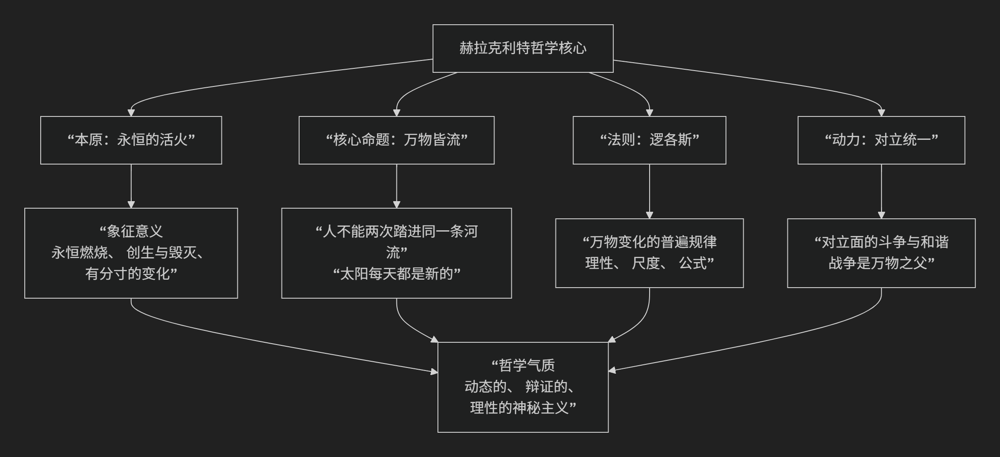

Heraclitus
=============

基于赫拉克利特（Heraclitus of Ephesus）的哲学核心思想

--------------------------------------------

赫拉克利特（约公元前535-475年）是古希腊前苏格拉底时期一位极具原创性和神秘色彩的哲学家，被称为“晦涩者”。他的核心思想可以概括为：**宇宙的本质是“永恒的活火”，万物都处于永不停息的流动和变化之中，而这种变化遵循着一种普遍的“逻各斯”，其动力源于内在的“对立统一”。**

他的思想深邃而凝练，其核心要义可以通过下图清晰地展现：

以下，我们将沿此脉络，深入解析赫拉克利特哲学的四大支柱。

一、本原：永恒的活火

赫拉克利特继承了早期希腊自然哲学家探寻“世界本原”的传统，但他给出了一个极具动态和象征性的答案。

*   **核心命题**：**“这个万物相同的宇宙，既不是由神也不是由人创造的，它过去是、现在是、将来也是一团永恒的活火，有分寸地燃烧，有分寸地熄灭。”**

*   **深层含义**：

    *   **永恒与流变**：“火”是永恒存在的，但其形态（燃烧与熄灭）永远在变化。这完美象征了宇宙既恒定（整体是火）又流变（具体形态不停转化）的本质。

    *   **创造与毁灭**：火在燃烧时消耗燃料（毁灭），同时带来光明和热量（创造）。因此，火本身就是创造与毁灭的统一体。

    *   **有分寸的变化**：火的变化不是混乱的，而是遵循着一定的“分寸”或“尺度”，即他所说的“逻各斯”。

二、核心命题：万物皆流

这是赫拉克利特最广为人知的思想，强调实在的绝对流动性。

*   **核心命题**：**“万物皆流，无物常驻。”**

*   **著名比喻**：

    *   **河流比喻**：**“人不能两次踏进同一条河流。”** 因为河水在不停流动，当你第二次踏入时，无论是河水还是你自己，都已经不再是第一次时的样子了。他甚至更激进地说：“我们踏进又不踏进同一条河流，我们存在又不存在。”

    *   **太阳的新颖性**：**“太阳每天都是新的。”** 强调宇宙万物无时无刻不在更新。

*   **哲学意义**：他批判了那种认为世界是静态、稳定的常识观念。真正的实在是 **过程**，是 **生成**，而不是 **存在** 的静态实体。

三、内在法则：逻各斯

尽管万物变幻不息，但赫拉克利特认为这种变化并非混乱无序，而是由一种普遍的理性法则所支配。

*   **核心概念**： **“逻各斯”**。这是赫拉克利特哲学中最深刻也最晦涩的概念，意指统摄万物变化的 **普遍规律、理性或公式**。

*   **特性**：

    *   **普遍性**：逻各斯是宇宙共通的，所有人都共享同一个逻各斯。

    *   **可知性**：逻各斯可以被人的理性所认识。但大多数人如同梦游，对自己的行为没有意识，未能理解和听从这共同的逻各斯。

    *   **客观性**：逻各斯是客观的，不以人的意志为转移。

四、变化动力：对立统一

赫拉克利特揭示了变化发生的根本机制——对立面的斗争与和谐。

*   **核心洞见**：**对立面是同一的**，事物的和谐源于对立面的张力，而非它们的消除。

*   **著名论述**：

    *   **“对立物存在于同一事物中”**：例如，“海水最洁净又最肮脏”：对鱼是滋养生命之水，对人则是无法饮用之水。

    *   **“隐藏的和谐比明显的和谐更强有力”**：弓弦的张力（对立）使得箭能发射（和谐）；琴弦的紧张才能奏出乐音。

    *   **“战争是万物之父，也是万物之王”**：这里的“战争”是冲突、对立、斗争的隐喻。正是事物内部和事物之间的对立与张力，推动着宇宙的生成和变化。

*   **哲学意义**：这是**辩证思维**的最早雏形。他天才地察觉到，矛盾是推动世界发展的根本动力。

---

核心要义总结

.. list-table:: 
   :header-rows: 1
   :widths: 30 40 30
   :align: center

   * - **理论维度**
     - **核心命题**
     - **关键概念与贡献**
   * - **本体论（本原）**
     - **"宇宙是一团永恒的活火"**，有分寸地燃烧和熄灭。
     - **活火本原、分寸、象征哲学**
   * - **宇宙论（变化）**
     - **"万物皆流，无物常驻"**，实在的本质是永恒的运动和生成。
     - **流变、河流比喻、过程哲学**
   * - **规律论（法则）**
     - **变化受普遍的"逻各斯"支配**，理性可认识此规律。
     - **逻各斯、普遍理性、客观规律**
   * - **动力论（辩证）**
     - **"对立统一"是变化的源泉**，"战争是万物之父"。
     - **对立统一、隐藏的和谐、辩证思维**

思想特质与影响

*   **晦涩与深刻**：赫拉克利特故意用格言和隐喻写作，风格晦涩，但思想极其深刻，故被称为“晦涩者”。

*   **辩证法的先驱**：他的对立统一思想被黑格尔和马克思批判地继承，成为辩证法的重要源头。

*   **理性主义与神秘主义的结合**：他一方面强调理性的“逻各斯”，另一方面又采用神秘的表达方式，体现了早期哲学的特点。

总而言之，赫拉克利特的核心思想在于，他是一位 **“流变的先知”和“辩证法的奠基人”** 。他教导我们，**必须放弃对静态、永恒实体的执着，转而拥抱一个充满动态、冲突和内在理性的活生生的宇宙。** 他的全部工作是对 **生成、过程和矛盾** 的一次伟大发现，为后世哲学，特别是过程哲学和辩证法，播下了最重要的种子。

------------

 .. toctree::
    :maxdepth: 3

    grok
    copilot
    deepseek
    gemini
