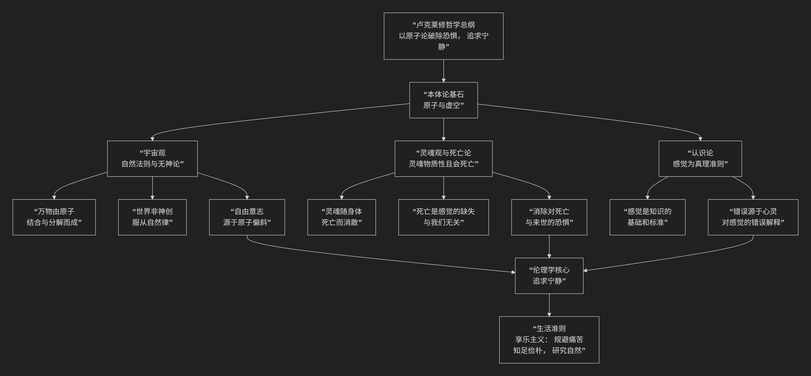

Lucretius
================

基于卢克莱修（Lucretius）哲学核心思想

--------------------------------------------

卢克莱修是古罗马共和国末期的一位诗人兼哲学家。他的核心思想可以概括为：**通过宏伟的哲学长诗《物性论》，系统而雄辩地阐述了伊壁鸠鲁派的原子论哲学，旨在用理性的自然观取代迷信的神话观，揭示宇宙和生命的本质，从而将人类从对神祇和死亡的恐惧中解放出来，获得心灵的宁静与幸福。**

卢克莱修的哲学体系宏大而深刻，其核心思想的内在逻辑与架构可以通过下图清晰地展现：

以下，我们将沿此逻辑脉络，深入解析卢克莱修哲学的核心要义。

一、本体论基石：原子与虚空

卢克莱修思想的根基是德谟克利特和伊壁鸠鲁的 **原子论**，他对此进行了详尽的论证和诗意的发挥。

*   **核心命题**：

    1.  **宇宙的基本构成是“原子”和“虚空”**。原子是 **不可分、坚固、永恒不变** 的微小粒子；虚空是原子运动所必需的 **空无的空间**。

    2.  **无中不能生有，有不能变无**（物质不灭定律）。万物生灭只是原子的结合与分离。

*   **论证与意义**：他用大量自然现象（如腐蚀、蒸发、生长）来证明这一理论。这一观点直接挑战了神创论，表明自然运作 **无需神的干预**，有其内在的、物质的必然规律。

二、宇宙观：自然法则与无神论

从原子论出发，卢克莱修推导出一个机械论的、无神论的宇宙图景。

*   **世界的形成与消亡**：世界并非神创，而是在无限虚空中，原子随机运动、碰撞、结合而形成的 **无数个世界之一**。它也会因原子离散而最终消亡。

*   **神的存在与角色**：卢克莱修并不完全否认神的存在，但他认为神是 **幸福的、不朽的**，居住在宇宙的缝隙之间，**根本不关心人世间的事务**，既不会创造世界，也不会奖善惩恶。

*   **著名的“宗教批判”**：他认为 **宗教源于无知和恐惧**。原始人类对雷电、地震等自然现象无法解释，便幻想出强大的神祇，并心生恐惧，进行献祭。宗教因此成为人类痛苦的根源之一。

*   **自由意志的难题**：如果一切由原子运动决定，人是否有自由意志？卢克莱修引入了伊壁鸠鲁的 **“原子偏斜说”** ：原子在垂直下落时会有 **极其微小的、随机的偏斜**，从而发生碰撞，形成新事物。这一微观的偶然性，为宏观层面的 **自由意志** 提供了物理基础，打破了绝对的命运枷锁。

三、灵魂观与死亡论：消除对死亡的恐惧

这是卢克莱修哲学最核心的伦理目标——治疗人类最深的恐惧。

*   **灵魂的物质性**：灵魂（或心灵）不是非物质的精神实体，而是由一种 **极其精细、活跃的原子** 构成的，遍布全身，与肉体紧密结合。

*   **灵魂会死亡**：既然灵魂由原子构成，那么当肉体死亡、分解时，灵魂原子也随之 **消散**。没有脱离肉体独立存在的灵魂。

*   **著名的“死亡无关论”**：

    *   **论证一**：**“当我们存在时，死亡尚未到来；当死亡来临时，我们已经不存在。”** 因此，死亡与活着的我们 **永无交集**，无需恐惧。

    *   **论证二**：回忆出生前的漫长时间，我们并不感到痛苦。死亡后的无尽时间长河，与出生前一样，**对我们而言是不存在的**。

    *   **结论**：死亡是 **感觉的彻底缺失**，既然没有感觉，也就没有痛苦。对死亡的恐惧是 irrational 的。

*   **消除对来世的恐惧**：由于灵魂会死，所以不存在死后世界、轮回转世或地狱的惩罚。这彻底消除了宗教利用来世观念对人进行的精神控制。

四、认识论：感觉主义

在知识论上，卢克莱修是坚定的感觉主义者。

*   **核心主张**：**感觉是一切知识的基础和真理的最终标准**。感觉是直接、可靠的，错误不在于感觉本身，而在于 **心灵对感觉材料做出的错误推理和判断**。

*   **目的**：这一观点旨在捍卫原子论的经验基础，并鼓励人们 **信任感官**，通过观察自然来认识世界，而不是诉诸神意。

五、伦理学：伊壁鸠鲁式的快乐主义

哲学的最终目的是获得幸福，即 **心灵的宁静**。

*   **快乐的定义**：快乐不是纵欲，而是 **“身体免于痛苦，心灵免于纷扰”**。最高的善是 **静态的快乐** （痛苦的消除），而非动态的享乐（欲望的满足）。

*   **如何达到宁静？**

    1.  **理解自然**：研究哲学，认识原子论和宇宙的真相，是 **摆脱恐惧、获得宁静的最根本途径**。知识就是解放。

    2.  **知足俭朴**：欲望是无限的，追逐财富、权力等外在之物只会带来焦虑。真正的幸福在于 **节制欲望，满足于简单的生活**。

    3.  **规避痛苦**：明智地选择能带来长久安宁的快乐，避开可能带来更大痛苦的短暂享乐。

六、核心要义总结

.. list-table:: 
   :header-rows: 1
   :widths: 25 45 30
   :align: center

   * - **理论维度**
     - **核心命题**
     - **关键概念与贡献**
   * - **本体论/物理学**
     - **宇宙万物由永恒不变的"原子"在"虚空"中运动、结合而成。**
     - **原子论、虚空、物质不灭**
   * - **宇宙观/宗教观**
     - **世界是自然形成的，神不干预人事，宗教源于无知与恐惧。**
     - **无神论、自然法则、原子偏斜（自由意志）、反宗教**
   * - **心理学/死亡观**
     - **灵魂是物质的，随身体死亡而消散，死亡是感觉的缺失故不可怕。**
     - **灵魂物质性、死亡无关论、消除恐惧**
   * - **认识论**
     - **感觉是知识的基础和真理的准则，错误源于心灵的误判。**
     - **感觉主义、真理标准**
   * - **伦理学**
     - **人生的目标是心灵宁静，通过理解自然、知足俭朴来实现。**
     - **快乐主义（静态快乐）、心灵宁静、知识即解放**

七、思想特质与影响

*   **诗性与理性的融合**：卢克莱修用拉丁语六步格史诗的庄严形式来阐述精深的哲学与科学理论，实现了 **诗与哲** 的完美结合，使《物性论》成为文学与哲学的双重瑰宝。

*   **系统性与战斗性**：他的论述体系严密，并充满激情地批判宗教迷信，富有启蒙精神。

*   **深远影响**：《物性论》在中世纪几乎失传，文艺复兴时期被重新发现后，对近代欧洲的科学革命（如伽桑狄、波义耳、牛顿）和哲学思想（启蒙运动）产生了深远影响。

八、总结

总而言之，卢克莱修的核心思想在于，他是一位 **“理性的诗人”和“恐惧的解剖师”** 。他教导我们，**真正的勇气不是无视恐惧，而是用理性的光芒去照亮恐惧的根源——对未知和死亡的错误想象。当我们理解了自然的运作机制，认识到我们自身也是自然的一部分时，我们就能从自我施加的精神枷锁中解放出来。**

他的全部工作是对 **人类精神解放** 的一次宏伟而诗意的论证。在迷信盛行的古代，他高举理性与科学的火炬，试图为人类在浩瀚而冷漠的宇宙中，找到一种基于理解、而非基于幻想的坚实幸福。在这个意义上，他不仅是伊壁鸠鲁主义的伟大传播者，更是一位跨越时空的先知与启蒙者。

------------

 .. toctree::
    :maxdepth: 3

    grok
    copilot
    deepseek
    gemini
    qwen
