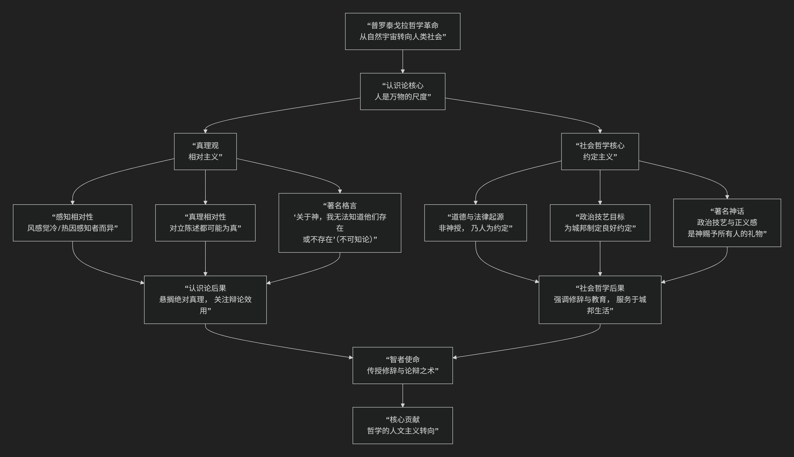

Protagoras
================

基于普罗泰戈拉（Protagoras）的哲学核心思想哲学核心思想

----------------------------------------------------------------------------

普罗泰戈拉是公元前5世纪古希腊“智者派”中最具代表性的哲学家。他的核心思想可以概括为：**一种以“人是万物的尺度”为核心的相对主义、人文主义和社会建构主义哲学。他将哲学的关注点从自然宇宙转向人类社会，强调感知和真理的相对性，并认为道德、法律等社会规范并非神授或永恒不变的自然法，而是人类出于生存需要而约定的产物。**

普罗泰戈拉的思想极具革命性，其核心架构与内在逻辑可以通过下图清晰地展现：

以下，我们将沿此逻辑脉络，深入解析普罗泰戈拉哲学的核心要义。

一、核心命题：“人是万物的尺度”

这是普罗泰戈拉最著名、最核心的哲学论断，蕴含着他的认识论和真理观的全部秘密。

*   **原文**：**“人是万物的尺度，是存在者存在的尺度，也是不存在者不存在的尺度。”**

*   **内涵解读**：

    1.  **个体主义与相对主义**：这里的“人”首先指 **具体的、个别的感知者**。对于每个个体来说，事物就是它向他呈现的样子。例如，一阵风，对于感觉冷的人来说它是“冷的”，对于感觉热的人来说它是“热的”。两者都是真实的。

    2.  **真理的相对性**：不存在超越个体感知的、绝对的、客观的真理。真理是相对于感知者而成立的。因此，**每一个意见都是真的**。

*   **著名例证**：柏拉图在《泰阿泰德篇》中引用普罗泰戈拉的观点：当一阵风吹来，你觉得冷，我觉得热。那么，**对我而言风是热的，对你而言风是冷的**。两者都真实，没有谁对谁错。

*   **哲学意义**：这一命题从根本上动摇了传统哲学对客观真理的追求，将真理的基准从外部世界拉回到了**人类主体自身**。

二、认识论：相对主义与不可知论

从“人是万物的尺度”出发，普罗泰戈拉发展出了一套系统的相对主义认识论。

*   **对任何事物都有两种相反的说法**：他声称，**“关于每一个对象，都有两种相互对立的说法（逻各斯）。”** 并且，通过训练有素的论辩，可以证明这两种说法都各有道理。

*   **智者派的实践**：这正是智者派教授修辞术和论辩术的基础。他们的目标不是发现绝对真理（因为不存在），而是 **训练学生能够就任何议题提出有说服力的正反论证**，从而在政治和法律辩论中取胜。

*   **不可知论**：在宗教问题上，他表现出鲜明的不可知论立场。其著作《论神》的开篇写道：**“至于神，我既不知道他们是否存在，也不知道他们像什么样子。因为有许多东西阻碍了我们的认识：这个问题的晦涩，以及人生之短促。”** 这直接挑战了当时希腊社会的传统宗教信仰。

三、社会哲学：约定主义与政治技艺

普罗泰戈拉将他的相对主义原则应用于社会领域，提出了关于道德、法律和国家的“约定主义”理论。

*   **道德与法律的起源**：他认为，道德、正义和法律 **并非源于神意或永恒不变的自然法则**，而是人类在集体生活中为了生存和避免相互毁灭而**创造出来的“约定”**。

*   **著名的“普罗泰戈拉神话”**：柏拉图在对话录中让普罗泰戈拉讲述了一个神话：神用土、水等元素造出万物后，发现人类缺少自卫能力，于是命令赫菲斯托斯将“正义”和“羞耻感”分配给**每一个人**，使人们能够组成城邦，通过合作得以生存。

*   **约定主义的内涵**：

    1.  **人为性**：社会规范是人类的发明，不是自然的发现。

    2.  **可变性**：不同城邦有不同的法律和习俗，它们会随着时间改变。没有绝对最好的法律，只有相对更有利、更有效的约定。

    3.  **普遍参与**：政治美德（正义与节制）是神赐予所有人的，因此 **每个人都有参与政治生活的潜力和权利**。这为民主制提供了理论依据。

*   **政治技艺**：智者（如普罗泰戈拉自己）的使命就是传授 **“政治技艺”** ，帮助公民（尤其是年轻人）更好地掌握修辞和论辩，从而参与公共生活，并为城邦制定“更好”的约定。

四、哲学地位与影响

*   **人文主义转向**：普罗泰戈拉实现了哲学史上一次根本性的转向——**从关注“自然”转向关注“人”本身**。这是人文主义的开端。

*   **相对主义的挑战**：他的相对主义对后来的哲学构成了持久挑战。柏拉图的大部分工作都可以被视为对普罗泰戈拉主义的系统反驳，试图重新确立客观真理和绝对价值的存在。

*   **民主政治的助推器**：他的约定主义和修辞术教育，迎合并推动了雅典民主政治的发展，使公民能够有效地在法庭和公民大会上为自己辩护。

五、核心要义总结

.. list-table:: 
   :header-rows: 1
   :widths: 25 45 30
   :align: center

   * - **理论维度**
     - **核心命题**
     - **关键概念与贡献**
   * - **认识论/真理观**
     - **"人是万物的尺度"：真理是相对于个体感知者而成立的。**
     - **相对主义、感知中心论、真理的相对性**
   * - **方法论**
     - **"对一切事物都有两种对立的说法"：强调论辩术与修辞学的作用。**
     - **双重逻各斯、论辩术、修辞学**
   * - **宗教观**
     - **"关于神，我无法知道"：对宗教信仰持不可知论立场。**
     - **不可知论、对传统神学的怀疑**
   * - **社会/政治哲学**
     - **道德与法律是人为的"约定"，政治技艺在于制定良好约定。**
     - **约定主义、政治技艺、民主理论、人文主义**

六、思想特质与评价

*   **革命性**：普罗泰戈拉的思想是对传统观念（绝对真理、神法）的猛烈冲击。

*   **实用性**：他的哲学具有很强的实践导向，服务于城邦公民的实际政治生活。

*   **争议性**：他被保守派（如阿里斯托芬）和后来的哲学家（如柏拉图）批评为“混淆是非”、“强词夺理”的诡辩家，但其思想的深度和影响力无可否认。

七、总结

总而言之，普罗泰戈拉的核心思想在于，他是一位 **“人文主义的先驱”和“相对主义的旗手”** 。他教导我们，**我们必须从人类自身的视角来理解世界和价值，而不是诉诸虚幻的神意或抽象的绝对理念。社会规范是我们自己创造的产物，因此我们也有责任和能力去改进它。**

他的全部工作是对 **人类主体性** 的一次伟大发现和张扬。尽管其相对主义结论存在理论困难，但他将哲学焦点从天上拉回人间，开启了哲学关注人、社会和政治的漫长历程，奠定了西方人文主义思想的基石。在这个意义上，他不仅是智者派的领袖，更是哲学史上一位划时代的思想家。

------------

 .. toctree::
    :maxdepth: 3

    grok
    copilot
    deepseek
    gemini
