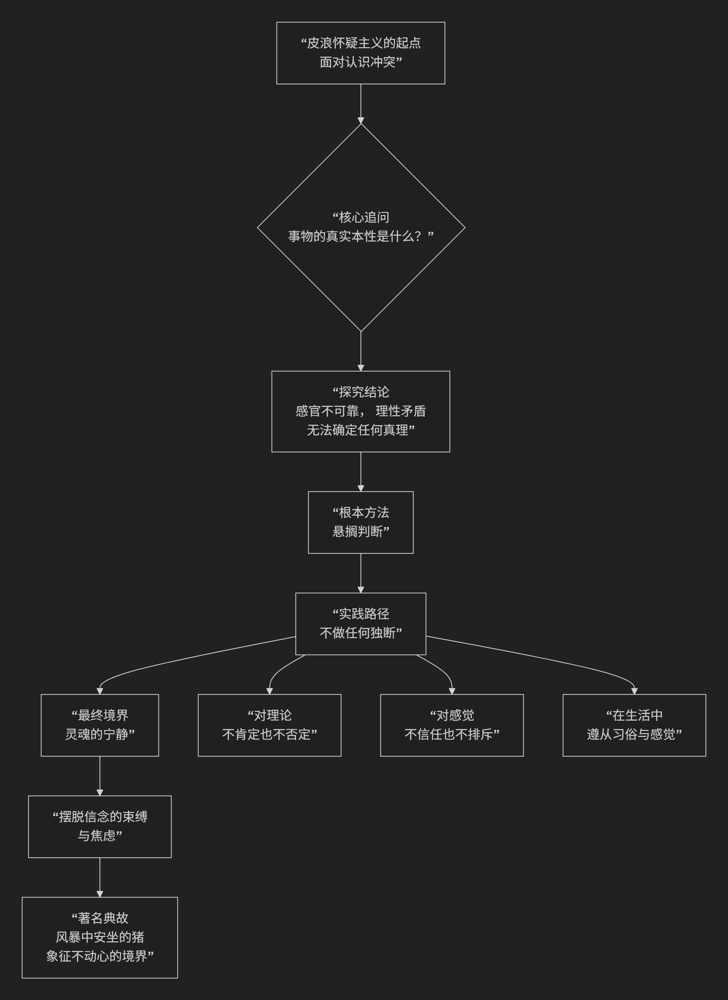

Pyrrho
================

基于皮浪（Pyrrho）的怀疑主义哲学核心思想

----------------------------------------------------------------------------

皮浪是古希腊怀疑主义哲学的奠基人。他本人没有留下任何著作，他的思想主要通过其弟子蒂蒙的记载以及后来塞克斯都·恩披里柯的系统阐述而流传于世。

皮浪怀疑主义的核心思想并非一套复杂的理论体系，而是一种 **根本性的生活态度和哲学实践**。其终极目标是通过彻底的“存疑”达到心灵的“宁静”。这一思想的根本逻辑与实践路径，可以通过下图清晰地展现：

以下，我们将沿此逻辑脉络，深入解析皮浪哲学的核心要义。

一、核心目标：灵魂的宁静

皮浪哲学的出发点和最终目的都是实践性的—— **如何获得幸福，或者说，如何让灵魂免受扰动，达到“宁静”的境界。**

他认为，困扰和焦虑源于两个原因：

1.  **我们无法拥有真正可靠的知识** （对事物本性的无知）。

2.  **但我们却强烈地渴望获得它并依此生活** （对确定性的执着）。

因此，他的解决方案是：**如果我们能彻底放弃对“确定事物本性”的追求，那么由这种追求所带来的困扰自然就会消失。**

二、根本方法：悬搁判断

“悬搁判断”是皮浪怀疑主义最核心的操作。希腊文是 **epochē**，意为“中止”或“停止”。

*   **它是什么？** 指 **对任何超出显明现象之外的问题，停止做出“真”或“假”的判断**。即，不对“事物本身究竟是什么”下结论。
*   **为何要悬搁？** 皮浪认为，我们的 **感官是矛盾的、不可靠的** （同一阵风，有人觉得冷，有人觉得凉）；我们的 **理性推理也充满矛盾和无解的二律背反** （任何命题都有同样有力的反命题）。因此，我们没有任何坚实的基础来断定事物的真实本性。
*   **著名格言**：**“我不比任何东西更是什么。”** 这句话精辟地体现了悬搁判断的精髓：蜂蜜尝起来是甜的，但我 **无法判断** 它“本身”是否是甜的。我止步于感觉现象，不做进一步的形而上学断言。

三、实践姿态：不做独断，遵循现象

怀疑主义者悬搁判断后，如何生活？他们会陷入瘫痪吗？答案是否定的。

皮浪主张一种 **“不做独断”的生活**：

*   **在理论上**：对一切超越现象的本体论问题（如世界是有限的还是无限的，是否有神等）保持沉默，不置可否。

*   **在感觉上**：承认感觉的显现（如“我感觉冷”），但不独断地认为“冷”是事物本身的属性。

*   **在生活中**：**遵循“现象”、习俗和本能**。即，按照社会的惯例、身体的自然需求和感觉的引导来行动。饿了就吃，渴了就喝，遵守法律，参与社会活动。但这是一种 **非独断的遵循**，他做这些事，并不基于“这些事本身是好的或对的”这样的信念，而是因为它们就是这样“显现”的，是生活的常规。

四、著名典故与影响

*   **皮浪与猪**：第欧根尼·拉尔修记载了一个著名故事：皮浪在船上遇到风暴，同伴们惊慌失措，他却指着一头在风暴中安然进食的猪，说：“智者应当像这头猪一样，在任何环境下都保持心灵的平静。”这个故事形象地说明了“不动心”的理想境界。
*   **历史地位**：皮浪开创的怀疑主义传统，经过他的追随者（尤其是 **塞克斯都·恩披里克** ）的系统化，形成了完整的哲学体系，成为古希腊哲学中与柏拉图学园、伊壁鸠鲁学派、斯多葛学派并立的重要思潮。其思想对后来的西方哲学，尤其是近代的蒙田、休谟等人产生了深远影响。

五、核心要义总结

.. list-table:: 
   :header-rows: 1
   :widths: 25 45 30
   :align: center

   * - **理论维度**
     - **核心命题**
     - **关键概念**
   * - **哲学目标**
     - **通过"悬搁判断"达到"灵魂的宁静"。**
     - **宁静、不动心、幸福**
   * - **核心方法**
     - **对事物的真实本性"悬搁判断"。**
     - **悬搁判断、存疑**
   * - **认识论立场**
     - **感官不可靠，理性矛盾，无法认识事物本性。**
     - **不可知论、现象与本体区分**
   * - **生活实践**
     - **不做独断，遵循现象、习俗和本能生活。**
     - **遵循现象、非信念行动**

思想特质

*   **实践性**：皮浪的怀疑主义首先是一种生活方式和心灵修炼，而非纯粹的理论建构。
*   **治疗性**：它将哲学视为治疗心灵困扰的“医术”，旨在通过“悬搁判断”来消除因独断信念而产生的焦虑。
*   **彻底性**：它将怀疑推向极致，甚至对“怀疑本身”也保持怀疑，从而避免成为另一种独断论。

总而言之，皮浪的核心思想在于，他是一位 **“心灵的医生”和“宁静的探索者”** 。他教导我们，**真正的智慧或许不在于拼命抓住某个看似坚固的“真理”，而在于有勇气承认认识的局限，并由此从无休止的求知焦虑中解脱出来。**

他的全部工作是对**人类认知傲慢**的一次深刻治疗，并为在不确定的世界中如何**获得内心的平静与自由**提供了一种极端而富有启发的答案。在这个意义上，他不仅是怀疑主义的创始人，更是一位探寻人类根本幸福的思想家。

------------

 .. toctree::
    :maxdepth: 3

    grok
    copilot
    deepseek
    gemini
