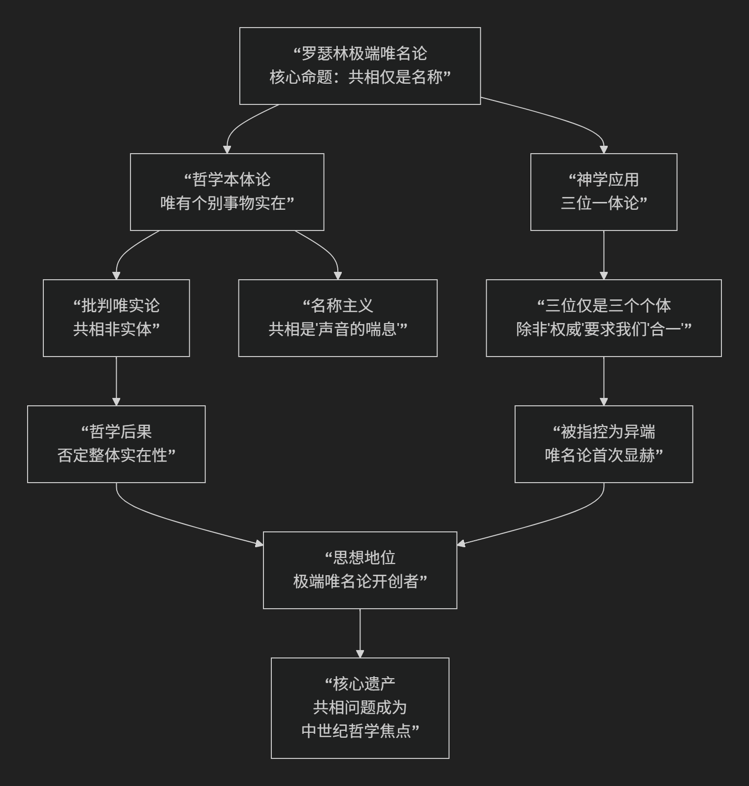

Rosecelin
=======================

基于早期唯名论代表人物罗瑟林（Rosecelin of Compiègne）的哲学核心思想

----------------------------------------------------------------------------

罗瑟林（约1050-1125年）是11世纪末法国经院哲学家，被公认为 **极端唯名论最早的明确代表**。他的思想极具革命性和挑战性，但由于其著作大多散佚，我们主要通过他的论敌（如安瑟尔谟和阿伯拉尔）的转述和批判来了解其观点。

他的核心思想可以概括为：**将唯名论立场推向极致，主张普遍概念（共相）仅仅是“声音的喘息”或“名称”，没有任何对应的实在性，真实存在的只有个别具体的事物。**

这一核心主张及其引发的哲学与神学后果，可以通过下图清晰地展现：

以下，我们将沿此逻辑脉络，深入解析罗瑟林的核心思想。

一、核心命题：共相仅仅是“声音的喘息”

这是罗瑟林哲学最著名也最激进的主张，直接挑战了当时主导的唯实论。

*   **靶子：唯实论**：以安瑟尔谟为代表的唯实论认为，**普遍概念（共相）**，如“人类”、“红色”，是独立于个别事物而存在的 **真实实体**。存在一个客观的“人类”理念，所有具体的人都是其分有或摹本。

*   **罗瑟林的革命性主张**：

    *   共相（如“人类”）**不是任何实体**。

    *   它仅仅是 **一个名称**、一个 **词语**、一种 **“声音的喘息”**。

    *   真实存在的只有 **个别的、具体的事物**，如苏格拉底这个人、这朵红色的花。

*   **内涵**：当我们说“苏格拉底是人类”时，“人类”这个词并不指代任何普遍的、客观存在的“人类实体”，它只是一个我们用来称呼苏格拉底、柏拉图等所有具体个人的 **语言标签**。这个标签本身没有实在性，就像给一只狗取名叫“星星”，但这个名字并不是一颗真正的星。

二、哲学后果：对“整体”实在性的否定

从其极端唯名论出发，罗瑟林得出了更惊人的推论。

*   **部分的实在性优先于整体**：如果只有个别事物是实在的，那么所谓的“整体”（如“学校”、“教会”、“国家”）就没有独立的实在性。整体仅仅是 **个别事物的集合名称**。

*   **安瑟尔谟的转述与批判**：安瑟尔谟猛烈抨击罗瑟林的观点，指责他认为“整体只是虚假，只有部分才是真实”，并将这种观点嘲讽为“那些只信感官的愚蠢之徒”的哲学。

三、神学应用：三位一体论与异端指控

罗瑟林将他的逻辑应用于基督教核心教义“三位一体”，引发了轩然大波。

*   **三位一体问题**：正统教义主张，圣父、圣子、圣灵是 **三个位格，但同一个实体（上帝）**。

*   **罗瑟林的推论**：

    *   如果共相（如“神性”）不是实在的实体，而只是名称。

    *   那么圣父、圣子、圣灵就只能是 **三个独立的实体**，就像三个具体的人一样。

    *   所谓“一位上帝”只是一个 **名称**，用来称呼这三个独立的实体集合。

*   **“三神论”指控**：这种观点被视为 **三神论** 的异端，即信仰了三位神。罗瑟林于1092年在苏瓦松会议上受到异端指控，被迫收回己见。

*   **他的妥协（？）**：据称，罗瑟林辩解道，他并非否认三位一体，而是说 **除非“权威”要求我们这样理解，否则从逻辑上讲，三位格应是三个实体**。这暴露了其哲学理性与神学权威之间的冲突。

四、核心要义总结

.. list-table:: 
   :header-rows: 1
   :widths: 30 40 30
   :align: center

   * - **理论维度**
     - **核心命题**
     - **关键概念与后果**
   * - **本体论（共相问题）**
     - **极端唯名论：共相仅仅是"声音的喘息"或名称，没有任何实在性。**
     - **名称主义、反唯实论、个别事物唯一实在**
   * - **部分与整体**
     - **整体没有独立实在性**，它只是个别部分的集合名称。
     - **整体虚无、部分优先、集合论**
   * - **神学应用**
     - **三位一体中的三个位格是三个实体**，否则共相（神性）就成为实体。
     - **三神论嫌疑、异端指控、理性与权威的冲突**
   * - **历史地位**
     - **极端唯名论的开创者**，首次将唯名论立场清晰化并推向极端。
     - **唯名论传统的起点、共相争论的激化者**

五、思想特质与影响

*   **极端性与革命性**：罗瑟林的立场是唯名论中最激进的，毫不妥协地否定共相的实在性。

*   **逻辑一致性**：他严格遵循其逻辑前提，并将其应用于最敏感的神学领域，显示了哲学的锋利性。

*   **影响深远**：尽管其观点被压制，但他点燃的共相问题之争成为整个中世纪经院哲学的核心议题。他的学生阿伯拉尔（提出更精致的“概念论”）正是在批判和修正其老师观点的基础上，推动了哲学的深化。

六、总结

总而言之，罗瑟林的核心思想在于，他是一位 **“逻辑的极端主义者”和“唯名论的先锋”** 。他教导我们，**如果严格遵循感官经验和逻辑一致性，那么哲学必须拒绝任何抽象的、非个体的实体存在，世界只由无数个别的“这个”构成。**

他的全部工作是对 **抽象实体的一次彻底解构**。尽管其结论在神学上无法被接受，但他以惊人的勇气，将理性逻辑推至其极限，迫使后来的哲学家（如阿伯拉尔）必须提出更精密、更复杂的理论来回答共相问题。在这个意义上，罗瑟林是 **中世纪哲学深度化的重要催化剂**。

------------

 .. toctree::
    :maxdepth: 3

    grok
    copilot
    deepseek
    gemini
