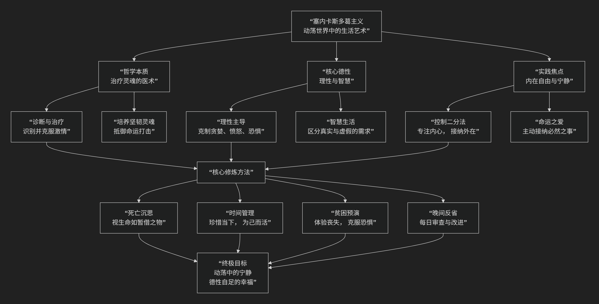

Seneca
================

基于吕齐乌斯·安涅·塞内卡（Lucius Annaeus Seneca）的斯多葛主义哲学核心思想

----------------------------------------------------------------------------

吕齐乌斯·安涅·塞内卡是罗马斯多葛学派中最具影响力的哲学家之一。他不仅是思想家，还是政治家、剧作家和尼禄皇帝的老师。他的斯多葛主义哲学核心思想可以概括为：**一种聚焦于实践伦理、治疗内心困扰和直面生命无常的“生活哲学”。其核心在于运用理性来培养德性、克服激情，并通过对死亡和命运的沉思，在动荡不安的世界中获得内心的宁静与真正的自由。**

塞内卡的哲学不是抽象的理论体系，而是一套针对现实生活的精神修炼指南。其核心架构与实践路径可以通过下图清晰地展现：

以下，我们将沿此逻辑脉络，深入解析塞内卡哲学的核心要义。

一、哲学的本质：治疗灵魂的医术

塞内卡将哲学视为一门实践性的治疗艺术，其目的是治愈灵魂的疾病。

*   **核心隐喻**：**哲学是灵魂的医术**。正如医生治疗身体疾病，哲学家治疗灵魂的疾病——主要是 **激情** （如贪婪、愤怒、恐惧、焦虑）和 **错误的价值观**。

*   **病因诊断**：人类痛苦的根源在于 **错误的判断**。我们追逐错误的东西（财富、权力、名声），恐惧本应接纳的事物（贫困、死亡、命运的安排），因为我们未能运用理性区分什么是真正的好与坏。

*   **治疗目标**：通过哲学修炼，培养一个 **强大、宁静、自足的灵魂**，使其能够抵御命运的任何打击。

二、核心德性：理性与智慧

塞内卡认为，**德性是唯一的善**，而德性的核心是 **理性** 和 **智慧**。

*   **理性**：理性是神圣的火花，是人最高贵的能力。它的作用是 **主导生活，克制激情**。一个理性的人不会因成功而傲慢，也不会因失败而绝望。

*   **智慧**：智慧在于 **辨别什么真正属于我们，什么不属于我们**。我们的性格、判断和意愿属于我们；我们的身体、财富、名声和地位则属于命运，随时可能被拿走。

*   **著名格言**：**“德性即幸福。”** 真正的幸福不依赖于任何外在条件，只依赖于内在的德性。一个拥有德性的人，即使在最恶劣的环境中也是幸福的。

三、实践焦点：内在自由与宁静

塞内卡哲学的全部实践都指向一个目标：**获得内在自由与宁静**。

*   **内在自由**：自由不是为所欲为的权力，而是 **免于激情奴役的状态**。一个被欲望或恐惧控制的人，无论多么有权有势，都是奴隶。真正的自由在于 **不贪求你不该贪求的东西，不恐惧你不该恐惧的东西**。

*   **宁静**：宁静源于 **顺应自然** 和 **接纳命运**。塞内卡提倡 **“爱命运”** ——不是被动忍受，而是主动地、理性地接纳发生的一切，视其为宇宙自然秩序的一部分。

四、核心修炼方法

塞内卡在其书信和论文中提出了许多具体的精神修炼方法。

1. 沉思死亡

*   **核心**：**把每一天都当作最后一天来活。**

*   **实践**：经常思考你和所爱之人的死亡。这不是为了悲观，而是为了 **珍惜当下**，认识到生命的短暂，从而不再拖延，活出真正的自己。它教你 **蔑视命运**，因为一个准备好死亡的人是无敌的。

2. 预演不幸

*   **核心**：**提前在想象中经历可能的损失。**

*   **实践**：定期过简朴的生活，想象失去财富、地位或健康。这并非希望它们发生，而是通过练习证明 **没有这些外在之物，你依然可以活得很好**，从而减少对它们的依赖和恐惧。

3. 晚间反省

*   **核心**：**每日进行灵魂的审查。**

*   **实践**：每天睡前回顾这一天的言行思绪。问自己：“我今日克服了哪个缺点？在何事上被激情左右？有何进步？” 这旨在 **持续不断地进行自我完善**。

4. 珍惜时间

*   **核心**：**时间是我们最宝贵、最易流失的财产。**
*   **实践**：塞内卡在《论生命之短暂》中猛烈抨击了人们浪费时间的行为。他主张，生命并非短暂，而是 **我们浪费得太多**。真正的智慧在于将时间投资于培养德性和追求智慧，**为自己而活，而非活在他人的看法里**。

五、对财富与社会的态度

与某些极端斯多葛主义者不同，塞内卡的态度更富实践性和中庸色彩。

*   **财富观**：财富本身非善非恶。它是 **中性的**。智者可以拥有和使用财富，但 **绝不依附于它**。他应像财富的 **临时保管者**，而非奴隶主，随时准备毫无怨言地将其归还给命运。

*   **社会参与**：斯多葛主义者不应逃避社会。只要条件允许，就应 **积极参与公共事务，服务他人**，因为人是社会性的存在。但当政治环境变得邪恶无法改变时（如他在尼禄统治下的处境），智者可以选择 **退隐**，专注于自身德性的完善。

六、核心要义总结

.. list-table:: 
   :header-rows: 1
   :widths: 25 45 30
   :align: center

   * - **理论维度**
     - **核心命题**
     - **关键概念**
   * - **哲学本质**
     - **哲学是治疗灵魂的医术，旨在克服激情与错误价值观。**
     - **灵魂医术、治疗哲学、激情克服**
   * - **核心德性**
     - **德性是唯一真正的善，幸福源于理性与智慧的生活。**
     - **德性即幸福、理性主导、智慧辨别**
   * - **实践目标**
     - **通过内在修炼获得不受外界影响的自由与宁静。**
     - **内在自由、灵魂宁静、爱命运**
   * - **修炼方法**
     - **通过沉思死亡、预演不幸、晚间反省等方法践行哲学。**
     - **死亡沉思、贫困预演、时间管理、每日反省**

思想特质与影响

*   **文学性与感染力**：塞内卡是杰出的文学家，其文章充满比喻、警句和生动的例证，极具说服力和感染力。

*   **现实性与中庸**：他的哲学直面罗马帝国的奢华、腐败与政治恐怖，为在现实中生存并提供了一种既坚持原则又灵活务实的智慧。

*   **深远影响**：他的思想深刻影响了后来的基督教思想（如奥古斯丁）、文艺复兴时期的人文主义以及现代的哲学和心理治疗（如认知行为疗法）。

七、总结

总而言之，塞内卡的核心思想在于，他是一位 **“灵魂的医生”和“生活的智者”** 。他教导我们，**哲学不是在学院中讨论的抽象理论，而是需要在每一天、每一刻去践行的生活艺术。真正的力量不在于控制世界，而在于控制我们对世界的反应。**

他的全部工作是对 **如何在充满不确定、不公和痛苦的世界中，有尊严地、宁静地、有意义地生活** 这一永恒问题的深刻回答。他的一生（包括其充满争议的政治生涯和被迫自杀的结局）本身就是对其哲学的一次宏大实践与考验。在这个意义上，他不仅是斯多葛主义的代言人，更是一位用生命诠释哲学的永恒榜样。

------------

 .. toctree::
    :maxdepth: 3

    grok
    copilot
    deepseek
    gemini
