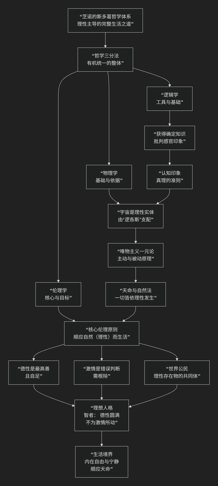

Zeno of Citium
================

基于斯多葛学派（Stoicism）的创始人、基提翁的芝诺（Zeno of Citium）哲学核心思想

----------------------------------------------------------------------------

基提翁的芝诺是古希腊斯多葛学派的创始人。他的哲学核心思想可以概括为：**确立了一种以“理性”为核心、以“顺应自然”为准则、以“德性”为最高目标的完整哲学体系，为斯多葛主义奠定了坚实的基础。**

芝诺的思想体系严谨而统一，其核心架构与内在逻辑可以通过下图清晰地展现：

以下，我们将沿此逻辑脉络，深入解析芝诺哲学的核心要义。

一、哲学体系的划分：逻辑学、物理学、伦理学

芝诺首次清晰地将哲学划分为三个有机部分，并用生动的比喻说明它们的关系：

*   **逻辑学**：哲学的 **围墙** 和 **骨架**。它提供正确推理、辨别真理的工具，是确保知识可靠性的基础。
*   **物理学**：哲学的 **灵魂** 或 **血肉**。它研究自然（宇宙）的本质和法则，为伦理学提供宇宙观的支撑。
*   **伦理学**：哲学的 **果实** 和 **最终目的**。它探讨如何生活，是哲学的意义所在。

这三部分紧密相连：**逻辑学确保我们正确认识世界（物理学），而对世界的正确认识指导我们如何正确地生活（伦理学）。**

二、逻辑学：真理的准则与“认知印象”

芝诺的逻辑学旨在为知识找到一个可靠的基础，以对抗怀疑论的挑战。

*   **核心概念：“认知印象”**

    *   这是芝诺认识论的核心。他认为，有些感觉印象是如此清晰、鲜明和有力，以至于它们 **不容置疑地揭示了其对象本身**。

    *   **定义**：一种源于真实存在、并与该存在相一致、且不可能源于非存在的印象。

    *   **作用**：“认知印象”是 **真理的准则**。我们以此为标准，同意它，就能形成真知；拒绝它，就会陷入错误。

三、物理学：理性的宇宙与唯物主义一元论

芝诺的物理学为其伦理学提供了形而上学基础，其核心是 **理性主义的唯物主义**。

*   **宇宙是一个有生命的理性实体**：整个宇宙是一个 **有生命的、有理智的、物质的统一体**。它由一种主动的、神圣的理性原则（他称之为 **“逻各斯”**、**“神”** 或 **“自然”**）所渗透和支配。

*   **主动原理与被动原理**：

    *   **被动原理**：无定性、被动的质料。

    *   **主动原理**：内在于质料中的、能动的理性（逻各斯）。

    *   二者不可分，是同一实体的两个方面，构成了 **唯物主义的一元论**。

*   **天命与自然法**：由于宇宙由理性统治，所以万物都根据 **严格的因果必然性** 而发生，这就是“天命”。所谓的“偶然”只是我们未能认识的因果链。**自然法** 就是这种神圣理性的法则。

*   **万物相互关联**：宇宙是一个有机整体，所有事件都是这个整体理性计划的一部分。

四、伦理学：顺应自然与德性生活

这是芝诺哲学的最高目标和最著名的部分。

1. 核心原则：“顺应自然（或理性）而生活”

*   **内涵**：由于人的本性是 **理性** （分有了宇宙的逻各斯），而宇宙的本性也是理性，因此，“顺应自然生活”就是 **顺应理性而生活**。

*   **具体化**：即 **有德性地生活**。德性是理性的完美体现。

2. 德性是唯一的善

*   **核心主张**：**德性是最高且唯一的善**，**邪恶是唯一真正的恶**。其他一切（生命、健康、财富、名誉、死亡、疾病、贫困等）都是 **“无关紧要”的**。

*   **无关紧要之物**：虽然这些事物本身非善非恶，但根据它们是否更符合理性，可以分为：

    *   **首选的无足轻重之物**：如健康、财富，理性会选择它们。

    *   **拒斥的无足轻重之物**：如疾病、贫困，理性会避免它们。

*   **德性自足**：有德之人是 **自足的** 和 **幸福的**，因为他的幸福完全依赖于自身内在的德性，不依赖于任何外在的、无常的事物。

3. 激情是理性的病态

*   **定义**：激情是 **过度、违背理性的冲动**，是 **错误的判断**。

*   **主要激情**：包括贪欲、恐惧、快乐和痛苦。

*   **目标**：斯多葛主义的目标不是节制激情，而是 **根除激情**，达到 **“不动心”** 的境界，让灵魂完全由理性主导。

4. 世界主义

*   **著名主张**：芝诺在《共和国》中提出了 **世界主义** 思想。

*   **内涵**：由于所有人都分有神圣理性，因此我们不应将自己局限于某个城邦或种族，而应视所有理性存在者为 **同一共同体的成员** —— **世界公民**。

*   **意义**：这是对古希腊城邦狭隘观念的突破，奠定了斯多葛派社会伦理的基础。

五、理想人格：“智者”

芝诺描绘了斯多葛主义的理想人格—— **“智者”**。

*   **特征**：智者是完全理性、拥有完美德性、摆脱了一切激情、自足且幸福的人。

*   **境界**：他 **顺应天命**，坦然接受发生的一切，因为他知道那是宇宙理性的一部分。他在任何环境下都保持 **内在的宁静与自由**。

*   **现实性**：芝诺承认真正的“智者”极为罕见，但他作为一个 **理想标准**，为人们提供了努力的方向。

六、核心要义总结

.. list-table:: 
   :header-rows: 1
   :widths: 25 45 30
   :align: center

   * - **理论维度**
     - **核心命题**
     - **关键概念与贡献**
   * - **哲学体系**
     - **哲学分为逻辑学、物理学、伦理学三部分，构成有机整体。**
     - **哲学三分法、逻辑学（围墙）、物理学（灵魂）、伦理学（果实）**
   * - **逻辑学**
     - **"认知印象"是真理的准则，为知识提供可靠基础。**
     - **认知印象、真理准则、同意**
   * - **物理学**
     - **宇宙是理性的物质实体，由"逻各斯"统治，遵循必然法则。**
     - **逻各斯、理性宇宙、唯物主义一元论、天命、自然法**
   * - **伦理学**
     - **"顺应自然（理性）而生活"，德性是唯一真正的善。**
     - **顺应自然、德性至上、激情根除、无关紧要之物、世界主义、智者**

七、思想特质与影响

*   **系统性**：芝诺构建了一个逻辑严密、环环相扣的完整哲学体系。

*   **理性主义**：理性是其哲学的最高原则，贯穿于认识论、宇宙论和伦理学。

*   **实践性**：其哲学最终指向一种理性的、有德性的生活方式，具有很强的实践指导意义。

*   **深远影响**：他创立的斯多葛学派成为希腊化时代和罗马时期最重要的哲学流派之一，深刻影响了后来的罗马法、基督教思想以及近代西方哲学。

八、总结

总而言之，基提翁的芝诺的核心思想在于，他是一位 **“体系构建者”和“理性生活的先知”** 。他教导我们，**宇宙是一个由理性法则支配的和谐整体，而人生的最高目标在于运用我们自身的理性，认识并顺应宇宙的理性，从而过一种有德性、自足和宁静的生活。**

他的全部工作是对 **理性、自然与德性之统一** 的一次宏伟建构。在城邦解体、个体寻求生命意义的时代，芝诺的哲学为个人提供了一种在广阔而有序的宇宙中安身立命的智慧。在这个意义上，他不仅是斯多葛学派的创始人，更是西方思想史上一位里程碑式的人物。

------------

 .. toctree::
    :maxdepth: 3

    grok
    copilot
    deepseek
    gemini

---------------------------

【:doc:`古希腊两个芝诺（Zeno） </chats/outlaw/analyse/foreign/schools/ancient/stoicism/zeno/zenos>`】
