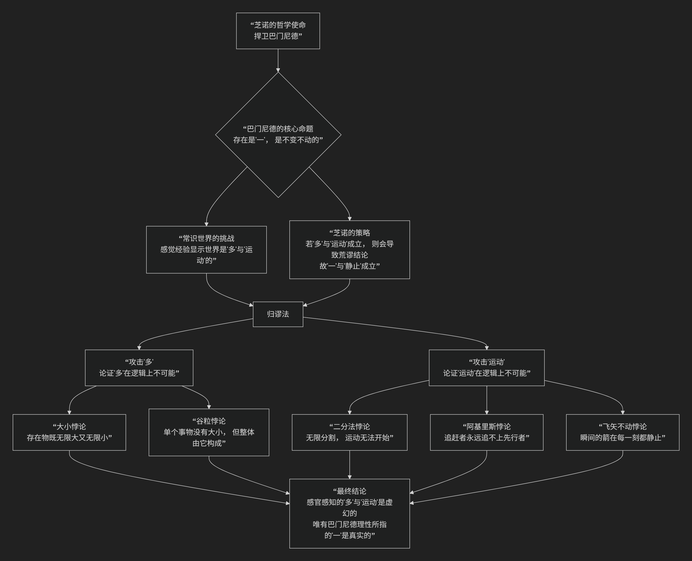

Zeno of Elea
=============

基于埃利亚的芝诺（Zeno of Elea）的哲学核心思想

--------------------------------------------

埃利亚的芝诺（约公元前490-430年）是古希腊前苏格拉底哲学家，他是巴门尼德的学生和忠实捍卫者。芝诺的哲学非常独特：**他本人并未提出一个关于世界本原的正面理论，而是通过一系列精妙的逻辑论证，来反驳对巴门尼德“一元论”的批评，从而证明“多”和“运动”的概念充满逻辑矛盾，进而捍卫其老师“存在是一、不变不动”的核心观点。**

因此，芝诺的核心思想可以概括为：**为巴门尼德辩护的“反证法大师”，其哲学是“逻辑悖论的武器库”，旨在通过揭示常识观念的荒谬性来捍卫理性的真理。**

他的论证极具挑战性，其核心逻辑可以通过下图清晰地展现：

以下，我们将沿此逻辑脉络，深入解析芝诺如何攻击“多”与“运动”。

一、思想背景：为巴门尼德辩护

要理解芝诺，必须先理解他的老师巴门尼德。

*   **巴门尼德的核心主张**：真正的“存在”是 **唯一的、不可分的、不生不灭、不变不动的**。我们感官所感知到的充满多个变化事物的世界，只是“意见”，是虚幻的表象。
*   **反对者的常识性质疑**：这明显违背常识！我们明明看到多个物体在运动。
*   **芝诺的登场**：芝诺的任务不是重复老师的观点，而是采取一种攻击性的辩护策略。他说：“我的论证的目的是捍卫巴门尼德的论点，通过表明，反对它的主张——即存在‘多’和‘运动’——会导致比它更荒谬的结论。”

二、攻击“多”：揭示“多元论”的逻辑矛盾

芝诺试图证明，如果我们承认“多”的存在，就会陷入逻辑悖论。

1. 关于大小的悖论

*   **论证**：
    1.  如果存在“多”，那么这些多个事物必须有数量，是有限的。
    2.  同时，这些事物之间必须有其他事物分隔，而分隔物之间又有其他事物，如此下去，事物的数量又是无限的。
*   **结论**：因此，如果存在“多”，它就必须同时是 **有限的和无限的**，这是矛盾的。所以，“多”是不可能的。

2. 关于谷粒的悖论

*   **论证**：
    1.  单个的谷粒落地时没有声音。
    2.  一袋谷粒落地时却有声音。
    3.  但如果一袋谷粒是由多个单个谷粒组成的，那么声音也应该由多个“无声”组成。
*   **结论**：这导致了 **整体不等于部分之和** 的矛盾。因此，认为事物由无限多个有体积的部分构成的观点是荒谬的。

三、攻击“运动”：著名的运动悖论

这是芝诺最广为人知的贡献，他提出了四个关于运动的悖论，旨在证明运动在逻辑上是不可能的。

1. 二分法悖论

*   **场景**：假设你要从A点走到B点。

*   **论证**：在到达B点之前，你必须先到达全程的 **1/2** 处；在到达1/2处之前，必须先到达1/2的1/2，即 **1/4** 处……如此无限分割下去。

*   **结论**：由于这段路程包含了 **无限多个点**，你永远无法在有限时间内越过无限的点，因此你甚至无法开始运动。

2. 阿基里斯追不上乌龟

*   **场景**：跑步英雄阿基里斯与乌龟赛跑，乌龟先跑一段。

*   **论证**：当阿基里斯跑到乌龟的起点时，乌龟已经向前爬了一小段；当阿基里斯跑到那个新点时，乌龟又前进了一点点……如此反复。

*   **结论**：阿基里斯每次都需要先到达乌龟的前一个位置，而乌龟总是能创造一个新的起点。因此，尽管速度差距巨大，阿基里斯 **永远追不上乌龟**。

3. 飞矢不动

*   **场景**：一支箭在空中飞行。

*   **论证**：在任何一个 **无限的瞬间**，箭都占据一个与自身长度相等的空间。因此，在这一瞬间，箭是 **静止** 的。

*   **结论**：既然整个飞行过程由无数个这样的瞬间组成，而每个瞬间箭都是静止的，那么飞行的箭整体上也是 **不动的**。

四、哲学意义与影响

芝诺的论证远非简单的诡辩，它们深刻地触及了哲学、数学和物理学的核心问题。

.. list-table:: 
   :header-rows: 1
   :widths: 30 70
   :align: center

   * - **方面**
     - **意义与影响**
   * - **哲学意义**
     - **揭示了理性与感官的冲突**：芝诺展示了逻辑推理的结论如何与日常经验严重背离，迫使哲学思考 **无限、连续、空间与时间** 的本质。
   * - **方法论意义**
     - **归谬法与辩证法的典范**：他熟练运用归谬法，通过接受对手的前提并推导出荒谬结论，来驳倒对手。这成为逻辑学和哲学论证的经典工具。
   * - **数学意义**
     - **提前触及微积分核心问题**：他的运动悖论本质上关乎 **无限分割与求和** 的问题。直到微积分建立了"极限"和"无穷小"概念，才为这些问题提供了数学解答。
   * - **物理学意义**
     - **对时空本质的追问**：他的悖论挑战了人们对时间、空间和运动连续性的朴素理解，激发了后世对时空是连续还是离散的持续探索。

五、总结

总而言之，芝诺的核心思想在于，他是一位 **“逻辑的禁卫军”和“常识的爆破手”**。他本人或许没有建立庞大的体系，但他用锋利无比的逻辑匕首，刺穿了常识世界的帷幕，迫使后人不得不思考：**我们赖以生存的感官世界，其基础是否稳固？**

他的全部工作是一次对人类思维的极限测试。他教导我们，**真正的哲学思考必须敢于用理性的严格性去拷问经验的貌似合理性**。尽管他的结论看似荒谬，但他提出的问题，至今仍在哲学、数学和物理学中回响，证明了他作为一位古代思想家的不朽深度。

------------

 .. toctree::
    :maxdepth: 3

    grok
    copilot
    deepseek
    gemini

---------------------------

【:doc:`古希腊两个芝诺（Zeno） </chats/outlaw/analyse/foreign/master/ancient/zenos>`】
