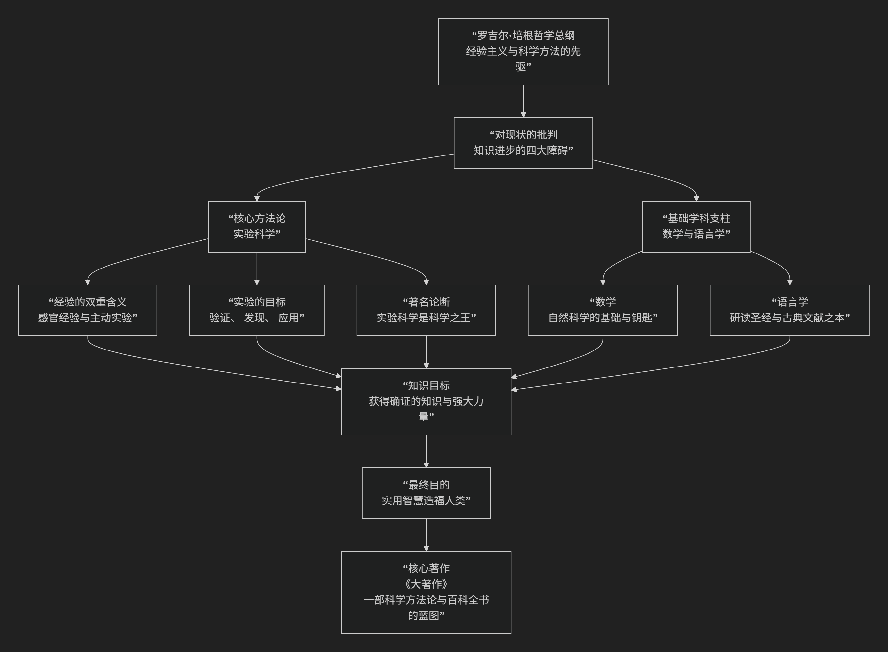

Roger Bacon
=================

基于 ​​罗吉尔·培根（Roger Bacon）​​ 的哲学核心思想

----------------------------------------------------------------------------

罗吉尔·培根是13世纪方济各会修士，一位极具前瞻性和批判精神的思想家。他通常不被视为构建了宏大体系的哲学家，而更像是一位 **科学方法的先知** 和 **经院学术的尖锐批判者**。他的核心思想可以概括为：**以“经验”为知识的最终权威，强烈批判盲目信从权威和空洞推理的学风，并系统性地倡导将数学、语言学与实验作为所有科学研究的基石，其根本目标是革新知识体系，造福人类社会。**

培根的思想极具革命性，其核心架构与内在逻辑可以通过下图清晰地展现：

我们将沿此逻辑脉络，深入解析培根哲学的核心要义。

一、对经院学术的尖锐批判：四大障碍

培根思想的起点是对当时知识界积弊的猛烈抨击。他认为追求真理的道路上存在四大主要障碍：

1.  **对权威的盲从**：不加批判地接受权威（如亚里士多德、教会先贤）的言论。
2.  **习惯的束缚**：固守沿袭已久的观念，缺乏怀疑精神。
3.  **大众的偏见**：被无知大众的普遍看法所左右。
4.  **虚假的智慧**：炫耀空洞、浮夸的知识以掩盖自身的无知。

他认为，这四大障碍导致学术充满了无休止的争论和错误，远离了真正的真理。

二、核心方法论：实验科学

在批判之后，培根提出了他的正面主张，其最核心、最著名的部分就是 **对实验方法的推崇**。

*   **“实验科学是科学之王”**：这是他最革命的论断。他认为，其他科学（如逻辑学、物理学）只是提供了理论和方法，但 **唯有实验科学才能最终证明它们的结论，并产生新的知识**。
*   **经验的两种形式**：

    1.  **外部感官经验**：我们通过感官认识自然世界，这是基础。

    2.  **内在启示经验**：通过上帝的启示获得神学真理。

    *   但最重要的是，他强调了第三种，即 **主动的“实验”**：通过 **人为设计和干预** 来验证假设、探索未知、制造新事物。这超越了被动的观察。

*   **实验的三个目的**：

    *   **验证**：证实从推理和权威那里得来的结论。

    *   **发现**：探索单凭推理无法发现的自然奥秘。

    *   **应用**：制造有用的发明，造福人类（如火药、透镜、机械）。

三、知识的两大支柱：数学与语言学

培根认为，可靠的知識大厦必须建立在两个坚实的基础上：

*   **数学的基础性**：

    *   他断言 **“数学是科学的大门和钥匙”** 。所有自然科学（如天文、物理、音乐、地理）都离不开数学。没有数学，其他科学就无法达到确定性。

    *   他预见到数学是描述自然规律的精确语言。

*   **语言学的重要性**：

    *   他强烈主张学习 **希伯来语、希腊语和阿拉伯语** 等原文语言。

    *   目的有二：一是为了准确理解《圣经》和古典文献，避免翻译错误导致的误解；二是为了获取阿拉伯世界先进的科学知识（如光学、医学）。

四、知识的最终目的：实用智慧

培根的思想具有强烈的实用主义倾向。

*   **知识就是力量**：他相信真知应该赋予人力量，以 **改善生活条件、促进社会福祉**。他本人对光学、火药、天文、地理学、历法改革等都进行了深入研究，预见了许多未来的科技发明（如望远镜、潜水艇、飞行器）。
*   **神学与科学的调和**：作为修士，他认为研究自然最终是为了 **更好地理解上帝的创造**，并利用这种理解来服务教会和社会（如纠正历法错误以准确计算宗教节日）。

五、核心要义总结

.. list-table:: 
   :header-rows: 1
   :widths: 25 45 30
   :align: center

   * - **理论维度**
     - **核心命题**
     - **关键概念与贡献**
   * - **批判哲学**
     - **盲从权威、习惯、偏见和虚假智慧是知识进步的四大障碍。**
     - **四大障碍、批判经院学风**
   * - **方法论核心**
     - **"实验科学是科学之王"，经验（尤其是主动实验）是知识的最终权威。**
     - **实验科学、感官经验、主动干预、验证与发现**
   * - **知识论基础**
     - **数学是所有自然科学的基础，语言学是理解文献的关键。**
     - **数学的基础性、语言学的工具性**
   * - **价值论**
     - **知识的目的是获得实用智慧，以造福人类社会。**
     - **实用主义、知识即力量、科学的应用性**

六、思想特质与历史地位

*   **革命性与前瞻性**：在13世纪，他的思想远远超出了他的时代，预告了400年后伽利略、弗朗西斯·培根等人的科学革命精神。
*   **悲剧性**：由于思想的激进和性格的直率，他长期受到教会权威的压制和监禁，著作也被忽视，直至近代才被重新发现和评价。
*   **历史地位**：他通常被看作是 **近代实验科学方法的伟大先驱**。尽管他的著作中仍夹杂着中世纪的神秘主义成分（如对炼金术、占星术的兴趣），但其核心主张——**强调观察、实验、数学和实用价值**——为他赢得了不朽的声誉。

七、总结

总而言之，罗吉尔·培根的核心思想在于，他是一位 **“理性的清道夫”和“科学的预言家”** 。他教导我们，**真正的知识并非源于引经据典，而是源于对自然的手动探究和数学的精确描述。权威的言论必须接受经验的检验，而知识的价值最终要由其对人类生活的改善来衡量。**

他的全部工作是对 **中世纪知识论和方法论** 的一次猛烈冲击。在一个崇尚权威和思辨的时代，他孤独地举起了 **经验、实验和实用** 的火炬，尽管这火炬在当时未能燎原，但其光芒照亮了通往现代科学世界的道路。在这个意义上，他不仅是方济各会的奇才，更是科学史上一位跨越时代的巨人。

------------

 .. toctree::
    :maxdepth: 3

    grok
    copilot
    deepseek
    gemini
