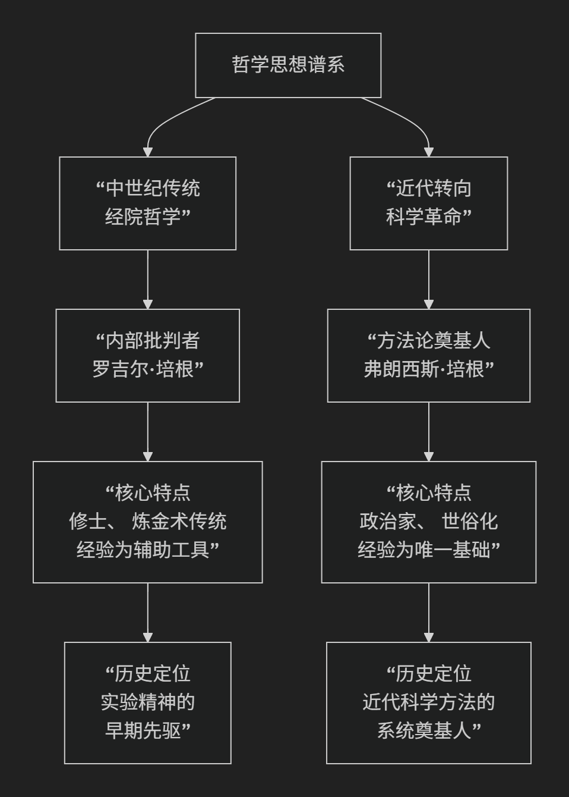

# compare

---

两个培根（Bacon）

---

这是一个非常经典的问题。罗吉尔·培根和弗朗西斯·培根两位哲学家虽然名字相近，且都强调经验和方法论，但他们是生活在完全不同时代的两位思想家，其思想背景、核心目标和历史角色有着根本性的区别。

他们的主要差异可以通过下表清晰地呈现：

| 对比维度 | **罗吉尔·培根** | **弗朗西斯·培根** |
| :--- | :--- | :--- |
| **所处时代** | **13世纪**（约1214-1292），**中世纪鼎盛期** | **16-17世纪**（1561-1626），**文艺复兴末期/科学革命前夜** |
| **身份背景** | **方济各会修士**，神学家，炼金术士 | **政治家，大法官**，散文家，哲学家 |
| **核心著作** | 《大著作》、《小著作》、《第三著作》 | 《新工具》、《学术的进展》、《新大西岛》 |
| **思想背景** | **经院哲学内部**的批判与革新，深受奥古斯丁传统影响 | **彻底反对经院哲学**，旨在构建全新的知识体系 |
| **核心方法论** | **强调“实验科学”**，但将其置于数学、语言学等学科之中，**并未系统化** | **系统提出“归纳法”**，作为取代亚里士多德三段论的**新工具** |
| **经验的角色** | 经验（尤其是主动实验）是**验证推理、发现新知**的关键手段 | 经验（系统收集的事实）是**所有知识的唯一基础**，推理必须建立在之上 |
| **科学的目的** | **服务于神学**：理解上帝创造的自然，也为教会和社会服务（如历法改革） | **为人类谋福利**：知识即力量，旨在征服自然，改善人类生活条件 |
| **对传统的态度** | **批判性地利用传统**（如阿拉伯科学、亚里士多德），但仍尊重权威框架 | **激进地批判和决裂**，提出“四假象说”系统清算一切认知偏见 |
| **历史角色与影响** | **孤独的先知**：思想远超时代，但被埋没，是实验精神的早期先驱 | **时代的吹号人**：为即将到来的科学革命提供了方法论宣言，直接影响皇家学会 |

为了更直观地把握两者在思想传承上的根本不同，下图展示了他们分别所属的思想脉络及其核心贡献：

---

### 核心区别的深入解析

#### 1. 时代与思想背景的根本不同
*   **罗吉尔·培根**身处**中世纪**。他的思考框架仍然是**神学中心论**的。他批判经院哲学的繁琐，目的是为了更有效地服务于神学，更好地理解上帝的创造。他的思想是经院哲学内部的“异类”和改革者。
*   **弗朗西斯·培根**身处**文艺复兴末期**，现代科学即将诞生。他的目标是**与古典和中世纪的传统彻底决裂**。他旗帜鲜明地反对经院哲学，认为它是徒劳无益的，试图建立一套全新的、世俗化的知识体系。

#### 2. 方法论的精密程度与系统性不同
*   **罗吉尔·培根**的伟大在于他**前瞻性地强调了“实验”的重要性**，并提出了“实验科学”的概念。但他并没有提供一套系统、可操作的方法论程序。他的思想更像是一系列充满洞见的宣言和呼吁。
*   **弗朗西斯·培根**的核心贡献在于他**系统化地提出了以“归纳法”为核心的科学方法论**。他著名的 **“三表法”**（存在表、缺如表、程度表）旨在通过系统收集和比较正反事例，逐步排除偶然因素，发现事物的本质形式（规律）。这是他提出的“新工具”，以取代亚里士多德的“旧工具”（演绎逻辑）。

#### 3. 对“经验”的理解深度不同
*   **罗吉尔·培根**强调的经验，更多指的是**个人的观察和主动的干预性实验**，用于验证理论和发现新现象。它仍然是获取知识的一种重要“手段”。
*   **弗朗西斯·培根**将经验提升到了**本体论和基础地位**。他认为所有知识必须从感官经验开始，通过系统化的归纳逐步上升为公理。他更关注如何**集体地、系统地收集和整理经验事实**（“自然史”），作为科学大厦的基石。

#### 4. 哲学目标的世俗化转向
*   **罗吉尔·培根**的最终目的带有中世纪色彩：**荣耀上帝，服务教会**。
*   **弗朗西斯·培根**的口号 **“知识就是力量”** 体现了完全不同的现代精神：知识的目的是为了**增强人类的能力，征服自然，创造理想社会**。他的《新大西岛》描绘了一个由科学家主导的乌托邦“本色列”，体现了其科学造福人类的世俗理想。

### 一个简明的总结

可以这样概括他们的关系：

*   **罗吉尔·培根** 是 **“实验科学的预言家”**。他在中世纪的黑夜里，远远地看到了未来科学方法的星光，并发出了孤独而勇敢的呼喊。
*   **弗朗西斯·培根** 是 **“科学方法的工程师”**。他在黎明时分，为即将到来的科学革命设计了一套详细的蓝图和施工方案。

他们都是科学思想史上的巨人，但**弗朗西斯·培根因其思想的系统性、世俗性和对科学共同体的直接影响，而被普遍视为“近代实验科学之父”**。而罗吉尔·培根则是一位值得尊敬的、生不逢时的伟大先驱。