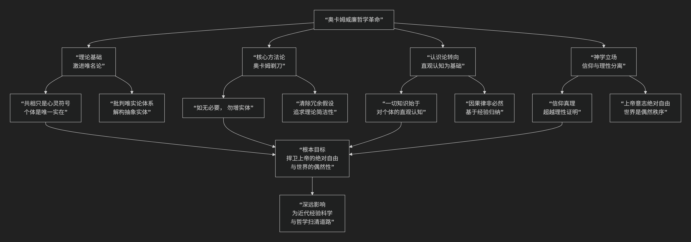

Ockham
=================

基于奥卡姆的威廉（William of Ockham）的哲学核心思想

----------------------------------------------------------------------------

奥卡姆的威廉（约1287–1347年）是14世纪最具革命性的哲学家和神学家，晚期经院哲学的代表人物。他的思想极具批判性和原创性，其核心可以概括为：**以“唯名论”为基石，以“思维经济原则”（奥卡姆剃刀）为利器，对经院哲学的宏大体系进行彻底解构，强调个体经验与直观认知，从而在哲学上倡导一种严谨的实证精神，在神学上捍卫上帝的绝对自由与信仰的超越性。**

奥卡姆的思想体系深刻挑战了中世纪的主流范式，其核心革命性可以通过下图清晰地展现：

以下，我们将沿此逻辑脉络，深入解析奥卡姆哲学的核心要义。

一、唯名论的激进立场：共相只是“心灵符号”

奥卡姆将唯名论推向了极致，这是他整个哲学体系的基石。

*   **核心命题**：断然否认共相（如“人类”、“红色”）的客观实在性。共相 **不是存在于心外的事物**，也不是存在于事物中的“共同本质”。

*   **概念论**：共相是存在于心灵中的 **“自然符号”** 。它是心灵在直观认识了许多个别事物后，**自然产生的一种指向所有同类个体的“习惯”或“意向”**。

*   **著名比喻**：共相就像一个 **自然的叹息**，或一个 **心理语言** 中的词，它本身是一个 **个别的心智活动**，但其功能是 **指代多个外部个体**。因此，“人类”这个共相概念，是一个 **指向苏格拉底、柏拉图等所有人的心灵符号**。

*   **后果**：这一观点动摇了托马斯·阿奎那等唯实论者建立的、以“本质”和“形式”为核心的庞大形而上学体系。

二、方法论革命：奥卡姆剃刀

这是奥卡姆最广为人知的贡献，是其唯名论立场在方法论上的直接应用。

*   **经典表述**：**“如无必要，勿增实体”**。更精确的表述是：**“能用较少原则说明的事物，用较多原则去说明是徒劳的。”**

*   **核心精神**：在解释现象时，应 **追求最大限度的简洁性**，坚决剔除所有不必要的、无法由经验证实的假设和实体。

*   **应用实例**：

    *   在物理学中，无需假设物体运动的“目的因”或“形式”，用动力因即可解释。

    *   在形而上学中，无需假设“共相实体”来解释我们如何认识个别事物，用心灵符号和直观认知足以说明。

*   **深远意义**：这把“剃刀”剃掉了经院哲学中大量繁琐、抽象的实体，为一种基于经验和简洁解释的 **自然科学方法论** 开辟了道路。

三、认识论：直观认知与因果律的或然性

奥卡姆的认识论紧密围绕个体经验展开。

*   **知识的基础**：**直观认知**。所有知识都始于对 **个别事物** 的直接、清晰的知觉。例如，“我看到这朵花是红色的”是一种直观认知，它是自明的、可靠的。

*   **因果律的非必然性**：我们无法先天地、必然地知道两个事件之间存在因果关系。因果知识源于 **经验中的恒常联结**，然后通过 **抽象认知** 形成“因果”概念。因此，因果律是 **或然的、基于归纳的**，而非逻辑必然的。这一观点深刻影响了后来的休谟。

四、神学：信仰与理性的分离与上帝的绝对自由

奥卡姆在神学上完成了一次重要转向，旨在捍卫上帝的绝对主权。

*   **信仰与理性的分离**：

    *   许多基督教核心教义（如三位一体、道成肉身、上帝的全能）是 **无法用理性证明的**，它们属于 **信仰的领域**。

    *   哲学（理性）和神学（信仰）是 **两个独立的领域**。理性不能证明信仰，信仰也不依赖理性。这打破了经院哲学试图用理性构建神学体系的梦想。

*   **上帝的绝对权能**：

    *   奥卡姆强调上帝的 **“绝对权能”** 。上帝意志是绝对自由的，他创造的世界秩序是 **偶然的**，他可以随时改变自然律。我们所知的自然律只是上帝 **“ ordained power ”** （定命之权）下选择的偶然秩序。

    *   **意义**：这进一步强调了世界的偶然性和经验的重要性，因为世界的运行法则无法从上帝的本质中推演出来，只能通过观察来认识。

五、核心要义总结

.. list-table:: 
   :header-rows: 1
   :widths: 30 40 30
   :align: center

   * - **理论维度**
     - **核心命题**
     - **关键概念与贡献**
   * - **形而上学**
     - **激进唯名论：共相只是指代个体的"心灵符号"，无实在性。**
     - **概念论、心灵符号、个体主义、反本质主义**
   * - **方法论**
     - **奥卡姆剃刀："如无必要，勿增实体"，追求解释的经济性。**
     - **思维经济原则、简洁性、实证精神**
   * - **认识论**
     - **知识始于对个体的直观认知，因果律是经验归纳的或然知识。**
     - **直观认知、抽象认知、因果或然论**
   * - **神学**
     - **信仰与理性分离，上帝意志绝对自由，世界秩序是偶然的。**
     - **双重真理、上帝绝对权能、信仰主义、意志主义**

六、思想特质与影响

*   **批判性与解构性**：奥卡姆的哲学如同一把锋利的手术刀，解剖了传统经院哲学的宏大体系，使其暴露出内在的冗余和假设。

*   **现代性的先驱**：他的思想蕴含了 **经验主义、个体主义、实证主义** 的萌芽，为后来的科学革命（如伽利略）和哲学革命（如英国经验论）扫清了道路。

*   **政治思想**：他晚年卷入政教冲突，撰文支持世俗皇权，反对教皇的绝对权力，提出了基于自然权利的早期世俗国家理论。

七、总结

总而言之，奥卡姆的威廉的核心思想在于，他是一位 **“经院哲学的掘墓人”和“现代思想的助产士”** 。他教导我们，**哲学思考必须立足于坚实的经验基础，并以极致的简洁性来追求真理；同时，必须谦卑地承认理性的界限，为信仰和偶然性留下空间。**

他的全部工作是对 **冗余假设的一次大清洗** 和对 **个体实在性的一次大肯定**。通过“剃刀”的锋芒，他不仅重塑了中世纪的哲学图景，更深刻地预告了一个以 **经验、个体和自由探究** 为特征的现代世界的来临。

------------

 .. toctree::
    :maxdepth: 3

    grok
    copilot
    deepseek
    gemini
