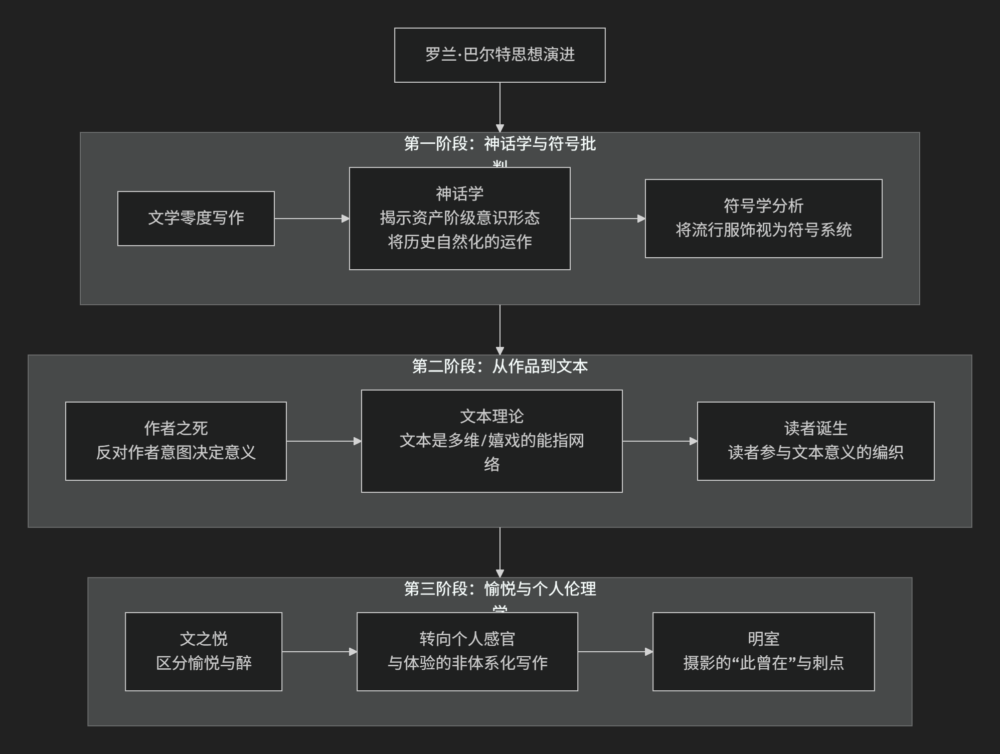

Roland Barthes
=============

基于罗兰·巴尔特（Roland Barthes）哲学核心思想对陈京元博士案件进行评价。

----------------

罗兰·巴尔特是20世纪下半叶法国最具原创性和影响力的思想家之一，他横跨结构主义与后结构主义，其思想难以简单归类。他的核心思想可以概括为：**将语言学模型（尤其是符号学）创造性地应用于分析广泛的文化现象（从文学、时尚到广告、神话），致力于揭示潜藏在看似“自然”和“天真”的表象之下的意识形态运作机制，并最终将意义的生产权和解释权从“作者”手中解放出来，交还给“读者”和“文本”本身。**

巴尔特的思想极具魅力且充满流动性，其核心发展可梳理为三个主要阶段，其演进过程如下图所示：

第一阶段：神话学与符号批判（结构主义符号学时期）

此阶段，巴尔特深受索绪尔语言学的影响，致力于用符号学方法解码日常文化。

*   **核心著作**：《神话学》、《符号学要素》

*   **核心命题**：我们的日常生活充满了被“自然化”的“神话”，其功能是将 **历史的、文化的、特定阶级的价值观伪装成永恒的、普世的、自然的真理**。

*   **关键操作：神话作为二级符号系统**

    1.  **一级系统（语言系统）**：能指（声音-形象） + 所指（概念） = **符号** （如单词“玫瑰”）。

    2.  **二级系统（神话系统）**：一级系统中的 **符号** 整体，成为二级系统的 **能指**，这个能指指向一个新的、意识形态的 **所指** （如“激情”）。

    *   **著名例子**：《巴黎竞赛》杂志封面上，一个黑人士兵向法国国旗敬礼。一级意义是“一个士兵在敬礼”。但神话系统将其转化为一个能指，所指是“法兰西帝国是一个没有种族歧视的伟大帝国”，从而 **将殖民主义的历史现实自然化为一种爱国主义的崇高形象**。

*   **目标**：通过这种解码，巴尔特旨在 **揭露资产阶级意识形态如何悄无声息地渗透并塑造我们的常识**。

第二阶段：从“作品”到“文本”（后结构主义转折）

20世纪60年代末，巴尔特的思想发生决定性转折，从寻找固定结构转向拥抱意义的多元和游戏。

*   **核心著作**：《作者之死》、《S/Z》

*   **核心命题**：“作者”的权威死亡了，意义的生产中心从作者转移到了读者和文本本身的游戏。

*   **“作者之死”**：他反对传统的文学批评将“作者”的意图视为文本意义的最终权威。文本一旦完成，作者就“死亡”了， **意义由语言本身和读者的参与来决定**。

*   **“作品” vs “文本”**：

    *   **作品**：是 **完成的、稳定的、像一颗果实** 一样可以被消费的物品。意义是封闭的。

    *   **文本**：是 **一个方法论的领域、一个能指的编织过程**。它永远是 **未完成的、开放的、多维的**，像一颗洋葱，只有层层包裹，没有核心。

*   **可读文本 vs 可写文本**：

    *   **可读文本**：让读者成为被动的 **消费者**，意义是预设好的。

    *   **可写文本**：邀请读者成为积极的 **生产者**，参与到意义的创造中，从中获得写作的狂喜（**愉悦/Jouissance**）。

第三阶段：愉悦、身体与个人伦理学

晚期，巴尔特越来越关注阅读和写作中身体的、感官的、非理性的体验。

*   **核心著作**：《恋人絮语》、《明室》

*   **核心命题**：文本的价值在于它能带给读者一种独特的、感官的、甚至是越轨的 **愉悦**。

*   **愉悦**：他区分了两种体验：

    *   **愉悦**：一种舒适的、与文化相一致的、可被言说的快乐。

    *   **醉**：一种更极致的、近乎失语的、身体性的、打破主体界限的狂喜。

*   **《明室》与摄影**：这是他最个人化、最动人的作品。他提出了两个关键概念来分析摄影的本质：

    *   **意趣**：照片中可被清晰描述的文化和象征意义。

    *   **刺点**：照片中某个偶然的、未被意图的细节（如一双鞋、一个表情）像针一样 **刺伤** 观者，激起一种个人的、难以言喻的、直接的情感震动。 **刺点揭示了摄影的本质：“此曾在”**，即对已逝时光的无可辩驳的见证，从而引发关于死亡和记忆的深刻思考。

---

核心要义总结

.. list-table:: 
   :header-rows: 1
   :widths: 25 45 30
   :align: center

   * - **思想阶段**
     - **核心命题**
     - **关键概念与贡献**
   * - **神话学与符号批判**
     - **文化神话将历史自然化**，以服务特定意识形态。
     - **神话作为二级符号系统、资产阶级意识形态自然化、符号学分析**
   * - **从作品到文本**
     - **"作者之死"**，意义在于 **读者对"可写文本"的主动生产**。
     - **作者之死、作品 vs 文本、可读文本 vs 可写文本、愉悦**
   * - **愉悦与个人伦理学**
     - 文本的价值在于其引发的 **身体性"愉悦"** 和 **个人情感的"刺点"**。
     - **愉悦 vs 醉、意趣 vs 刺点、此曾在**

思想特质与影响

*   **文体大师**：巴尔特本人就是其理论的实践者，其写作兼具理论深度与文学美感，充满隐喻和智慧。

*   **批判的武器**：他将符号学从一门精密的科学，转变为一种 **批判日常文化意识形态的尖锐武器**。

*   **解放读者**：他的“作者之死”和“文本理论”极大地解放了文学批评和阅读实践，为接受美学、读者反应批评等理论奠定了基础。

*   **广泛影响**：其思想深刻影响了文化研究、媒体研究、文学理论、电影研究、时尚理论等领域。

总而言之，罗兰·巴尔特的核心思想在于，他是一位 **意义的侦探和享乐者**。他教导我们， **没有什么意义是天然的，一切皆是建构**； **没有谁是意义的绝对主人，每个人都可以是意义的创造者**。他的全部工作是一场持续的、优雅的邀请：邀请我们以怀疑的眼光去 **解码** 我们周围的文化符号，并以一种感官的、游戏的、充满愉悦的态度去 **编织** 属于我们自己的文本和生命体验。

-------------------

 .. toctree::
    :maxdepth: 3

    grok
    gemini
    copilot
    deepseek
    qwen

