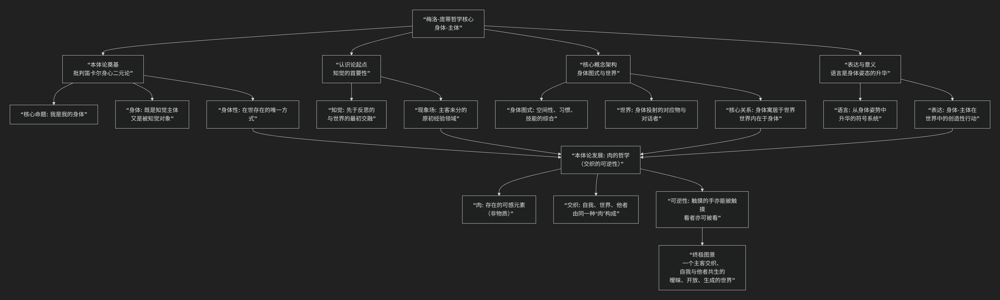

Merleau-Ponty
============

基于梅洛-庞蒂（Merleau-Ponty）的哲学核心思想。

----------------

梅洛-庞蒂是20世纪法国现象学与存在哲学的核心人物，其思想深刻、原创且富有诗意。其核心思想可概括为：**以“身体-主体”为核心，揭示人与世界的本源、交织的知觉关系，批判传统的身心二元论与主客对立，并在此基础上发展出一套关于意义、表达与自由的哲学。**

其思想体系与核心概念的关系，可以通过下图清晰地概览：

以下，我们将沿此逻辑脉络，深入解析其核心要义。

一、核心基石：“身体-主体”与对二元论的颠覆

梅洛-庞蒂哲学的起点，是对笛卡尔以降“身心二元论”和“意识哲学”的彻底批判。

*   **“我是我的身体”**：他反对将“我”视为一个纯粹的、透明的思考实体（“我思”），而将身体视为一台由意识操纵的机器。他认为，**身体本身就是主体**，是我们认识世界、存在于世的绝对中心。我们不是“拥有”一个身体，我们就是“通过”身体而存在。

*   **身体的双重性**：身体既是 **知觉的主体** （我能看、能触），又是 **被知觉的对象** （我能被看见、被触摸）。这种“可逆性”揭示了身体并非纯粹客体，而是主客未分的原初存在方式。

二、认识论的起点：知觉的首要性

在梅洛-庞蒂看来，传统哲学过于注重“反思”和“科学认知”，却遗忘了知识的源头—— **前反思的、活生生的知觉经验**。

*   **知觉是世界向我们原初的敞开**：在一切科学分析、概念判断之前，世界已经以其整体、模糊、充满意义的方式向我们的身体呈现。比如，我们不是先看到颜色、形状，再组合成一个“杯子”；我们是直接知觉到一个“可用来喝水的杯子”。这个被直接给予的世界，他称之为 **“现象场”** 或 **“生活世界”**。

*   **知觉是意义的诞生地**：意义并非意识后来赋予感觉材料的，而是直接在知觉中涌现的。身体在与世界的互动中，直接把握了事物的“意义”（如椅子的“可坐性”、工具的“可使用性”）。

三、核心架构：身体图式与世界

为了解释身体如何组织知觉、如何行动，他提出了 **“身体图式”** 概念。

*   **身体图式**：这不是一个大脑中的“地图”，而是身体在世界上定向、行动和理解的 **整体能力系统**。它综合了我们的空间感、运动习惯、技能（如骑自行车、弹琴），使我们无需思考就能熟练地与环境打交道。身体图式是身体在世界中的“生存方案”。

*   **身体寓居于世界**：世界不是摆在我们对面的客体集合，而是我们的身体图式得以展开的 **场域**。就像盲人的手杖不是工具，而是他身体感知的延伸一样，世界是我们身体存在的“另一半”。身体与世界是相互蕴含、相互定义的关系。

四、语言、表达与自由

*   **语言是身体姿态的升华**：他反对将语言视为传递内在思想的透明工具。语言源于身体的表达姿态（如手势、表情），是一种身体性的行动。说话和写作，是身体-主体在世界中创造意义的姿态，思想是在表达的过程中才成形的。

*   **自由是处境中的发明**：人的自由不是绝对、无条件的意志自由。自由植根于我们的身体性和历史处境中。但处境并不决定我们，它为我们提供了 **可能性领域**。自由体现为我们在这个模糊的领域中，通过身体性的行动和表达，不断地“发明”自己、赋予处境以新的意义。

五、后期发展：“肉”的哲学

在未完成的著作《可见的与不可见的》中，他提出了更具本体论深度的 **“肉”** 概念。

*   **“肉”**：不是物质的肉，而是指构成世界、身体、事物乃至思想的 **普遍的可感元素**，是存在的基本“组织”。我的身体是“肉”，我看到的树木、他人也是“肉”。

*   **交织与可逆性**：正因为世界万物由同一种“肉”构成，所以才能发生深刻的“交织”。我看世界，世界也在“看我”；我触摸事物，事物也“触摸”我。这种“可逆性”打破了传统的主客对立，描绘了一个自我、世界、他者彼此嵌入、相互诞生的存在图景。

六、总结

总而言之，梅洛-庞蒂的哲学是一场 **“身体的复权”** 和 **“知觉的复兴”**。他将哲学从抽象思辨的高空，拉回到我们用身体触摸、感知、生活的 **大地**。

他的全部工作旨在表明：**人并非一个被囚禁在身体机器中的幽灵般意识，而是一个通过有血有肉的身体，与一个充满意义、暧昧不明、且不断生成的世界交织共生的存在者。** 在这个交织中，我们知觉、表达、创造意义，并实现我们处境化的自由。他的思想深刻影响了后来的存在主义、解释学、认知科学（特别是具身认知流派）、艺术理论和建筑现象学。

-------------------

 .. toctree::
    :maxdepth: 3

    grok
    gemini
    copilot
    chatgpt
    deepseek
    qwen

