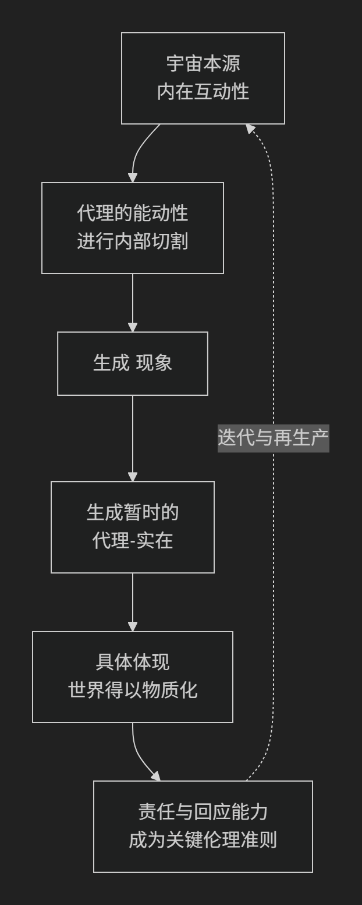

Karen Barad
================

基于 **凯伦·芭拉德（Karen Barad）** 的 **新唯物主义/分散实在论（Agential Realism）** 哲学核心思想

-------------

凯伦·芭拉德是当代最具原创性和挑战性的思想家之一。她独特地融合了 **量子物理学、女性主义理论和解构哲学**，构建了一个名为 **“代理实在论”** 的哲学体系。她的思想极为精深，其核心可以概括为：**宇宙的本质不是独立存在的个体，而是动态的“现象”；现象源于“内在互动性”，其关键是“代理”的“内部切割”行为，从而生成暂时的“实在”。**

为了更直观地把握其思想的整体架构与核心机制，下图清晰地展示了“代理实在论”的生成逻辑：

以下，我们将沿此逻辑链条，深入解析芭拉德哲学的核心要义。

一、思想渊源：量子物理学的哲学启示

芭拉德的理论根基深植于量子物理学，尤其是尼尔斯·玻尔的互补原理。她并非简单地用哲学解释科学，而是将物理学实践视为 **本体论的来源**。

*   **关键洞见**：在量子力学中，比如著名的 **双缝实验**， **“测量装置”不再是中立的观察工具，而是现象不可分割的一部分**。电子的“粒子性”或“波动性”并非其固有属性，而是在与特定测量装置的互动中 **“涌现”** 出来的。

*   **哲学结论**：这动摇了经典物理学中“独立存在的客观实体”和“中立的观察者”的观念。世界的基本单位不是“事物”，而是 **“现象”** ——即整个相互关联的“代理-测量装置-世界”的互动过程。

二、核心概念解析

基于以上洞察，芭拉德发展出一套独特的哲学概念体系。

1. 现象

这是芭拉德本体论的基本单位。**现象不是人类感知中的表象，而是宇宙的基本构成单元**。它是一个动态的、关系性的过程，是“世界与世界互动”自身的方式。没有先于现象而存在的独立实体。

2. 内在互动性

这是芭拉德哲学的核心原则。它指宇宙并非由先已存在的个体构成，这些个体然后进入关系；相反，**“关系”是先于“个体”的**。存在本身是 **动态的、关系性的和持续进行的互动**。个体（或“代理”）是从这种根本的互动性中暂时稳定化的结果。

3. 代理

这是最易被误解的概念。芭拉德的“代理” **并非指一个拥有意图和意识的主体（如人类）**。

*   **定义**：**代理是“世界行事、承担责任、进行内部互动的能力”**。它是宇宙内在互动性的一种 **动态迭代的重构**。

*   **关键**：代理是 **非人本的、分布式的**。它可以是人类、仪器、制度、概念或任何在特定现象中具有因果效力的互动节点。

4. 内部切割

这是生成“实在”和“意义”的关键机制。

*   **问题**：在一个所有事物都无限关联的内在互动性中，具体的“实在”如何产生？

*   **解答**：通过 **“内部切割”** 。代理在互动中，并非从外部，而是 **从内部**，在无穷的关系中做出 **暂时的、局部的“切割”**，从而将某些部分 **暂时稳定化** 为“主体”和“客体”，为特定的互动划定边界。

*   **例子**：在一次科学实验中，科学家通过配置仪器（测量装置），进行了一次“内部切割”，将“电子”（客体）与“观测行为”（主体）暂时区分开来，从而使得“电子的属性”这一现象得以显现。这次切割不是发现了一个预先存在的电子，而是 **共同创造了“作为客体的电子”和“作为主体的科学家”**。

5. 代理-实在

这是“内部切割”的结果。它指 **通过代理的特定实践（内部切割）而暂时稳定化和物质化的“实在”**。不同的切割方式会产生不同的代理-实在。因此，实在是 **复数、局部和情境化的**，而非单一、普遍和绝对的。

6. 具体体现

强调认知、存在和伦理都是 **彻底物质性的、具身的**。我们不是拥有身体的心灵，我们就是身体，我们的思维和互动都是世界物质性互动的一部分。

三、伦理与政治意涵：责任与回应能力

芭拉德的伦理学直接从其本体论中衍生出来。

*   **核心概念**： **回应能力**

*   **逻辑**：既然我们通过“内部切割”共同生成着实在，那么我们 **对由此产生的结果负有不可推卸的责任**。伦理学不在于遵循外在规则，而在于在每一次互动中，敏锐地意识到我们的切割行为如何物质化世界，并 **增强其回应能力** ——即对由此产生的影响做出回应、并为之负责的能力。

*   **应用**：这一框架被广泛用于批判性分析，如 **转基因生物** （我们如何切割“自然”与“文化”的边界？）、 **技术伦理** （算法作为代理如何生成新的社会实在？）和 **气候变化** （人类世的切割行为带来了何种不可逆的后果？）。

---

核心要义总结

.. list-table:: 
   :header-rows: 1
   :widths: 25 45 30
   :align: center

   * - **理论维度**
     - **核心命题**
     - **关键概念与贡献**
   * - **本体论**
     - **实在通过"代理"的"内部切割"在"内在互动性"中动态生成**，基本单位是"现象"。
     - **内在互动性、现象、代理、内部切割、代理-实在**
   * - **认识论**
     - **认识是具身的、物质性的实践**，我们不是世界的观察者，而是其积极的参与者。
     - **具体体现、代理的能动性、情境化知识**
   * - **伦理学**
     - **伦理学源于本体论**，核心是对我们共同生成的世界的"回应能力"与责任。
     - **回应能力、责任、迭代的重构**
   * - **方法论**
     - **打破自然科学与人文科学的壁垒**，提供一种基于量子物理学的后人类主义哲学框架。
     - **哲学-科学的融合、跨学科方法**

思想特质与影响

*   **激进的后人类主义**：彻底消解了“人”在宇宙中的特权地位，将能动性分配给非人力量。

*   **深刻的辩证性**：她的理论同时是 **实在论的** （承认独立于单一人类意识的实在）和 **建构论的** （认为实在是通过特定实践局部生成的），她称之为 **“实在-建构”**。

*   **实践导向**：其理论强烈关切现实世界的伦理和政治问题，为思考科技、生态和社会正义提供了极其有力的工具。

总而言之，凯伦·芭拉德的核心思想在于，她是一位 **“宇宙互动性的哲学家”和“伦理责任的唤醒者”** 。她教导我们，**我们并非居住在一个已然完工的世界中，而是通过我们的每一次实践，在不断生成和重塑这个世界**。她的全部工作是对 **关联性、物质性和责任** 的一次极其复杂而又充满力量的深刻揭示，邀请我们以一种更谦卑、更敏锐、更负责任的方式参与宇宙的持续创造。

------------

 .. toctree::
    :maxdepth: 3

    grok
    copilot
    deepseek
    gemini
