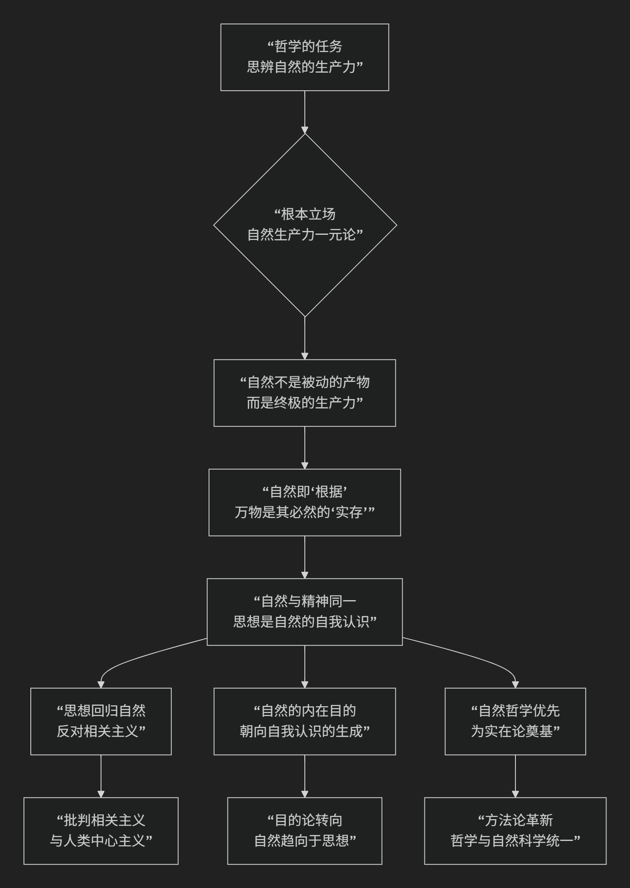

Iain Hamilton Grant
====================

伊恩·汉密尔顿·格兰特（Iain Hamilton Grant）独特的思辨自然哲学核心思想

-------------

伊恩·汉密尔顿·格兰特是英国哲学家，他的思想在“思辨实在论”思潮中独树一帜，构建了一套极其独特且雄心勃勃的 **思辨自然哲学** 体系。他的核心思想可以概括为：**坚决反对将“自然”贬低为被动、惰性的产物，主张一种强硬的“自然生产力”一元论，即自然是充满内在动力和创造性的、自我差异化的洪流，万物（包括思想、文化和社会）都是自然这一终极生产力直接而必然的表达。**

为了更直观地把握格兰特思想的核心架构与内在逻辑，下图清晰地展示了他的思辨自然哲学体系：

以下，我们将沿此逻辑链条，深入解析格兰特哲学的核心要义。

一、根本立场：自然生产力一元论

这是格兰特全部思想的基石，是其最激进的主张。

*   **批判目标**：他猛烈批判西方哲学中占主导地位的 **“自然取消主义”** ——即认为自然仅仅是惰性的、待加工的原材料，其秩序和形式需要由外在于它的力量（如神圣的造物主、人类的精神或主体性）来赋予。

*   **核心命题**： **自然是“生产力”，而非“产品”**。自然不是一堆等待被人类意识或文化赋予意义的死物，它自身就是一股强大的、自我组织的、充满创造力的洪流。

*   **思想渊源**：他的理论直接继承并激进了 **谢林的自然哲学**。谢林认为，自然不是精神的他者，而是“可见的精神”，精神则是“不可见的自然”。

二、核心原则：根据与实存的同一性

格兰特通过重新阐释德国唯心论（尤其是谢林）的“根据”概念来论证其自然生产力理论。

*   **根据 vs. 实存**：

    *   **根据**：指事物得以存在和生成的**内在根据、潜能或生产力**。它不是逻辑上的原因，而是实在的、动态的力量。

    *   **实存**：指实际存在着的、具体化的事物。

*   **格兰特的创新**：他主张， **自然本身就是最终的“根据”**。所有实存的事物（从岩石到生命，从生命到思想），都不是外在于自然的奇迹，而是 **自然这一根据的必然“实存化”或“表达”**。自然的生产力必然要表达自身，思想的出现是自然生产力达到一定复杂程度后 **自我认识的实现**。

*   **著名论断**： **“没有自然以外的根据”**。这意味着，不存在一个超自然的上帝或一个先验的主体来为自然立法。自然自己为自己立法，它自身的动力学规律就是其存在的根据。

三、对“相关主义”的彻底批判

格兰特将思辨实在论对“相关主义”的批判推向了一个更历史的维度。

*   **相关主义**：指认为我们无法思考独立于人类思维的“物自体”，思维与存在总是相互关联的哲学教条。

*   **格兰特的诊断**：相关主义的根源正是 **“自然取消主义”**。当哲学将自然贬低为惰性的产物后，就只剩下人类意识（精神）作为意义的唯一来源，从而不可避免地陷入人类中心主义的循环。因此，要彻底击败相关主义，必须 **复兴一种强硬的、生产力意义上的自然哲学**。

四、哲学任务：思辨自然哲学的重建

格兰特为哲学设定了一项宏伟的任务。

*   **目标**： **哲学应成为“思辨自然学”**，即对自然的内在动力和创造性潜能进行思辨的学科。它的任务是追踪自然生产力从最简单到最复杂形式的演化轨迹。

*   **方法**：哲学必须与 **自然科学（特别是地质学、生物学、复杂科学）结盟**，但不是被动地接受科学结论，而是主动地对其进行 **思辨的诠释**，揭示其背后的形而上学含义——即它们如何证明了自然的内在生产力。

*   **本体论承诺**：哲学必须承诺 **自然的绝对优先性和自足性**。自然是“原初的”，文化和思想是“衍生的”。

---

核心要义总结

.. list-table:: 
   :header-rows: 1
   :widths: 25 45 30
   :align: center

   * - **理论维度**
     - **核心命题**
     - **关键概念与贡献**
   * - **本体论**
     - **"自然生产力一元论"**：自然是自我差异化的、充满创造力的终极生产力。
     - **自然生产力、根据、实存、动态一元论**
   * - **自然观**
     - **自然不是产品，而是过程**；它是"根据"本身，万物是其必然的"实存"。
     - **自然取消主义批判、根据-实存同一性、自然动力学**
   * - **批判哲学**
     - **"相关主义"的根源是"自然取消主义"**，必须从源头进行批判。
     - **相关主义批判、人类中心主义、哲学史诊断**
   * - **哲学方案**
     - **重建"思辨自然哲学"**，使哲学与自然科学结盟，思辨自然的内在动力。
     - **思辨自然学、自然哲学优先、思辨与科学的结盟**

思想特质与影响

*   **历史深度**：格兰特的工作建立在对哲学史（尤其是德国唯心论）的深厚解读之上，而非凭空创造。

*   **系统性野心**：他试图提供一个统一的框架，来解释从物理世界到精神文化的一切现象，将其全部视为自然生产力的不同层级的表现。

*   **激进性**：他的思想比许多新唯物主义者更激进，因为他拒绝任何形式的二元论残余，坚持一种彻底的一元论。

*   **生态意涵**：他的哲学为深层生态学提供了强大的形而上学基础，将人类重新定位于一个充满能动性的自然内部，而非其对立面或主宰者。

总而言之，伊恩·汉密尔顿·格兰特的核心思想在于，他是一位 **“自然生产力的辩护者”和“思辨哲学的再造者”** 。他教导我们， **哲学的首要任务不是反思人类自身，而是去思辨那个生成我们、包含我们、且远比我们宏大的自然创造力**。他的全部工作是对 **自然之优先性、创造力和内在理性** 的一次极其深刻而又富有诗意的重申。在这个生态危机时代，他的哲学呼唤我们以一种更谦卑、更敬畏的态度，重新思考我们在一个活生生的自然中的位置。

------------

 .. toctree::
    :maxdepth: 3

    grok
    copilot
    deepseek
    gemini
