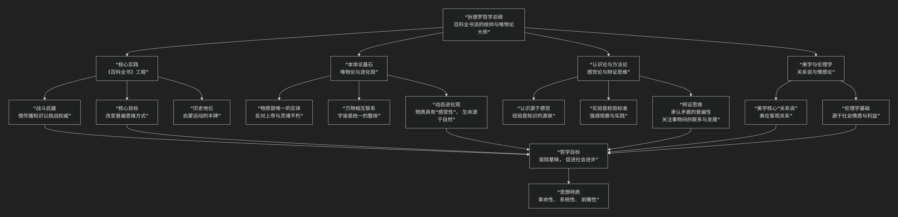

Denis Diderot
==============

基于丹尼斯·狄德罗（Denis Diderot）哲学核心思想。

----------------

德尼·狄德罗是法国启蒙运动的核心人物，也是18世纪最具原创性和前瞻性的思想家之一。他的哲学核心思想可以概括为：**一种以“《百科全书》”为实践载体，以“唯物主义”、“辩证思维”和“进化观”为理论基石，旨在通过汇聚全人类知识来挑战权威、解放思想、推动社会进步的综合性哲学体系。他不仅批判旧世界，更致力于构建一个新世界的知识蓝图。**

狄德罗的思想深邃且极具现代性，其核心架构与内在逻辑可以通过下图清晰地展现：

以下，我们将沿此逻辑脉络，深入解析狄德罗哲学的核心要义。

一、核心实践：《百科全书》的哲学

狄德罗首先是一位“行动的哲学家”，他毕生的事业与《百科全书或科学、艺术和工艺详解词典》紧密相连。这不仅是工具书，更是启蒙运动的战略工程。

*   **战斗武器**：狄德罗采取了一种“伊索式”的策略，即 **借传播知识之名，行批判旧制度之实**。在词条中，他巧妙地插入对宗教偏见、专制政治、社会不公的抨击，引导读者独立思考。

*   **核心目标**：改变人们普遍的思维方式。他旨在汇总所有人类知识，展示各学科间的联系，尤其是为一直被轻视的 **机械工艺** 正名，体现了他对实践和生产劳动的尊重。

*   **历史意义**：《百科全书》是启蒙思想的传播中枢，凝聚了“百科全书派”的集体智慧，是**向旧世界发起总攻的檄文**。

二、本体论：唯物论与进化观

狄德罗的哲学基础是彻底且充满辩证色彩的唯物主义。

*   **物质是唯一的实体**：他肯定物质是宇宙中唯一的、永恒的实体，反对笛卡尔的二元论和宗教神学。他认为所谓上帝、灵魂不朽都是无根据的假设。

*   **动态进化观**：这是狄德罗最富天才的洞见。在《达朗贝的梦》中，他提出了惊人的猜想：

    *   **普遍感受性**：物质本身具有一种“迟钝的感受性”，在一定条件下可发展为“活跃的感受性”（即意识）。

    *   **生命自然发生论**：生命可以从无机物中自然产生，并随着环境从低级向高级演化。

    *   **物种进化**：物种并非固定不变，而是可以相互转化。这些思想直接预示了后来的进化论。

三、认识论与方法论：感觉论与辩证思维

在认识论上，狄德罗坚持感觉经验是知识的源泉，并表现出深刻的辩证思维。

*   **感觉论**：他继承洛克的经验论，认为一切知识最初都来源于感官。他著名的比喻是将人比作 **钢琴**，感官是键盘，外界事物弹奏键盘从而产生观念和知识。

*   **重视实验**：他强调观察、思考和实验相结合，认为实验是检验猜想、接近真理的根本途径。

*   **辩证思维**：他敏锐地看到了自然和社会中的矛盾与联系，反对非此即彼的形而上学思维。他关注事物的 **运动、发展和转化**。

四、美学与伦理学：“关系说”与情感论

*   **美学“关系说”**：狄德罗是西方美学史上“关系说”的代表。他认为 **“美在关系”** 。美不是事物固有的神秘属性，而是存在于由感官、知性和文化背景所把握的客观 **关系** 之中。他将艺术视为“自然的模仿”，但强调模仿需融入艺术家的理想和批判。

*   **伦理学**：在道德哲学上，他倾向于一种 **自然主义的情感论**，认为道德感源于人的社会情感和对共同利益的追求。他关注德行与幸福的关系。

五、核心要义总结

.. list-table:: 
   :header-rows: 1
   :widths: 25 45 30
   :align: center

   * - **理论维度**
     - **核心命题**
     - **关键概念与贡献**
   * - **哲学实践**
     - **通过《百科全书》汇集与传播知识，挑战权威，改变普遍思维方式。**
     - **百科全书派、知识体系、工艺精神**
   * - **本体论**
     - **物质是唯一实体，万物普遍联系并处于动态进化之中。**
     - **唯物主义、普遍联系、动态进化、感受性**
   * - **认识论**
     - **知识源于感觉，并通过实验检验；思维应具辩证性。**
     - **感觉论、实验主义、辩证思维**
   * - **美学与伦理学**
     - **美存在于客观"关系"中；道德源于社会情感与利益。**
     - **关系说、自然主义、社会情感**

六、思想特质与历史影响

*   **革命性与系统性**：狄德罗的思想极具战斗性，其唯物主义和进化观对宗教神学构成了根本性冲击。他的思想自成系统，融贯本体论、认识论、美学和伦理学。

*   **前瞻性**：他的进化猜想比拉马克和达尔文早近一个世纪，其辩证思维也预示了德国古典哲学的某些方向。

*   **深远影响**：他直接影响了后世的唯物主义哲学、进化生物学和社会主义思想（如马克思、恩格斯对其评价很高）。《百科全书》更是塑造了整整一个时代的精神面貌。

七、总结

总而言之，狄德罗的核心思想在于，他是一位 **“知识的建筑师”和“唯物论的先知”** 。他教导我们，**真正的哲学不应是书斋里的思辨游戏，而应是汇聚人类一切知识成果、直面物质世界本身、并用理性的光芒驱散一切蒙昧的战斗力量。**

他的全部工作是对 **人类理性能力** 的一次宏大而自信的展示。在启蒙的时代，他以其非凡的博学、深邃的洞察和坚韧的实践，将批判的武器转化为改造世界的蓝图。在这个意义上，狄德罗不仅是百科全书派的统帅，更是近代科学精神和辩证思维的一位卓越先驱。

-------------------

 .. toctree::
    :maxdepth: 3

    grok
    gemini
    copilot
    chatgpt
    deepseek
    qwen

