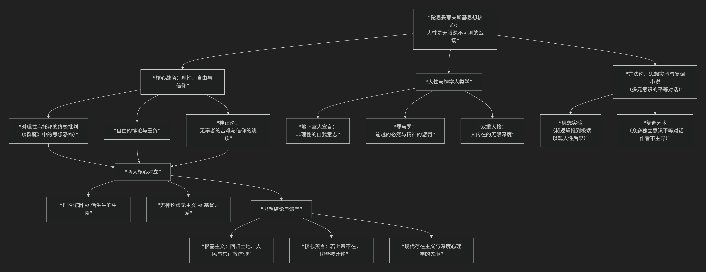

Dostoyevsky
==============

基于陀思妥耶夫斯基（Fyodor Dostoyevsky）核心思想

--------------------------------------------

陀思妥耶夫斯基并非体系化的哲学家，而是一位 **思想的戏剧家**。他的“哲学”并非通过论文，而是通过其小说中人物间激烈的对话、内心的撕裂和极端的处境来呈现的。其核心思想可被看作是对19世纪兴起的理性主义、社会主义和虚无主义的深切回应与拷问，最终指向了对人性和神性深渊的勘探。

其哲学思想的主要脉络与核心张力，可以通过下图清晰地概览：

以下，我们将沿此逻辑脉络，深入解析其核心要义。

**一、核心战场：理性、自由与信仰**

陀思妥耶夫斯基思想的全部张力，都围绕这三者的冲突展开。

1.  **对抗理性乌托邦**：他最深切的忧虑源于当时俄国知识分子中流行的 **理性利己主义、社会主义和虚无主义** 思想。他认为，试图用纯粹的理性逻辑（如“幸福计算”、“社会工程”）来规划人类社会，其结果必然是抹杀人性的复杂、自由和尊严，最终走向新的奴役和暴政（《群魔》是其最激烈的预言）。
2.  **自由是人的本质与重负**：陀氏认为，人最根本、最不可剥夺的属性是 **自由意志**。然而，自由不仅是选择善的能力，更是选择恶、选择自我毁灭、选择“非理性”的权利。在《地下室手记》中，他借主人公之口宣告：人不是钢琴键，为了证明自己的自由，他甚至可以故意选择对自己不利的、愚蠢的事。自由因此成为一种沉重的负担，是人一切痛苦和伟大的根源。
3.  **苦难、罪恶与上帝的搏斗**：面对世界的苦难和无辜者的眼泪（尤其是儿童），陀氏对上帝的存在提出了最尖锐的质疑（伊万·卡拉马佐夫的质问）。然而，他并非简单的无神论者。在他看来，**信仰不是理性的结论，而是生命深处的一场“跳跃”**。他笔下最深刻的灵魂，都在无神论的深渊与对基督的渴望之间撕裂。真正的信仰，必须经过怀疑的淬炼。

**二、陀思妥耶夫斯基的“人性学”**

他的所有思想都建立在对人性极其深刻、甚至黑暗的洞察之上。

1.  **“地下室人”的宣言**：人是 **非理性** 的生物。人不仅追求利益和幸福，更追求 **自我意志** 的实现，哪怕这会带来痛苦。这种“任性的自由”是人性的尊严，也是其悲剧所在。
2.  **罪与救赎的辩证法**：陀氏相信，人有一种内在的、近乎本能的 **对罪的渴望**，以及伴随而来的 **对惩罚的渴望**。《罪与罚》中的拉斯柯尔尼科夫正是在主动接受惩罚（流放）和苦难（索尼娅的爱）中，才开始了精神的复活。苦难被视为涤罪和重生的必经之路。
3.  **双重人格与无限深度**：人不是统一的整体，其内心是**多重声音、多重人格**的战场（如《双重人格》）。人能在同一时刻爱又恨，高尚又卑劣，行善又渴望堕落。这种内在的分裂和深度，使得对人进行任何简单的善恶定论都显得苍白。

**三、复调：思想的艺术**

这是其哲学思想的独特呈现方式，由巴赫金提出。

*   陀氏的小说创造了 **“复调”** 世界。其中没有作者全知全能的单一声音，而是众多 **独立、平等、充满自我意识的声音** 在进行激烈的对话（如伊万与阿辽沙，拉斯柯尔尼科夫与索尼娅，斯塔夫罗金与沙托夫）。真理不存在于任何一个角色之口，而存在于他们之间无法终结的对话和碰撞中。这本身就是对绝对真理和独白式思想体系的文学反抗。

**四、核心思想总结**

1.  **反对理性万能**：纯粹的理性主义会扼杀人性的生命与自由，导向精神死亡或政治暴政。
2.  **捍卫痛苦的自由**：自由意志是人性的核心，它包括选择恶、制造痛苦、甚至自我毁灭的权利。剥夺这种自由，就是将人降格为物。
3.  **穿越虚无的信仰**：真正的信仰诞生于绝望的深渊，必须包含对上帝的怀疑和反叛。基督的形象（如阿辽沙、索尼娅、佐西马长老所体现的）代表了一种谦卑、受难、包容一切的**爱**，这是对抗虚无主义的唯一力量。
4.  **人性深渊论**：人是无限复杂、自我矛盾、深不可测的。任何试图用简单理论（心理的、社会的、经济的）来概括人性的努力，都是一种傲慢的简化。
5.  **根基主义**：在经历了对西方思想的深刻怀疑后，晚期的陀氏主张俄国应回到自身的 **“根基”** ——即东正教信仰、人民的集体智慧和土地的滋养中，寻找精神出路。

**五、遗产与影响**

陀思妥耶夫斯基的哲学思想是 **存在主义、精神分析、宗教哲学的先驱**。他提前探讨了尼采的“上帝之死”、萨特的“自由选择”、弗洛伊德的“潜意识”与“罪疚感”，以及存在主义神学的核心命题。他留下的终极问题至今仍在回响：**在一个没有上帝的世界里，道德的根基何在？人如何承担其无限的自由？我们又该如何面对自身灵魂中那深不可测的黑暗与光明？**

他的回答不是结论，而是一场永不终结的、充满痛苦的对话——而这，或许正是他对人性真诚的最高体现。

------------

 .. toctree::
    :maxdepth: 3

    grok
    chatgpt
    copilot
    deepseek
    gemini
    qwen
