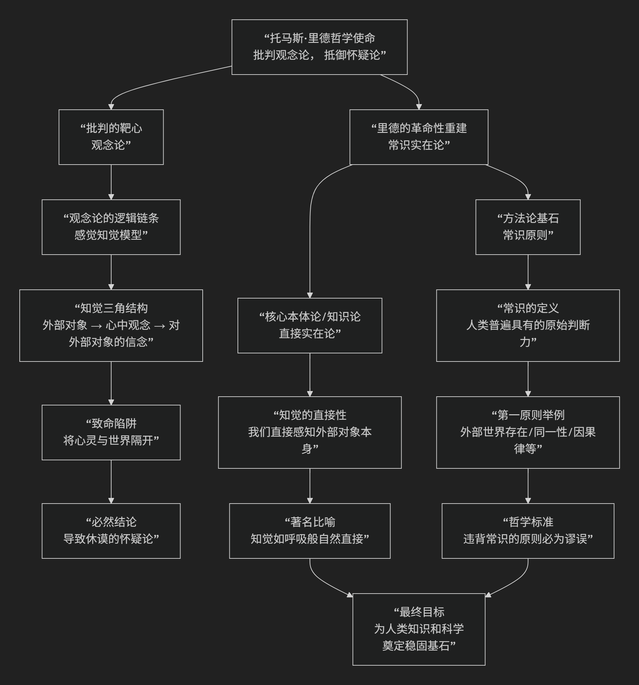

Thomas Reid
=====================

基于托马斯·里德（Thomas Reid）创立的苏格兰常识学派（Scottish School of Common Sense）的哲学核心思想

----------------------------------------------------------------------------

托马斯·里德是18世纪苏格兰启蒙运动中的重要哲学家，他创立的 **苏格兰常识学派** 是对笛卡尔以降的“观念论”传统，尤其是大卫·休谟的激进怀疑论，的一次强力反击。其核心思想可以概括为：**哲学必须建立在人类心灵不可抗拒的“常识原则”之上，这些原则是自然赋予我们的信念本能，比任何精巧的哲学怀疑都更基本、更可靠；我们能够直接感知外部世界，而非感知内在的“观念”。**

里德的哲学体系深刻而富有原创性，其核心架构旨在用“常识”的权威来拯救哲学于怀疑论的泥沼。其根本的理论框架与论证逻辑可图示如下：

以下，我们将沿此逻辑链条，深入解析里德哲学的核心要义。

一、批判的起点：对“观念论”的彻底清算

里德的全部哲学始于对自笛卡尔、洛克到休谟的“观念论”传统的系统批判。

*   **观念论**：该传统认为，我们无法直接感知外部世界，我们直接感知的只是自己心中的 **“观念”** （或印象、感觉材料）。外部对象是这些观念的“原因”或“对应物”，但本身无法被直接认识。
*   **里德的诊断**：观念论是哲学陷入怀疑论的**根源**。它设置了一个致命的“知觉三角结构”：外部对象 → 心中观念 → 对外部对象的信念。这个结构在心灵与世界之间插入了一道“观念纱幕”。
*   **逻辑后果**：一旦接受观念论，我们就无法证明观念与外部世界的一致性。休谟正是沿着这一逻辑得出了彻底怀疑论的结论：我们无法知道外部世界、持续存在的自我、以及因果必然性。
*   **里德的批判**：观念论是一个 **没有根据的假设**。它违背了人类的常识和自然信念。如果一种哲学理论得出的结论与我们最深层的、无法抗拒的信念相矛盾，那么错误的一定是理论，而不是信念。

二、正面学说：常识原则哲学

在批判之后，里德提出了以“常识原则”为基石的正面哲学。

*   **常识原则的定义**：常识原则不是指“大众意见”或“未受教育的偏见”，而是指 **人类心灵在构造上固有的、不可抗拒的、原始的判断原则或信念**。它们是自然（或上帝）赋予我们的认知本能，是理性推理的 **前提和基础**，其本身无法被证明，也无需证明。
*   **常识原则的例证**（里德列举了大量第一原则）：

    1.  **形而上学原则**：“凡我清楚地意识到的东西，是真实存在的。”（我思维，故我存在。）

    2.  **外部世界原则**：“那些我通过感官清晰感知到的事物，是真实存在并如其显现那样的。”

    3.  **同一性原则**：“我昨天记得的事物，与今天存在的事物是同一的。”

    4.  **因果性原则**：“有开始存在的事物，必有一个原因。”

*   **哲学意义**：这些原则是 **自明的**，它们构成了人类知识和科学活动的 **共同基础**。任何挑战这些原则的哲学论证，其本身都已经预设了这些原则（如逻辑律、同一律）为真。因此，常识原则是 **判断哲学理论是否正确的最终标准**。

三、核心主张：直接实在论

这是里德在知觉理论上的革命性主张，是其常识哲学的具体体现。

*   **核心命题**：**我们能够直接感知外部世界中的对象本身，而不是感知内在的“观念”。**
*   **知觉过程**：感觉刺激（如光线）会在我心中产生一种 **感觉** （如红色的感觉），但这种感觉不是知觉的对象，而是 **知觉的符号或信号**。根据常识原则，我的心灵会 **立即、直接地、不可抗拒地** 形成一个关于外部对象存在的信念（如“那里有一个红色的苹果”）。
*   **著名比喻**：知觉就像 **呼吸** 一样自然和直接。我们不会先意识到“呼吸的感觉”，再推论出“我在呼吸空气”；我们直接意识到自己在呼吸空气。同样，我们直接感知到的是苹果，而不是“苹果的观念”。

四、对休谟怀疑论的具体回应

里德逐一回应了休谟的怀疑论结论，认为那是观念论的苦果，而非人类的真况。

*   **外部世界**：根据常识原则，我们 **直接相信** 感官所呈现的世界是真实的，无需通过观念来推论。
*   **自我**：休谟因找不到一个持续的“自我印象”而否认同一的自我。里德认为， **记忆** 的功能本身就预设了一个同一的、持续存在的主体。记忆的连续性（我记得昨天的我）直接证明了自我的同一性。
*   **因果关系**：我们关于“原因”的概念并非来自休谟所说的“恒常联结”的习惯性联想。我们天生就有一种 **根据意志努力来理解因果性的能力**。当我决定举手时，我直接体验到我的意志是举手运动的原因。这种“能动者因果”的概念是原始的、直接的。

五、核心要义总结

.. list-table:: 
   :header-rows: 1
   :widths: 25 45 30
   :align: center

   * - **理论维度**
     - **核心命题**
     - **关键概念与贡献**
   * - **批判哲学**
     - **"观念论"是哲学错误的根源，它必然导致不可接受的怀疑论。**
     - **观念纱幕批判、知觉三角模型批判**
   * - **知识论/形而上学**
     - **"常识原则"是哲学不可动摇的基石，是自然赋予的原始判断。**
     - **常识原则、第一原则、自明性、自然信念**
   * - **知觉理论**
     - **"直接实在论"：我们直接感知外部对象，而非内在观念。**
     - **直接知觉、感觉作为符号、信念的直接性**
   * - **对怀疑论的回应**
     - **休谟的怀疑论是观念论的人为产物，违背了人类的自然信念。**
     - **自我同一性、能动者因果、记忆的连续性**

六、思想特质与影响

*   **自然主义倾向**：里德将我们的认知能力视为自然设计的一部分，强调其可靠性和正当性。
*   **对日常语言的重视**：他主张哲学中的混乱往往源于对日常语言的误用，应回归语词的通常含义。
*   **深远影响**：他的思想在18-19世纪的欧洲和北美影响巨大，为科学和道德提供了稳固的基础。他也被视为现象学、日常语言哲学等现代思潮的先驱之一。

七、总结

总而言之，托马斯·里德的核心思想在于，他是一位 **“常识的辩护者”和“哲学病的治疗师”** 。他教导我们，**当哲学推理将我们引向违背基本常识的荒谬结论时，我们不应怀疑常识，而应检查推理所依赖的初始假设是否出了问题。**

他的全部工作是对 **人类自然理性的一次伟大信任投票**。在怀疑论似乎要吞噬一切确定性的时代，里德力图证明，**我们的知识大厦并非建立在流沙之上，而是建立在由自然亲手浇筑的、坚固的常识基石之上。** 他提醒哲学家们，真正的智慧始于承认我们人类认知能力的本来面目，而不是试图用一套人为的理论去扭曲它。

------------

 .. toctree::
    :maxdepth: 3

    grok
    copilot
    deepseek
    gemini
