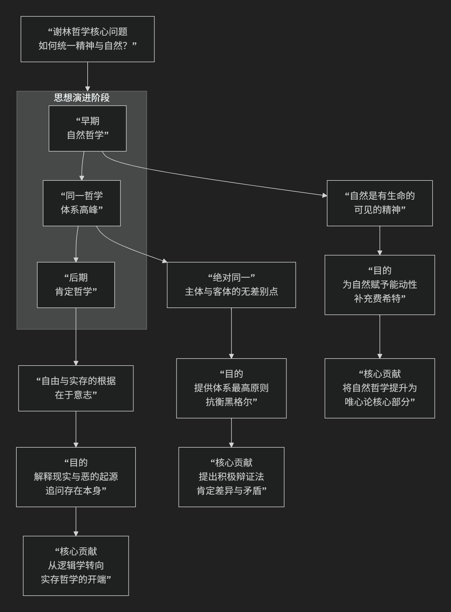

Friedrich Schelling
=============

基于弗里德里希·谢林（Friedrich Schelling）的唯心论哲学核心思想

--------------------------------------------

弗里德里希·谢林是德国古典哲学中一位极具创造力和演变性的思想家。他的哲学思想前后期变化很大，但其核心始终围绕着 **解决主观与客观、精神与自然、自由与必然的统一性问题**。与费希特强调“绝对自我”不同，谢林的核心思想可以概括为：**探寻那个超越主体与客体对立的“绝对”，并认为自然与精神是这个“绝对”同一体两极化的表现，从而建立了一种“同一哲学”或“自然哲学”。**

谢林的思想发展可被视为一个不断探寻“绝对”之本性的历程，其核心演进脉络如下图所示：

以下，我们将沿此脉络，深入解析谢林哲学的核心要义。

一、早期：自然哲学——自然是“可见的精神”

谢林的哲学起点是对其老师费希特的批判与发展。

*   **对费希特的批判**：费希特的“绝对自我”看似设定了一切，但其设定的“非我”（自然）始终是一个 **被动的、僵死的障碍**。自然在费希特体系中没有任何积极地位和内在生命。

*   **谢林的革命性洞见**：谢林提出，**自然绝非被动的产物，它本身是能动的、有生命的、有创造力的**。他的名言是：**“自然应该是可见的精神，精神应该是不可见的自然。”**

*   **自然哲学的目标**：揭示自然作为一个 **动态发展的系统**，如何从无意识的状态（重力、磁力、化学过程）一步步演化出生命和意识，最终在人类精神中达到自我认识。自然是一个 **沉睡的、正在生成中的理智**。

二、鼎盛期：同一哲学——“绝对同一”原则

为了彻底解决精神与自然的二元论，谢林提出了其哲学体系的最高峰——“同一哲学”。

*   **核心概念：“绝对同一”**

    *   这是谢林哲学的核心。他认为，在主体（自我）与客体（自然）之上，存在一个 **超越两者对立的、绝对无差别的本源**，即“绝对同一”或简称“绝对”。

    *   这个“绝对”是 **纯粹的、无限的能动性**，它本身不可被直接认识（因为它先于一切差异），但它是一切差异（主体与客体）的 **共同根源**。
*   **两极分化与辩证发展**：

    *   谢林认为，“绝对”为了认识自身，必须 **外化** 自身，产生差异。这个分化过程如同磁铁的两极，从“绝对同一”中分化出 **主体性（精神）** 和 **客体性（自然）** 两个对立倾向。

    *   整个宇宙和历史，就是这个“绝对”通过自然与精神这两个“极”来逐步展开、实现自我认识的过程。自然是无意识的精神，精神是达到自我意识的自然。

三、后期：肯定哲学与天启哲学——追问存在与自由

晚年谢林的思想发生了重要转折，他开始批判包括黑格尔在内的“否定哲学”，并转向“肯定哲学”。

*   **对黑格尔的批判**：谢林认为黑格尔的哲学体系是一个“否定哲学”。它从纯粹逻辑概念出发，推演出整个存在体系，但这只能推演出事物 **“是什么”的本质**，却无法解释事物 **“为什么存在”** 这一事实本身。逻辑无法解释“实存”。

*   **肯定哲学的核心**：哲学必须从 **“实存的事实”** 出发。这个最终的事实是一个 **自由的、有意志的、人格性的存在者**，它决定让世界存在。这带有强烈的 **基督教哲学** 色彩，接近于上帝从虚无中 **创世** 的观念。

*   **自由与恶的问题**：谢林深入探讨了人类自由的本质。真正的自由意味着选择善与恶的可能性。他试图解释“恶”如何可能在一个由上帝创造的世界中存在，提出了恶源于人类将自身意志脱离宇宙整体精神的“堕落”。

---

四、谢林哲学的核心要义总结

.. list-table:: 
   :header-rows: 1
   :widths: 25 45 30
   :align: center

   * - **理论维度**
     - **核心命题**
     - **关键概念与贡献**
   * - **自然哲学**
     - **"自然是可见的精神"**，是一个动态的、有生命力的、朝向精神发展的系统。
     - **自然的目的论、能动的自然、两极分化**
   * - **同一哲学**
     - **"绝对同一"是超越主客对立的终极本源**，自然与精神是其两极化的表现。
     - **绝对同一、主体-客体、积极的辩证法**
   * - **肯定哲学**
     - **哲学必须从"实存"出发**，解释自由和恶的起源，追问"为什么存在某物而非虚无"。
     - **实存、意志、自由、恶的起源**
   * - **历史地位**
     - **德国古典哲学的关键枢纽**，影响了黑格尔，也启发了存在主义、过程哲学等现代思潮。
     - **黑格尔的先驱、现代哲学的预告**

五、思想特质与影响

*   **浪漫主义气质**：谢林的哲学充满对自然生命力和创造力的敬畏，与德国浪漫主义精神相通。

*   **辩证法的先驱**：他的“两极分化”理论是黑格尔辩证法的重要来源。

*   **现代性的预告**：他从“本质”向“实存”的转向，为后来的克尔凯郭尔、海德格尔等存在主义思想家开辟了道路。

*   **与黑格尔的竞争**：谢林与黑格尔的关系是哲学史上著名的“瑜亮情节”。谢林强调“绝对”是包含差异的同一，而黑格尔则强调“绝对”是通过矛盾斗争不断发展的精神。谢林批评黑格尔的体系是“尸骨累累的战场”，而黑格尔则批评谢林的“绝对同一”是“黑夜中看牛，一切皆黑”。

六、总结

总而言之，谢林的核心思想在于，他是一位 **“绝对的探险家”和“自然的诗人哲学家”** 。他试图超越主观唯心论与机械唯物论的简单对立，为我们描绘了一幅 **自然与精神同源共流、宇宙生命奔涌不息** 的宏大图景。

他的全部工作是对 **统一性、生命和自由** 的一次深邃而富有诗意的探索。他教导我们，**真正的哲学不仅要思考我们如何认识世界（知识论），更要追问世界为何存在以及自由如何可能（存在论）**。尽管其思想体系庞杂多变，但他对生命能动性的强调和对存在奥秘的追问，使其成为德国哲学史上一位不可或缺的、充满魅力的思想家。

------------

 .. toctree::
    :maxdepth: 3

    grok
    copilot
    deepseek
    gemini
