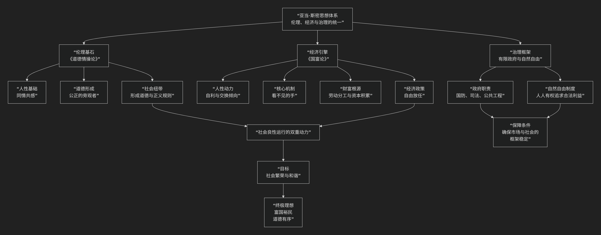

Adam Smith
===========

基于亚当·斯密（Adam Smith）自由主义哲学核心思想

---------------------------------

亚当·斯密是苏格兰启蒙运动的巨擘，现代经济学之父。他的核心思想远不止于经济学，更是一套关于人性、社会和繁荣的宏大哲学体系。其核心可以概括为：**一套以“同情心”为伦理基础、以“自利”为经济动力、以“看不见的手”为协调机制、主张“自然自由”和有限政府的综合性社会理论，旨在探究国民财富的性质和原因，并实现社会的普遍繁荣与和谐。**

斯密的思想体系深邃而统一，其核心架构与内在逻辑可以通过下图清晰地展现：

以下，我们将沿此逻辑脉络，深入解析亚当·斯密的核心要义。

一、伦理基石：同情心与《道德情操论》

在成为经济学家之前，斯密首先是一位道德哲学家。他的伦理思想是其全部学说的基础。

*   **核心概念：“同情共感”**

    *   斯密认为，**“同情”** （或译“同感”）是人性的基石，即我们能够设身处地想象并分享他人感受的能力。这并非怜悯，而是情感共鸣。

*   **“公正的旁观者”**

    *   我们的道德判断源于将自己置于一个 **中立第三方** 的视角来审视自己和他人的行为。我们通过这个内心的“旁观者”来评判何为合宜、正当。

*   **社会意义**：正是通过这种同情和旁观者机制，社会才形成了 **共同的道德准则和正义观念**，从而维系了社会秩序和和谐。

二、经济引擎：自利与《国富论》

斯密最著名的贡献在于经济学，他从人性中另一面出发，构建了国民财富增长的逻辑。

*   **人性动力：自利与交换倾向**

    *   斯密指出：“**人类几乎随时随地都需要同胞的协助，但要想仅仅依赖他们的恩惠，那一定是不行的。……我们之所以有吃喝，不是出自屠夫、酿酒师或面包师的恩惠，而是出于他们自利的打算。**”

    *   他同时认为，人有 **天生的、以物易物的“交换倾向”**，这导致了劳动分工。

*   **核心机制：“看不见的手”**

    *   这是斯密最伟大的洞见。当个人在市场上 **追求自身利益** 时，他会被一只“看不见的手”引导，去促进一个他 **本意之外的目标** ——公共福利。

    *   **著名论述**：“他追求自己的利益，往往能比在真正出于本意的情况下更有效地促进社会的利益。”

*   **财富的根源：劳动分工与资本积累**

    *   **劳动分工**是生产力提高和国民财富增长的源泉。分工专业化极大地提升了效率（他以制针工坊为例）。

    *   分工的深度受 **市场规模** 限制。

    *   资本积累是实现分工和扩大再生产的前提。节俭是资本积累的美德。

*   **经济政策：“自由放任”**

    *   基于“看不见的手”的逻辑，斯密强烈反对重商主义的政府干预和特权授予。他主张 **降低关税、取消垄断、减少政府对经济的干预**，让每个人在自然自由制度下自由竞争。

三、治理框架：有限政府与自然自由

斯密并非无政府主义者，他赋予了政府至关重要的有限角色。

*   **政府的三项职责**：

    1.  **国防**：保护社会免受其他独立社会的侵犯。

    2.  **司法**：尽可能保护社会每一个成员免受其他成员的不公或压迫。

    3.  **建立并维持公共工程与制度**：那些对全社会有益但利润不足以吸引个人投资的设施（如道路、桥梁、教育）。

*   **“自然自由制度”**：斯密的理想是建立一个“明显而简单的自然自由体系”。在该体系下，每个人只要不违反正义的法律，都有权 **以自己的方式追求自己的利益**，以其劳动和资本与他人竞争。

核心要义总结

.. list-table:: 
   :header-rows: 1
   :widths: 25 45 30
   :align: center

   * - **理论维度**
     - **核心命题**
     - **关键概念与贡献**
   * - **人性论与伦理学**
     - **人性具有"同情共感"能力，通过"公正的旁观者"形成社会道德。**
     - **同情心、公正的旁观者、合宜性**
   * - **经济学**
     - **个人在"看不见的手"引导下，通过追求自利和分工合作，促进公共福祉和国民财富增长。**
     - **看不见的手、劳动分工、自利、自由放任、国民财富**
   * - **政治学**
     - **政府应扮演"守夜人"角色，维护正义、提供公共品，保障"自然自由制度"。**
     - **有限政府、自然自由、正义、三项职责**

思想特质与澄清

*   **“斯密问题”的澄清**：所谓《道德情操论》强调“利他”而《国富论》强调“利己”的矛盾，是一种误解。斯密的人性观是统一的：人是 **社会性动物**，既有同情和追求道德认可的需要，也有改善自身状况的强烈欲望。市场交易本身也是一种需要 **合宜、正义和信任** 的社会行为。

*   **并非极端自由主义者**：斯密支持必要的政府干预，如规制银行、提供基础教育（他认为分工可能使人变得愚蠢，教育可弥补）、实施公共工程。他怀疑商人的合谋倾向，并主张对富人征税。

*   **深远影响**：他的思想为现代经济学奠定了基础，倡导的自由市场原则深刻影响了全球经济发展。他的伦理学和政府观也为现代自由社会提供了理论支撑。

总结

总而言之，亚当·斯密的核心思想在于，他是一位 **“社会机制的揭示者”和“人性智慧的乐观主义者”** 。他教导我们，**一个繁荣和谐的社会，无需依赖圣人的道德或政府的全能计划，而可以建立在普通人的人性基础上——通过道德情感维系社会纽带，通过市场机制将自利行为转化为公共福祉。**

他的全部工作是对 **社会秩序自发性与和谐性** 的一次伟大探索。他向我们展示，一只“看不见的手”——

既存在于市场中，将自利导向公益；

也存在于人心中，将同情升华为正义——

共同维系着社会的运行。在这个意义上，他不仅是经济学之父，更是一位深刻洞察人类社会运行规律的哲学大师。

------------

 .. toctree::
    :maxdepth: 3

    grok
    copilot
    chatgpt
    deepseek
    gemini
    qwen
