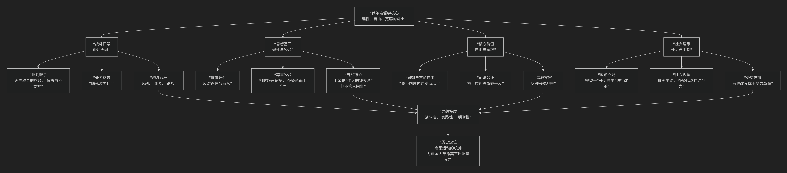

Voltaire
=========

基于伏尔泰（Voltaire）哲学核心思想。

----------------

弗朗索瓦-马利·阿鲁埃（法文：François-Marie Arouet），笔名“孔庙大主持”、“伏尔泰（法文：Voltaire）”。

伏尔泰是启蒙运动的旗手和灵魂人物法国思想家、文学家、哲学家，“资产阶级启蒙运动的泰斗”。被誉为“法兰西思想之王”、“法兰西最优秀的诗人”、“欧洲的良心”。

他并非构建体系的理论家，而是一位针砭时弊、传播思想的战士。他的核心思想可以概括为：**一位以“理性”为武器，以“自由”为旗帜，以“宽容”为美德，对宗教偏执、政治专制和法律不公进行毫不妥协批判的“启蒙斗士”哲学。其根本目标是砸碎迷信与专制的枷锁，倡导一种基于常识和人性、开放而文明的社会。**

伏尔泰的思想体系犀利而务实，其战斗姿态与核心主张可以通过下图清晰地展现：

以下，我们将沿此逻辑脉络，深入解析伏尔泰哲学的核心要义。

一、战斗口号：“砸烂无耻！”

这是伏尔泰最著名的战斗口号，体现了他思想的批判锋芒。

*   **“无耻”指什么？** 主要指 **天主教会的宗教偏执、腐败、虚伪和由此带来的不宽容**。他一生都在猛烈抨击“败类”，即那些利用宗教权威进行迫害、制造迷信、阻碍思想进步的教士和制度。

*   **批判的武器**：他最主要的武器是 **辛辣的讽刺、无情的嘲笑和雄辩的论战**。其文学作品（如《哲学通信》《老实人》）都是寓教于乐的批判利器。

*   **著名案例**：他亲自投入为 **卡拉斯案**、**西尔文案** 等宗教冤案平反的斗争，体现了他“知行合一”的斗士本色。

二、思想基石：理性与经验

伏尔泰是英国经验论（尤其是洛克和牛顿思想）在法国的杰出继承者和传播者。

*   **推崇理性**：他坚信 **理性** 是照亮黑暗、驱散迷信的光芒。但他所谓的理性更接近 **常识和健全的判断力**，而非复杂的哲学思辨。

*   **尊重经验**：他信奉洛克的 **经验论**，认为所有知识源于感官经验。因此，他极度反感莱布尼茨的“预定和谐论”等脱离经验的形而上学体系，认为那是无用的空想。

*   **自然神论**：在宗教观上，他是典型的 **自然神论者**。

    *   他相信一个 **作为“宇宙钟表匠”的上帝** 的存在，认为宇宙的精妙秩序需要一个创造者。

    *   但他坚决否认上帝会干预人间事务（如神迹、启示），反对人格化的上帝。宗教应是一种 **自然的、道德的信仰**。

    *   他的名言：“即使没有上帝，也必须创造一个。” 意在说明，作为道德约束和社会秩序基础的上帝信仰是必要的。

三、核心价值：自由与宽容

这是伏尔泰思想中最光辉、最具有现代意义的部分。

*   **思想与言论自由**：这是他最核心的主张。其不朽名言完美诠释了这一点：**“我不同意你的观点，但我誓死捍卫你说话的权利。”** 他认为，只有允许自由辩论和质疑，真理才能越辩越明。

*   **宗教宽容**：他一生都在为宗教宽容而战。他认为，不同信仰的人应该和平共处，任何宗教都无权迫害异端。他的《论宽容》是其思想的集中体现。

*   **司法公正**：他深刻揭露和批判了当时法国司法制度的黑暗、刑讯逼供的野蛮和不公正。他为冤案平反的努力，推动了现代司法公正理念的传播。

四、社会理想：开明君主制

与卢梭激进的“主权在民”不同，伏尔泰的政治主张相对温和务实，带有精英主义色彩。

*   **政治立场**：他推崇英国的君主立宪制，但更寄希望于 **“开明君主”** （如他心目中的普鲁士腓特烈大帝和俄国叶卡捷琳娜大帝），即由一位有理性的君主自上而下地进行改革，推动社会进步。

*   **对民主的态度**：他 **不信任普通民众**，认为他们容易受激情和偏见左右。他认为，治理国家需要由有教养、有财产的精英阶层来主导。

*   **务实改良**：他主张 **渐进式的社会改良**，反对激进的暴力革命，认为那会导致混乱。

五、核心要义总结

.. list-table:: 
   :header-rows: 1
   :widths: 25 45 30
   :align: center

   * - **理论维度**
     - **核心命题**
     - **关键概念与贡献**
   * - **批判哲学**
     - **以理性为武器，无情批判宗教偏执与政治专制。**
     - **砸烂无耻、批判精神、讽刺文学**
   * - **认识论与宗教观**
     - **信奉基于经验常识的理性，主张自然神论，反对迷信。**
     - **经验论、自然神论、常识理性**
   * - **政治哲学**
     - **捍卫思想自由与宗教宽容是文明社会的基石。**
     - **言论自由、宗教宽容、司法公正**
   * - **社会理想**
     - **通过开明君主的理性改革，实现社会进步。**
     - **开明君主制、精英主义、渐进改良**

六、思想特质与历史评价

*   **并非体系建构者**：伏尔泰的伟大不在于他构建了精密的哲学体系，而在于他 **将哲学思想转化为强大的社会批判力量**。

*   **清晰的传播者**：他用清晰、犀利、幽默的文笔，将先进的启蒙思想传播给广大公众，真正践行了“启蒙”的含义。

*   **局限性**：他的精英主义立场和对民主的怀疑，反映了他作为上层资产阶级代表的阶级局限性。

*   **历史地位**：他是 **启蒙运动的统帅和象征**。他的思想和斗争极大地动摇了旧制度的根基，为法国大革命准备了舆论条件。雨果曾评价：“伏尔泰的名字所代表的不是一个人，而是整整一个时代。”

七、总结

总而言之，伏尔泰的核心思想在于，他是一位 **“理性的使徒”和“自由的工匠”** 。他教导我们，**面对不公和愚昧，知识分子不应沉默于书斋，而应勇敢地运用理性之光和文字之力，为争取每一个人的基本权利和尊严而战。**

他的全部工作是对 **知识分子的社会责任** 的一次伟大示范。在启蒙的时代，他用自己的生命和才华证明了，思想本身就是一种改变世界的力量。在这个意义上，他不仅是18世纪的哲人，更是一切追求真理、自由与正义者的永恒榜样。

-------------------

 .. toctree::
    :maxdepth: 3

    grok
    gemini
    copilot
    chatgpt
    deepseek
    qwen

