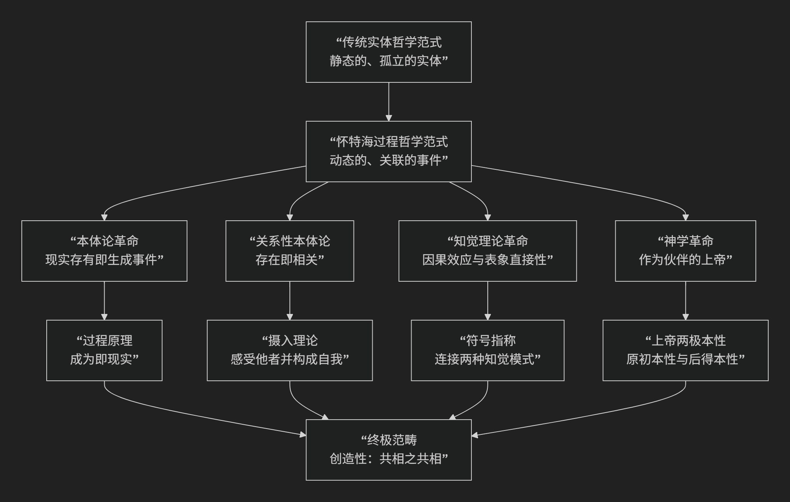

Alfred North Whitehead
========================

基于阿尔弗雷德·诺斯·怀特海（Alfred North Whitehead）的过程哲学（或称有机哲学）核心思想

--------------------------------------------

阿尔弗雷德·诺斯·怀特海的过程哲学（或称有机哲学）是20世纪最具原创性和综合性的哲学体系之一。它是对传统实体思维方式的彻底革命，其核心思想可以概括为：**宇宙的基本单位不是静态的“物质实体”，而是动态的、相互关联的“生成事件”（或称“现实存有”）。实在的本质是“过程”而非“物质”，一切存在物都在永恒的创造之流中相互关联、相互摄入，共同构成一个活的、有感觉的有机整体。**

怀特海的思想体系宏大而精密，其核心架构旨在用“过程”和“关系”的概念重构我们的世界观。其根本的范式转换可图示如下：

以下，我们将沿此脉络，深入解析过程哲学的核心要义。

一、本体论革命：从“实体”到“事件”

这是过程哲学最根本的范式转换。

*   **批判“实体”观念**：怀特海批判了自亚里士多德以来主导西方哲学的“实体”概念。这种观点认为世界是由具有固有属性的、独立自存的“东西”构成的。

*   **核心命题：“现实存有”是最终的实在**：怀特海提出，构成世界的最终实在不是“实体”，而是 **“现实存有”** （或称“现实机缘”）。它们不是持久的“东西”，而是 **瞬间的、具体的“经验活动”或“生成事件”**。

*   **著名格言**：**“一个现实存有的‘存在’，完全是由它的‘生成’所构成的。”** 这被称为“过程原理”。一个事物不是什么，然后才去变化；它的存在本身就是它生成的过程。例如，一个电子不是一个小球，而是一系列高速重复的生成事件。

二、关系性本体论：“摄入”与“共生”

现实存有是如何相互关联的？怀特海提出了“摄入”理论。

*   **核心概念：“摄入”**

    *   **定义**：**“摄入”指一个现实存有“感受”并吸纳其他现实存有，从而将它们的影响纳入自身构成之中的内在活动。** 它不是被动的接受，而是主动的“把握”。

    *   **内涵**：每个现实存有在生成时，都 **将整个宇宙作为材料摄入自身**，从而与万物内在相关。我们是由我们与世界的所有关系构成的。

*   **核心概念：“共生”**

    *   **定义**：指多个“摄入”合生为一个新的、复杂的统一体（即一个新的现实存有）的过程。

    *   **内涵**：宇宙是一个 **创造性的进展过程**，通过不断的“摄入”和“共生”，从已实现的现实存有中生成新的现实存有。

三、知觉理论：因果效应与表象直接性

怀特海用过程观重新解释了知觉，解决了心物二元论难题。

*   **两种知觉模式**：

    1.  **因果效应模式**：我们对世界最原始、最基础的知觉。指我们的身体直接 **感受到** 外部世界的影响（如光线撞击视网膜、压力触及皮肤）。这是一种 **模糊的、身体的、关乎因果关系的感受**。

    2.  **表象直接性模式**：在因果效应基础上产生的、清晰的感官知觉（如看到的颜色、听到的声音）。这是我们熟悉的知觉，但它提供的是 **抽象化的、脱离具体环境的表面属性**。

*   **关键论点**：传统哲学（如笛卡尔）错误地将“表象直接性”当作知觉的基础，从而割裂了心灵与身体。怀特海认为，**“因果效应”才是更根本的**，它保证了我们与世界的真实连接。这两种模式通过“符号指称”联系起来。

四、神学革命：过程神学

怀特海重新定义了上帝在宇宙中的角色，开创了“过程神学”。

*   **上帝的两极本性**：

    *   **上帝的原初本性**：上帝是 **永恒的潜能**，为每个现实存有提供其生成的“初始目标”，引导世界朝向新颖性和价值。上帝是“说服的上帝”，而非“强制的主宰”。

    *   **上帝的后得本性**：上帝 **感受并接纳世界上所有已实现的现实存有**，将它们的经验永久地保存在神性之中。因此，世界也影响和丰富了上帝。

*   **上帝与世界的伙伴关系**：上帝不是冷漠的创造者或不变的存在，而是 **宇宙的“ fellow-sufferer ”**，与世界一同经历过程，共同创造。

五、核心要义总结

.. list-table:: 
   :header-rows: 1
   :widths: 25 45 30
   :align: center

   * - **理论维度**
     - **核心命题**
     - **关键概念与贡献**
   * - **本体论**
     - **"现实存有"是终极实在，其存在即生成过程**。
     - **现实存有、过程原理、生成、事件本体论**
   * - **宇宙论**
     - **宇宙是"创造性进展"的有机体，万物通过"摄入"内在关联**。
     - **摄入、共生、创造性、有机哲学**
   * - **认识论**
     - **知觉的基础是"因果效应"，它保证了身心、心物的连续统一**。
     - **因果效应、表象直接性、符号指称**
   * - **神学**
     - **上帝具有"两极本性"，是与世界共同演化的"伙伴"**。
     - **过程神学、上帝的两极本性、说服的上帝**
   * - **终极范畴**
     - **"创造性"是共相之共相，是推动宇宙进程的终极动力**。
     - **创造性、新颖性、多与一的融合**

六、思想特质与影响

*   **综合性与科学性**：怀特海深刻融合了哲学与相对论、量子力学等现代科学成果，试图为科学世界观提供一个连贯的形而上学基础。

*   **生态意涵**：其关系性、整体性的宇宙观为深层生态学和环境伦理学提供了强大的哲学支持，强调万物互联互依。

*   **建设性后现代主义**：过程哲学被视为“建设性后现代主义”的主要思想源泉，它不满足于解构，而是致力于在批判现代性机械世界观的基础上，建构一个更富生机、更有价值的宇宙图景。

七、总结

总而言之，怀特海的核心思想在于，他是一位 **“过程的诗人”和“关系的建筑师”** 。他教导我们，**必须放弃将世界视为一部由冰冷零件构成的机器的图像，转而拥抱一个由无数瞬间经验之流交织而成的、活生生的、不断创新的有机宇宙。**

他的全部工作是对 **生成、关联性和创造性** 的一次极其宏大而又精密的揭示。在生态危机、意义失落和机械论世界观盛行的今天，怀特海的过程哲学为我们提供了一种重拾世界之敬畏、重建万物之联结的深刻智慧。

------------

 .. toctree::
    :maxdepth: 3

    grok
    copilot
    deepseek
    gemini
