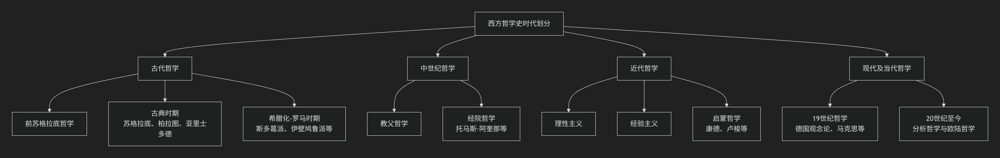

西方哲学简史
------------

西方哲学史的时期划分是一个经典问题。划分方式并非绝对唯一，但通常会基于思想风格、核心问题与历史背景的重大转折点来划分。

最经典和清晰的划分是**四阶段法**，下图直观地展示了这一脉络：

### **第一时期：古代哲学（约公元前6世纪 — 公元6世纪）**

**核心特征**：从探究自然的本源转向关注人与社会，为整个西方哲学奠定了基本概念和问题域。

* **1. 前苏格拉底哲学（公元前6世纪 — 公元前5世纪）**

  * **核心问题**：“世界的本质（本源）是什么？”（宇宙论）
  * **代表人物**：
    * **泰勒斯**：认为水是万物的本源（西方哲学开端）。
    * **赫拉克利特**：强调“万物皆流”，火是本源，逻各斯是关键。
    * **巴门尼德**：强调“存在”是不变、唯一的，区分了“真理之路”与“意见之路”。
* **2. 古典时期（公元前5世纪 — 公元前4世纪）**

  * **核心转折**：从自然转向人和社会（伦理学、政治哲学、认识论）。
  * **代表人物**：
    * **苏格拉底**：提出“认识你自己”，专注于伦理问题，使用“诘问法”探寻普遍定义。
    * **柏拉图**：提出“理念论”，认为可感世界是理念世界的摹本。强调理性灵魂对真理的回忆。
    * **亚里士多德**：柏拉图的学生，批判理念论，建立系统的逻辑学、形而上学（“第一哲学”）、伦理学和政治学。
* **3. 希腊化与罗马时期（公元前4世纪 — 公元6世纪）**

  * **核心问题**：如何在动荡的世界中获得“幸福”与“心灵宁静”？（伦理学为中心）
  * **主要学派**：
    * **伊壁鸠鲁学派**：快乐是善，但强调通过知识消除恐惧（尤其是对神和死亡的恐惧）的静态快乐。
    * **斯多葛学派**：顺应自然（理性）而活，强调德性自足，忍受痛苦，世界主义。
    * **怀疑主义学派**：悬置判断，以达到心灵的宁静。

### **第二时期：中世纪哲学（约公元5世纪 — 14世纪）**

**核心特征**：哲学成为“神学的婢女”，主要任务是用理性来理解和论证基督教信仰。

* **1. 教父哲学（约2世纪 — 8世纪）**

  * **核心任务**：将希腊哲学与基督教教义结合，确立正统教义。
  * **代表人物**：**奥古斯丁**，受柏拉图主义影响，提出“光照说”，强调信仰是理解的前提。
* **2. 经院哲学（约9世纪 — 14世纪）**

  * **核心任务**：用严密的逻辑和理性方法系统化神学体系。
  * **代表人物**：**托马斯·阿奎那**，将亚里士多德哲学与基督教神学完美结合，构建了宏大的综合体系。其核心是“五路证明”和“信仰与理性的和谐”。

### **第三时期：近代哲学（约17世纪 — 18世纪末）**

**核心特征**：哲学从神学中独立出来，研究的中心从“神”转向“人”和“人的理性”，核心问题是**认识论**（我们如何认识世界？）。

* **1. 理性主义（大陆学派）**

  * **核心主张**：知识源于先天固有的理性原则，强调演绎法。
  * **代表人物**：
    * **笛卡尔**（近代哲学之父）：提出“我思故我在”，通过普遍怀疑确立理性的绝对基础。
    * **斯宾诺莎**：采用几何学方法，构建一元论的“实体”体系。
    * **莱布尼茨**：提出“单子论”和“预定和谐”。
* **2. 经验主义（英国学派）**

  * **核心主张**：知识源于后天感官经验，强调归纳法。
  * **代表人物**：
    * **洛克**：批判“天赋观念”，提出“白板说”。
    * **贝克莱**：提出“存在就是被感知”，走向主观唯心主义。
    * **休谟**：将经验主义推向极致，提出因果律只是心理习惯的“恒常联结”，对知识的可靠性提出严重怀疑。
* **3. 启蒙哲学与批判哲学的集大成**

  * **核心任务**：回应理性主义与经验主义的冲突，为科学和道德寻求稳固基础。
  * **代表人物**：**康德**，发动“哥白尼式革命”，提出不是观念符合对象，而是对象符合观念。划分“现象界”与“物自体”，试图为人类的知识和道德划定界限和基础。

### **第四时期：现代及当代哲学（约19世纪 — 至今）**

**核心特征**：对近代哲学的理性万能观念进行反思和批判，哲学流派纷呈，呈现出“分析哲学”与“欧陆哲学”两大主要传统的分野。

* **1. 19世纪哲学**

  * **德国观念论**：**黑格尔**，构建庞大的绝对精神辩证法体系。
  * **对理性主义的反叛**：
    * **叔本华**：强调非理性的“意志”是世界的本质。
    * **克尔凯郭尔**：存在主义先驱，强调个体生存的抉择与焦虑。
  * **社会批判**：**马克思**，将黑格尔的辩证法应用于社会历史领域，强调实践和经济基础的决定作用。
* **2. 20世纪至今的两大主流**

  * **分析哲学**（主要流行于英美）
    * **核心**：关注语言、逻辑和概念分析。认为哲学问题源于语言的误用。
    * **代表人物**：弗雷格、罗素、早期维特根斯坦、奎因等。
  * **欧陆哲学**（主要流行于欧洲大陆）
    * **核心**：关注存在、历史、权力、现象和实践。
    * **主要流派**：现象学（胡塞尔、海德格尔）、存在主义（萨特）、解释学（伽达默尔）、结构主义与后结构主义（福柯、德里达）、批判理论（法兰克福学派）。

### **西方哲学史总结**

这个四阶段的划分清晰地勾勒了西方哲学重心的转移：

* **古代**：从**宇宙**到**人**。
* **中世纪**：从**人**到**神**。
* **近代**：从**神**到**人的理性**（认识论转向）。
* **现代/当代**：从**人的理性**到**语言**（语言学转向）和**人的生存**。

**总结表格：**

| 时代名称 | 大致时间范围 | 核心特征 | 主要代表人物（或思潮）|
| :---: | :---: | :---: | :---: |
| **古代哲学** | 公元前 6 世纪 - 公元 5 世纪 | 关注自然、宇宙和城邦伦理 | 苏格拉底、柏拉图、亚里士多德、斯多葛学派 |
| **中世纪哲学** | 公元 5 世纪 - 公元 15 世纪 | 调和信仰与理性（神学主导） | 奥古斯丁、托马斯·阿奎那 |
| **近代哲学** | 公元 16 世纪 - 公元 19 世纪初 | 认识论为中心，强调理性或经验 | 笛卡尔、洛克、休谟、康德 |
| **当代哲学** | 公元 19 世纪中后期 - 至今 | 广泛批判与多元发展 | 尼采、胡塞尔、海德格尔、维特根斯坦、萨特 |

---

### **补充说明**

现代哲学的起止时间存在学术争议，有的划在19世纪末，有的划在一战或二战之后。

不少学者支持将“现代哲学”或“当代哲学”起始于二战之后。这种划分不仅是时间上的断裂，更是思想上的转向。

🌍 为什么将现代哲学起点定在二战之后？

- **历史断裂与思想危机**：二战的惨烈、纳粹主义的兴起与灭亡、大屠杀的震撼，使得传统理性主义和人文主义遭遇深刻质疑。哲学不再只是抽象思辨，而是必须回应人类的苦难与制度性暴力。
- **存在主义的兴起**：萨特、加缪等人强调人的自由、荒诞与责任，回应战争后的精神空虚。
- **法兰克福学派的批判理论**：阿多诺、霍克海默等人反思启蒙理性如何走向工具化，导致灾难。
- **语言哲学与分析哲学的成熟**：维特根斯坦后期、奎因、戴维森等人推动哲学转向语言、逻辑与科学的分析。
- **结构主义与后结构主义的兴起**：福柯、德里达等人挑战主体的稳定性，强调权力、话语与解构。
- **全球化与多元性**：哲学不再局限于欧洲传统，开始吸收非西方思想、女性主义、生态哲学等多元视角。

🕊️ 二战后的哲学：一种“反思的哲学”

将“现代哲学”或“当代哲学”起始于二战之后，实际上强调了哲学的“伦理转向”与“历史意识”。它不再是系统建构的自足游戏，而是对人类命运的深刻追问。在这个意义上，现代哲学从废墟中开始，从对灾难的记忆中生长。

