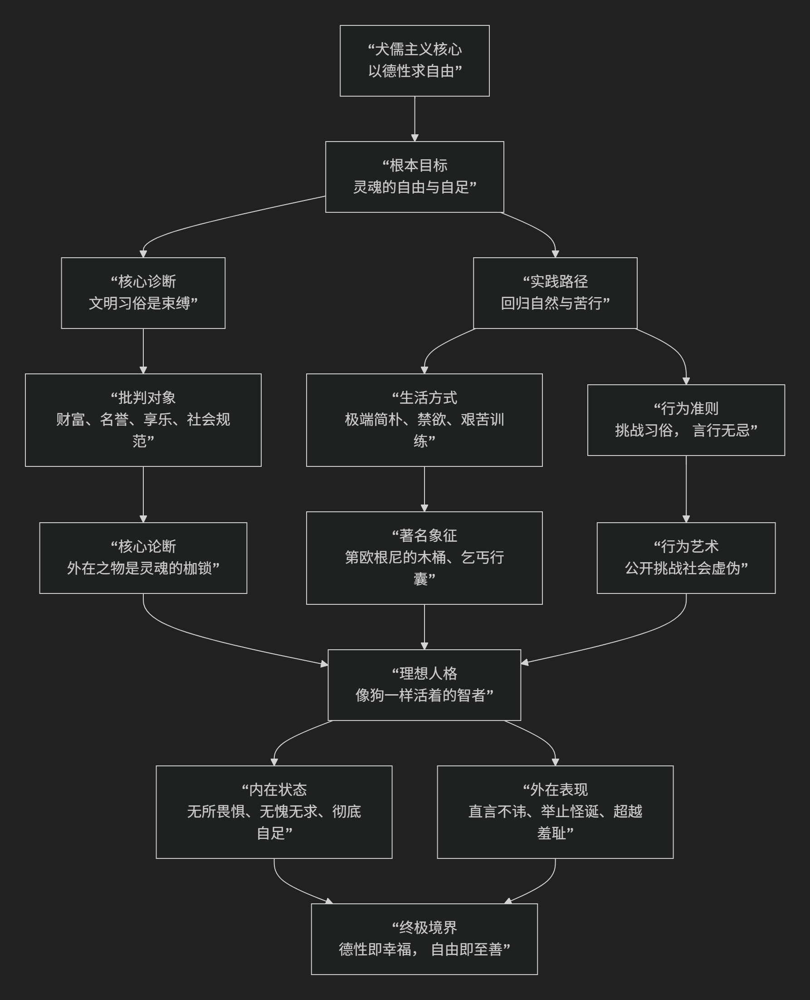

Cynicism
========

基于犬儒学派（Cynicism）​​ 的哲学核心思想

---------------------------------

犬儒学派是古希腊哲学中一个极其独特且影响深远的流派。其核心思想可以概括为：**一种通过极端的“回归自然”、禁欲苦行和挑战社会习俗来追求“德性”与“精神自由”的实践哲学。它认为文明社会的习俗、财富、名誉和享乐是束缚人性的虚假枷锁，真正的幸福在于摒弃一切外在依赖，回归简朴自然的生活，从而获得灵魂的绝对自足与自由。**

犬儒学派的哲学不是一套理论体系，而是一种彻底的生活方式。其核心追求与实践路径可以通过下图清晰地展现：

以下，我们将沿此逻辑脉络，深入解析犬儒学派的核心要义。

一、核心目标：德性即自由

犬儒学派的所有实践都指向一个终极目标——**获得灵魂的绝对自由和自足**。

*   **核心命题**：**“德性”是唯一的善，而德性就在于“依自然生活”的智慧。** 拥有这种德性，人就能在任何环境下都保持幸福。
*   **自由的内涵**：这种自由是 **消极的** ——即“**免于**”被欲望、舆论和命运束缚的自由。一个真正自由的人，不依赖任何外在条件（健康、财富、社会地位）来获得幸福。
*   **著名格言**：**“一无所需是神性，所需越少越近神性。”** 犬儒追求的就是这种神性的自足状态。

二、核心诊断：文明是社会病症的根源

犬儒学派对主流社会进行了尖锐且彻底的批判。

*   **批判靶子**：他们攻击 **一切被社会视为“美好”但人为的习俗和价值**，包括：

    *   **财富与奢侈**：认为其腐蚀灵魂，制造虚假需求。

    *   **名誉与权力**：认为其依赖于他人的意见，是奴役的根源。

    *   **社会规范与礼仪**：认为其是虚伪、做作和不自然的。

*   **核心论断**：人们之所以痛苦和不自由，是因为他们 **错误地将幸福寄托在这些变幻无常、不受控制的外在之物上**。文明的进程就是人类背离自然、自我奴役的过程。

三、实践路径：回归自然与苦行主义

犬儒主义最显著的特征是其极端的**实践性**。他们不构建复杂理论，而是用生命来演示哲学。

*   **回归自然**：这不是指隐居山林，而是 **按照生命最原始、最简单的需求来生活**。自然的需求（如食物、水、 shelter）很容易满足，而人为的欲望（如山珍海味、华屋美宅）则永无止境，带来焦虑。

*   **苦行训练**：为了摆脱对享乐的依赖，犬儒有意识地 **过一种极端艰苦的生活**，视其为一种精神训练。这包括：

    *   **赤足、单衣、以地为床**。

    *   **乞讨为生**，以克服羞耻心，证明生存无需依赖工作或财产。

    *   **忍受寒冷、炎热和饥饿**，以锻炼意志，证明灵魂可以超越身体的痛苦。

*   **著名象征**：

    *   **第欧根尼的木桶**：他住在一个木桶（实为大型陶罐）里，表明生活所需可以如此之少。

    *   **乞丐的行囊**：一件斗篷、一个装食物的口袋、一根手杖，便是全部家当。

四、行为艺术：挑战习俗与“无耻”的直言

犬儒主义者是古代的行为艺术家，他们用惊世骇俗的举动来揭露社会的虚伪。

*   **“犬儒”之名的由来**：意为“**像狗一样的人**”。这既指他们简陋的生活方式，也指他们 **像狗一样“无耻”地公开行事，毫不顾忌社会礼仪**。

*   **第欧根尼的著名事迹**：

    *   **白天点灯寻找“真正的人”**：讽刺世上充满虚伪之徒。

    *   **对亚历山大大帝说：“不要挡住我的阳光。”** 表明帝王的权力在他所珍视的自然馈赠（阳光）面前一文不值，彰显其精神的独立与自由。

    *   **在公共场合进行生理行为**：以此挑战“体面”的观念，主张自然行为不应被污名化。

*   **“直言”**：犬儒主义者以 **毫无顾忌的坦率批评** 著称，他们视此为社会责任，旨在唤醒沉溺于虚幻价值中的人们。

五、理想人格：“世界公民”

犬儒学派孕育了 **“世界主义”** 思想的萌芽。

*   **核心主张**：他们摒弃传统的城邦忠诚和种族区分，宣称自己是 **“世界公民”**。

*   **内涵**：整个宇宙和人类都是一个整体，不应被人为的边界和习俗所分割。这种观念后来被斯多葛学派继承和发展。

六、核心要义总结

.. list-table:: 
   :header-rows: 1
   :widths: 25 45 30
   :align: center

   * - **理论维度**
     - **核心命题**
     - **关键概念与贡献**
   * - **哲学目标**
     - **通过德性获得灵魂的绝对自由与自足。**
     - **德性即幸福、精神自由、自足性**
   * - **社会批判**
     - **文明社会的习俗和价值是束缚人性的虚假枷锁。**
     - **反文明、反习俗、批判虚伪**
   * - **实践方法**
     - **通过"回归自然"和极端苦行来训练意志、摒弃物欲。**
     - **苦行主义、回归自然、艰苦训练**
   * - **行为姿态**
     - **以"无耻"的直言和惊世骇俗的行为挑战社会规范。**
     - **行为艺术、直言、像狗一样生活**
   * - **理想人格**
     - **成为不依赖外物、不畏人言的"世界公民"。**
     - **世界主义、智者、第欧根尼典范**

七、思想特质与影响

*   **极端实践性**：犬儒主义是一种“做”的哲学，其学说完全体现在生活方式中。
*   **激进批判性**：它对主流价值观的批判是彻底且不留情面的。
*   **深远影响**：犬儒学派直接启发了斯多葛学派（芝诺曾是犬儒学生），其批判精神、世界主义思想和苦行训练方法被后者吸收并温和化。后世的许多社会批判者和异见者也常被冠以“犬儒”之名。

八、总结

总而言之，犬儒学派的核心思想在于，它是一场 **“生活方式的革命”和“社会价值的清道夫”** 。它教导我们，**真正的强大不是征服世界，而是征服对世界的欲望；真正的自由不是为所欲为，而是可以一无所求。**

它的全部工作是对 **文明价值的一次极端拷问**。在一个物欲横流、价值纷杂的世界里，犬儒主义像一面刺眼的镜子，迫使人们反思：我们真正需要的是什么？我们的痛苦有多少是自寻烦恼？尽管其方式过于极端，但它对简单、真实和自由的追求，至今仍具有深刻的警示和启迪意义。

------------

 .. toctree::
    :maxdepth: 3

    copilot
    grok
    chatgpt
    deepseek
    gemini
    qwen
