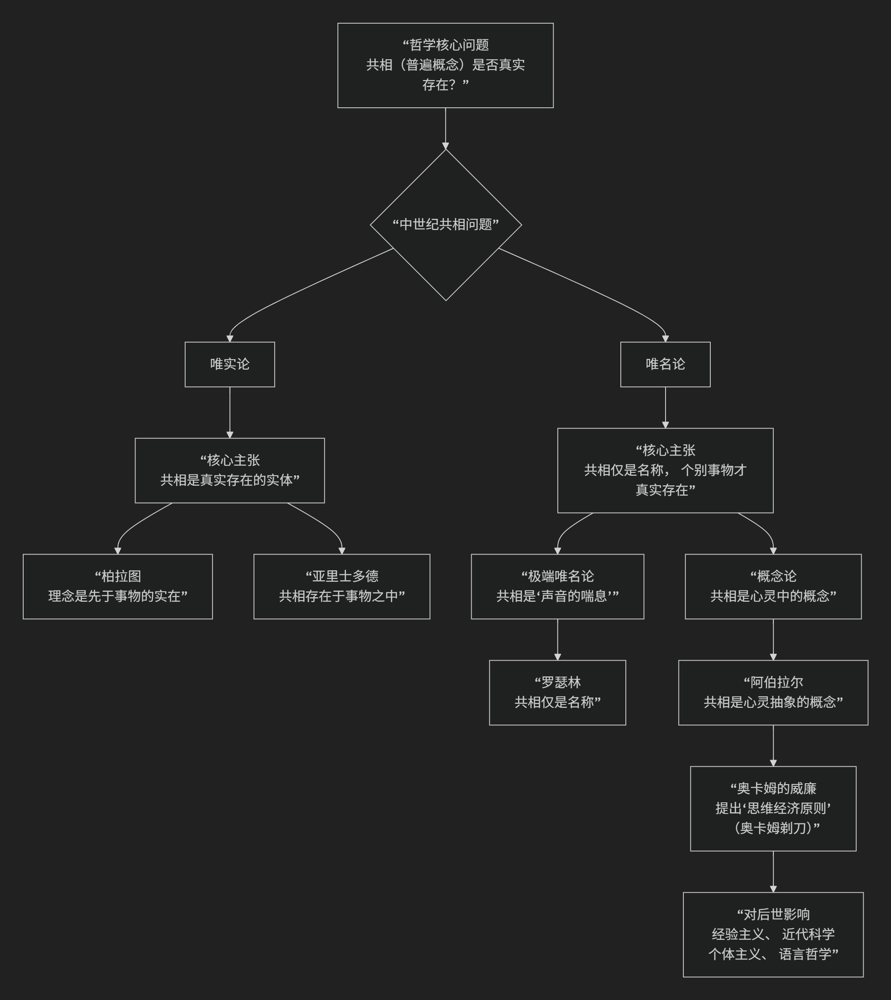

Nominalism
============

基于唯名论（Nominalism）哲学核心思想

----------------------------------

唯名论是哲学史上一场极具革命性的思想运动，其核心主张可以概括为：**拒绝承认“普遍概念”（共相）具有任何独立的、客观的实在性，认为它们仅仅是名称、词语或心理概念，真实存在的只有一个个具体的、个别的个体事物。**

这场争论主要发生在中世纪，是经院哲学的核心论战，其焦点是 **“共相问题”**。

为了更直观地理解唯名论的核心主张及其与唯实论的根本对立，下图清晰地展示了其思想脉络与关键分野：

以下，我们将沿此脉络，深入解析唯名论的核心思想、主要分支、代表人物及其深远影响。

一、核心命题：何谓“唯名”？

“唯名论”一词源于拉丁语“nomen”，意为“名称”。其核心命题围绕对“共相”的看法展开：

*   **共相**：指 **普遍概念** 或 **抽象属性**，如“人类”、“红色”、“美德”。

*   **个体**：指 **具体的个别事物**，如“苏格拉底这个人”、“我面前的这朵红花”。

**唯名论的核心回答**：“人类”这个普遍概念并不真实存在。真实存在的只有一个个具体的人，如苏格拉底、柏拉图。“人类”这个词（名称）只是我们为了方便，用来 **指代所有具体个人的一个标签或声音**。

二、主要分支及代表人物

唯名论内部根据对“共相”本质的不同解释，可分为两种主要形态：

1. 极端唯名论

*   **核心命题**： **共相仅仅是“声音的喘息”或“词语”**，是纯粹物理性的声音或符号，没有任何客观对应物，甚至没有对应的心理实在。

*   **代表人物**：

    *  :doc:`罗瑟林 </chats/outlaw/analyse/foreign/master/ancient/rosecelin/index>` ：唯名论的早期代表。他认为共相只是 **flatus vocis** （声音的喘息）。例如，“人类”这个词只是一个声音，它不指代任何普遍的实体，只用于称呼许多个别的个体。

2. 概念论（温和唯名论）

这是更精致、影响力更大的唯名论形式。

*   **核心命题**： **共相不是外在的实体，但也不是纯粹的声音。它是存在于心灵之中的“概念”**。当我们看到许多具体的马之后，我们的心灵通过抽象思维，形成了一个“马”的概念。这个概念作为心理表象是存在的，但它不对应外部世界中的一个独立的“马性”实体。

*   **代表人物**：

    *   :doc:`彼得·阿伯拉尔 </chats/outlaw/analyse/foreign/master/middle/abelard/index>` ：概念论的主要奠基者。他提出了精密的论证，指出共相是 **心灵通过抽象形成的概念**，用于 **谓述** 多个个体。它的存在依赖于心灵的活动，而非独立的客观实在。

    *   :doc:`奥卡姆的威廉 </chats/outlaw/analyse/foreign/master/middle/william/index>` ：晚期唯名论的集大成者，他的思想极具颠覆性。

三、奥卡姆的威廉与“奥卡姆剃刀”

 :doc:`奥卡姆的威廉 </chats/outlaw/analyse/foreign/master/middle/william/index>` 是唯名论最著名的代表，他的思想极大地推动了唯名论的发展并产生了深远影响。

*   **核心思想**：

    1.  **唯名论立场**：坚决主张 **个别事物是唯一真实的存在**。共相只是存在于心灵中的“自然符号”，它们作为概念是存在的，但其功能是代表许多个别事物，其本身不是实在的实体。

    2.  **思维经济原则（奥卡姆剃刀）**：这是他最著名的贡献。其原则是 **“如无必要，勿增实体”**。即，在解释现象时，不应假设不必要的实体或原因。在共相问题上，既然我们用个别事物和心灵概念就能解释世界，就 **没有必要假设“共相”这种多余的实体**。他用这把“剃刀”剃掉了经院哲学中许多繁琐、不必要的抽象实体。

*   **哲学影响**：他的思想动摇了中世纪经院哲学的基础，为强调个体经验和观察的 **近代经验论** 和 **自然科学** 的兴起扫清了道路。

---

四、唯名论的哲学后果与影响

唯名论的胜利对西方思想产生了深远而彻底的影响：

.. list-table:: 
   :header-rows: 1
   :widths: 30 70
   :align: center

   * - **领域**
     - **影响**
   * - **形而上学**
     - **个体主义转向**：哲学的关注点从普遍的"本质"转向具体的、个别的"存在物"。为现代哲学对 **个体性** 和 **自由** 的强调奠定了基础。
   * - **认识论**
     - **经验主义兴起**：如果真实存在的只有个别事物，那么知识就不能来自对共相的理性直觉，而必须来自对个别事物的 **感觉经验**。这直接影响了洛克、贝克莱、休谟等经验论者。
   * - **科学**
     - **实证科学的发展**：科学不再追求探究事物背后的"隐蔽的质"或"形式因"，而是转向对个别现象进行 **观察、分类和寻找数学关系**。
   * - **宗教与政治**
     - **权威的削弱**：如果"教会"这个普遍概念只是名称，那么真正的权威可能在于个别的信徒或世俗统治者。这间接为 **宗教改革** 和 **现代个体权利** 观念提供了思想资源。
   * - **语言哲学**
     - **语言转向的先声**：唯名论将哲学家的注意力引向 **语言** 本身：词语（名称）是如何与世界建立联系的？这成为20世纪语言哲学的核心问题。

五、总结

总而言之，唯名论的核心思想在于，它是一场 **“个体的解放运动”和“形而上学的瘦身计划”** 。它教导我们，**真实世界的丰富性和实在性在于其具体、多样、个别的存在物，而不是那些我们用以概括它们的抽象标签。**

从 :doc:`罗瑟林 </chats/outlaw/analyse/foreign/master/middle/rosecelin/index>` 的声音，到 :doc:`彼得·阿伯拉尔 </chats/outlaw/analyse/foreign/master/middle/abelard/index>` 的概念，再到 :doc:`奥卡姆的威廉 </chats/outlaw/analyse/foreign/master/middle/william/index>` 的剃刀，唯名论者完成了一次哲学上的“哥白尼式革命”：**将哲学的焦点从抽象的“共相天堂”拉回到了具体的“个体世界”**。它的胜利，标志着中世纪经院哲学的衰落，并深刻地塑造了现代哲学、科学和政治思想的个体主义、经验主义和实证主义基调。

------------

 .. toctree::
    :maxdepth: 3

    grok
    copilot
    deepseek
    gemini
