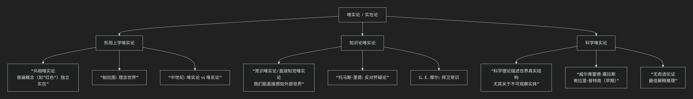

Realism
========

基于唯实论（Realism，也译“实在论”）哲学核心思想

---------------------------------

唯实论是哲学中最基本、最持久的立场之一。它的核心思想可以概括为：**承认存在一个独立于我们的心灵、信念、感知或语言的客观世界。**

简单来说，唯实论者坚信：“**月亮在我们不看它的时候依然存在。**”

然而，这个看似简单的核心主张，在不同哲学领域衍生出丰富而各异的形式。它们共同回答着一个核心问题：“**何物为实？**”

为了更直观地理解唯实论的全貌，下图清晰地展示了其主要分支与演进脉络：

以下，我们将沿此脉络，详细解析唯实论的核心思想与代表人物。

一、核心命题：何谓“独立实在”？

尽管分支众多，所有唯实论形式都共享一个基本承诺：

*   **形而上学承诺**：存在一个 **独立于人类心智** 的客观世界。事物的存在和性质不依赖于我们是否知道、相信或感知到它们。

*   **知识论目标**：人类能够 **认识** 这个独立世界的至少一部分。我们的信念和理论可以或多或少地真实描述这个世界。

**唯实论的反面** 是各种形式的 **反实在论**，后者认为实在在某种根本意义上依赖于心灵（如唯心主义）、概念框架（如建构主义）或无法被认识（如怀疑论）。

二、主要分支及代表人物

唯实论在不同哲学领域围绕不同的争论焦点，形成了若干重要分支。

1. 形而上学唯实论：共相问题

这是最古老的唯实论争论，源于中世纪，探讨 **普遍概念** （如“美”、“狗”、“红色”）的本体论地位。

*   **核心命题**： **普遍概念（共相）是真实存在的实体**，不依赖于个别事物或人类语言。

*   **代表人物与流派**：

    *   :doc:`柏拉图 </chats/outlaw/analyse/foreign/master/ancient/plato/index>` （极端唯实论）：认为“共相”是存在于 **理念世界** 的完美原型，个别事物只是其不完善的摹本。

    *   :doc:`亚里士多德 </chats/outlaw/analyse/foreign/master/ancient/aristotle/index>` （温和唯实论）：认为“共相”存在于 **个别事物之中**，是事物的本质或形式，不能脱离具体事物而独立存在。

    *   **中世纪唯实论者** （如 :doc:`安瑟尔谟 </chats/outlaw/analyse/foreign/master/ancient/anselm/index>` ）：继承柏拉图路线，认为共相先于事物而存在。

2. 常识唯实论 / 直接知觉唯实论

这是一种针对知识论怀疑论（如“我们如何知道外部世界存在？”）的强硬回应。

*   **核心命题**： **我们能够直接感知外部世界，而不是感知我们自己的“感觉材料”或“观念”。** 怀疑论的问题是荒谬的，因为外部世界的存在是常识和哲学的默认起点。

*   **代表人物**：

    *   :doc:`托马斯·里德 </chats/outlaw/analyse/foreign/master/recent/reid/index>`  （苏格兰常识学派）：猛烈抨击休谟的怀疑论，认为知觉的直接对象是外部事物本身。

    *   :doc:`G. E. 摩尔 </chats/outlaw/analyse/foreign/branch/langu/moore/index>` ：通过举起他的手说“这是一只手”，来论证外部世界的存在是一个比任何怀疑论论证都更确定的常识信念。

    *   **日常语言学派** （后期维特根斯坦、奥斯汀）：认为怀疑论误用了语言，在日常语言实践中，我们无疑地预设了外部世界的存在。

3. 科学唯实论

这是20世纪下半叶以来最活跃、争论最激烈的唯实论领域。

*   **核心命题**： **我们的最佳科学理论（尤其是关于不可观察实体，如电子、夸克、基因的理论）是近似为真的描述，其核心术语真实地指称了客观世界中的实体。**

*   **核心论证**：

    *   **“无奇迹论证”**：科学实在论最有力的论证。其形式是：如果科学理论不是近似真实的，那么其惊人的经验成功（如做出新颖预测、指导技术进步）将是一个无法解释的“奇迹”；因此，最合理的解释是科学理论是近似真实的。

*   **代表人物**：

    *   :doc:`威尔弗雷德·塞拉斯 </chats/outlaw/analyse/foreign/branch/science/sellars/index>` ：提出“科学形象”应当最终取代“明显形象”（常识世界图景）。

    *   **希拉里·普特南（早期）**：明确提出“无奇迹论证”，并主张“实在论是唯一不使科学成功成为奇迹的哲学”。

    *   :doc:`理查德·博伊德 </chats/outlaw/analyse/foreign/branch/science/boyd/index>` ：为科学实在论提供了精致的认识论辩护。

三、面临的挑战与回应

唯实论，尤其是科学唯实论，面临着强大的反实在论挑战，这些挑战也促使唯实论者发展出更精致的版本。

.. list-table:: 
   :header-rows: 1
   :widths: 25 35 40
   :align: center

   * - **挑战**
     - **反实在论论证**
     - **唯实论回应（举例）**
   * - **科学史**
     - **悲观元归纳**：科学史上充满曾成功但后被证明为假的理论（如燃素说、以太说），因此当前理论未来也可能被证明为假。
     - **结构实在论**：我们可能不知道实体的内在本质，但能知道它们之间的 **关系结构**。理论更替中，数学结构得以保留。
   * - **理论选择**
     - **不充分决定性**：任何有限证据在逻辑上都与多个不相容的理论相容，证据无法唯一决定理论选择。
     - **最佳解释推理**：我们选择那个能对证据提供 **最佳解释** 的理论，而实在论正是最佳解释。
   * - **观察负载理论**
     - 观察渗透理论，没有中性证据，证据可能已预设理论为真，导致循环论证。
     - **实验实在论** （哈金）：当我们能 **操作** 一个实体（如用电子束做实验）来干预世界时，我们有理由相信它是真实的。

四、总结

总而言之，唯实论的核心思想在于，它是对 **人类认知能力和世界客观性** 的一种基本信任。它是一棵枝叶繁茂的哲学大树，其共同根系是：

**存在一个不依赖于我们的世界，并且我们的努力——无论是哲学思辨、常识信念还是科学研究——能够真正地触达它。**

从 :doc:`柏拉图 </chats/outlaw/analyse/foreign/master/ancient/plato/index>` 对永恒理念的追寻，到 :doc:`G. E. 摩尔 </chats/outlaw/analyse/foreign/branch/langu/moore/index>` 捍卫常识的举手，再到科学家探索基本粒子的执着，背后都跃动着同一种唯实论的精神：**对客观真理的信仰和追求。** 尽管其形式千变万化，并不断面临严峻挑战，但唯实论依然是哲学中最有生命力、最引人入胜的立场之一。

------------

 .. toctree::
    :maxdepth: 3

    copilot
    grok
    deepseek
    gemini
    qwen
